**Programming Boot Camp**

# ノーコードツール Bubble について

**東京化学大学 2024/11/09**
　
　
　
　
　
　　　　　　　　　　　　　　　　　　　**Naotake KYOGOKU**

---

## 目次
- ノーコードツールとは / Bubble とは
- まずはサインアップの部品を使ってユーザ登録画面を作ってみよう
- Bubble でのアプリ開発の概要説明
- ユーザ登録、ログイン機能を作ってみよう
- データベースを学びペット登録から一覧表示まで作ってみよう
- ペット詳細画面を作ってみよう
- 画面間の共通部品を作っていこう
- まとめ

---

## ノーコードツールとは

- ノーコードツールとは、プログラミングの知識がなくても、視覚的な操作だけでアプリやウェブサイトを作れるツールです
- ドラッグ＆ドロップや簡単な設定を使って、機能を組み合わせることで、誰でもアイデアをすぐに形にすることができます

---

## Bubble とは

- [Bubble](https://bubble.io/) はビジュアルプログラミングツールと呼ばれ、ノーコードツールではありますが、プログラミング的な発想が必要なツールとなります。
- 用意されているパーツから使用したいものを選び、それを画面にドラッグ＆ドロップしていくなどの操作は直感的で分かりやすいです
- ただ、配置したパーツに対して動きをつけていく部分については、プログラミング的な発想が必要となります
- Bubble で開発するアプリは Web アプリケーション前提での開発となり、それをスマホ表示に対応させていく形となります

---

#### Bubble で作られたアプリの例

- あいホームバーチャル展示場: https://aihome-vr.com/
  - 物件のオンライン内見アプリ
  - 物件をストリートビューのような形でオンライン内見できるアプリです。
  - 参考: https://note.com/apopopo/n/n155b0df7f78c
    - Bubble のノウハウというよりノーコード開発の知見が書かれている

- 他にも色々あるので「Bubble 事例」などで調べてみてください！
  - 例: https://www.c3reve.co.jp/post/nocode-app-development

---

### Bubble に登録しよう

- Bubble の TOP 画面からメールアドレスを入力してアカウント登録
  - https://bubble.io/
  - "Get started" をクリック


---
- アカウントは無料で登録できます
- ご自身のメールアドレスと好きなパスワードを入力して "Start building" をクリック

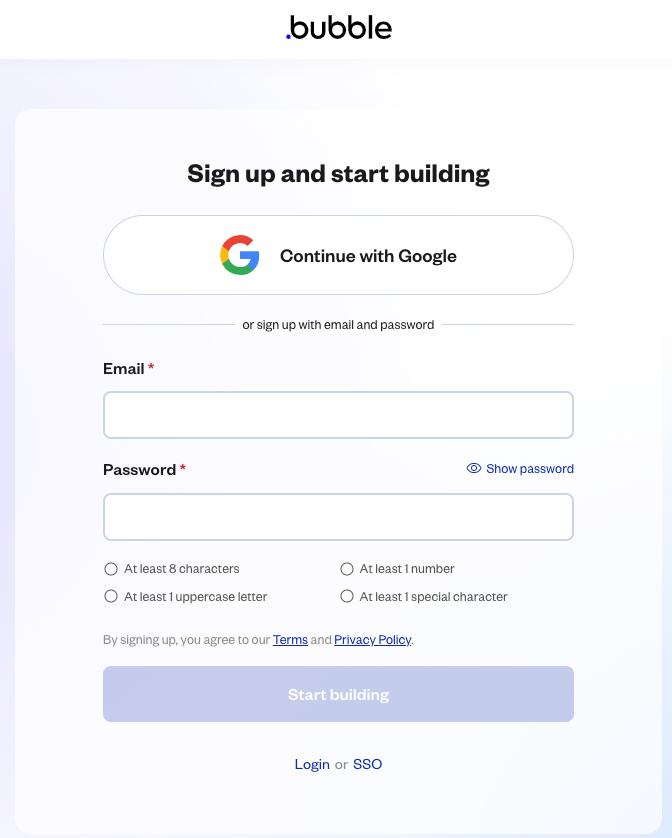

---

- Bubble をどこで知ったか聞かれるので "Friend or colleague" を選択

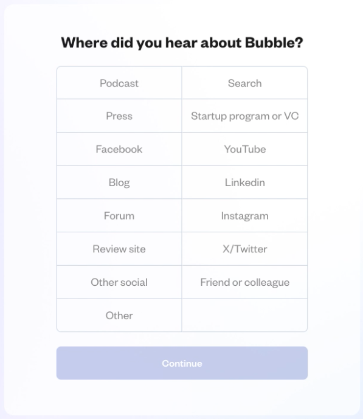

---

- AI 機能を開発に組み込むかと聞かれますが、今回は Bubble の使い方をメインでお伝えするため、利用せずに進みます
- そのため、一番下の "Skip and take me to the editor" を選択


---

- 最後に利用するプランを聞かれます
- 今回は無料プランの中で使って行きますので、下にある "Start with basic features" を選択

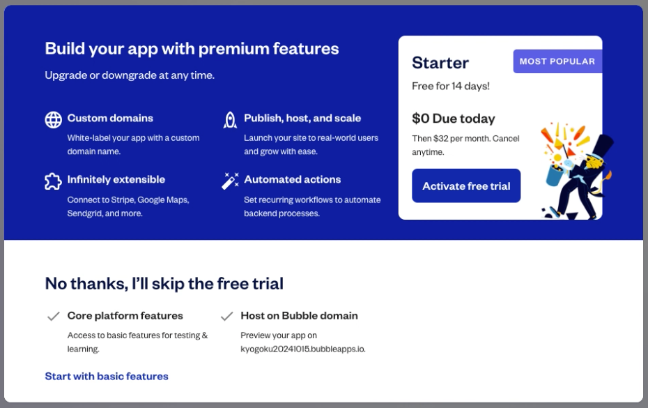

---

- すると、画面が切り替わり、白い編集画面のようなものが表示されたかと思います
- これが Bubble のメインの画面になります

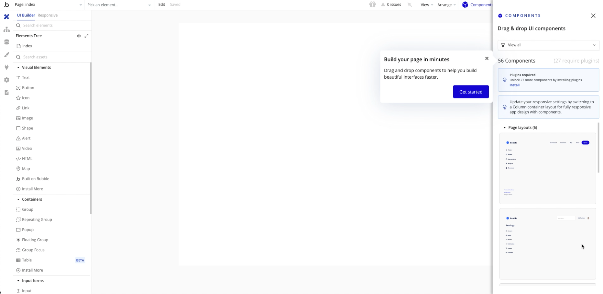

----

- また、並行して入力したメールアドレス宛に確認メールが送信されるので、ご自身のメールボックスを確認
- "Verify Your Bubble Account" というタイトルで Bubble からメールが来ていると思うので、本文に記載の "Click here to confirm your email address" のリンクをクリック

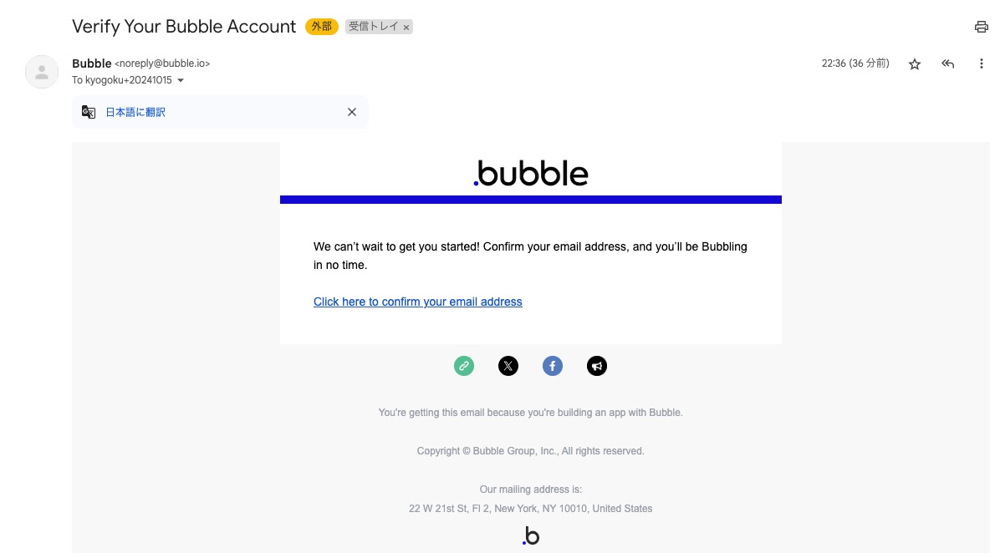

---

- Bubble の画面が表示され "Thanks for confirming!" と表示されていれば OK


---

### まずは Bubble のテンプレートを動かしてみよう

- 画面右上の Preview リンクをクリックしてください


---

- プレビュー画面が別タブで表示されます
- しかし、真っ白の画面しか表示されません
- これは、真っ白なキャンバスにまだ何もオブジェクトなどを配置していないため問題ありません :+1:

---

- さすがに少し動きを見ていきたいので、早速サインアップ画面を作って試してみましょう
- Bubble では、よくあるサインアップ・ログインの「画面」は用意されていませんが「部品」は用意されています
- その部品を組み込んでサインアップ画面を作ってみたいと思います
- :warning: 実際のサインアップやログインの機能はこのあと開発していくので今は紙芝居としてしか動きません

---

## まずはサインアップの部品を使ってユーザ登録画面を作ってみよう

- :warning: 画面の色々な部品を触っていきますが、各パーツの説明は後ほど行います
- まずは最低限の部品の説明を行い、ユーザ登録画面を作ってみます

---

### 3 つのメイン操作

- Bubble では主に 3 つの操作を使い分けていきます
- ラベルなどがないので分かりづらいですが、上からこの 3 つになります
  1. Design
  2. Workflow
  3. Data
- 左メニューからそれぞれを行き来することができます


---

#### Design

- このうち Design の説明だけ先に行います
- ユーザーインターフェースを作るために画面上にコンポーネントを配置するモード
- 左パネルに UI のコンポーネント類、右パネルに実際の画面編集領域となっています


---

- それでは早速ユーザ登録画面を作っていきましょう！

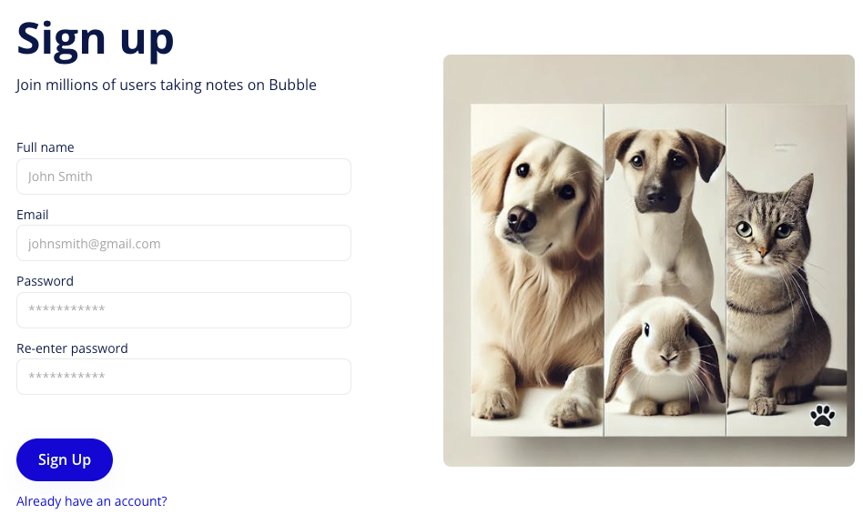

---

- まずは Bubble に標準で用意されているサインアップの部品を、配置していきます
- 画面上段右側にある "Components" をクリック

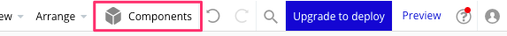

---

- すると、画面の右側から `Components` (UI Componets) というエリアが出てきたと思います
- これは文字通り、Bubble で用意されている共通部品の一覧になります

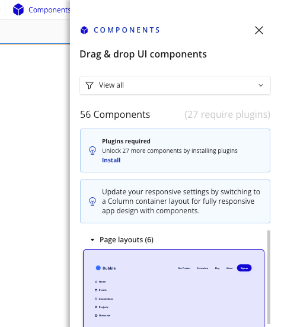

---

- このエリアの中で下の方にある Inputs & forms のカテゴリを開き、その中にある画像付きの Sign up 部品を Drawing エリアへドラッグ & ドロップします

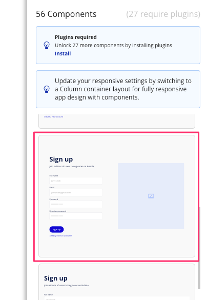

---

- おそらくこんな感じで画面上部にピッタリ収まるよう配置されたかと思います


---

- ここでプレビューを実施してみます
- 無事に Sing up の部品が表示されたかと思います


---

- この部品の中には Sign up ボタンの下に `Already have an account?` というリンクがあり、あたかもログイン画面へ遷移できるような UI になっていますが、まだログイン画面を用意していないため、今はリンクを押しても何も起きません


---

- なので続いてログイン画面を用意していきます


---

- 画面左上の `Page: index` をクリックするとポップアップが表示されます
- ポップアップの中から `Add a new page...` をクリック


---

##### ちなみに...

- ここには現在作成中のアプリケーションの中にある「ページ」や「共通コンポーネント」の一覧が表示されています
- Bubble では 1 つのキャンバスで 1 つの画面を操作していく操作になります
- そのため、画面間の移動はここから変更する必要があるので覚えておきましょう :raising_hand:

---

- `Add a new page...` をクリックすると新しい画面のポップアップが表示されます
- `Page name` は画面の名前となるので、空白などを含めずに英数字だけで入力します
  - 今回は `login` としましょう

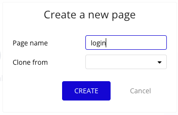

---

- `Clone from` は似たような画面を作りたい時に、コピー元となる画面を選択してその画面のコピーを作ることができます


---

- 例えば登録画面と編集画面などは画面要素がほとんど同じになるので、登録画面を作った後に編集画面を作る時に "Clone from" に登録画面を選択すると、開発工数の削減につながります


---

- 今回は未選択のままとします
- "CREATE" ボタンをクリック


---

- 新しい画面ができたら、最初に画面の "レイアウト" をユーザ登録画面と合わせます
- 具体的な説明は今回の会では省略しますが、画面に配置するコンポーネントの位置関係をページ単位で指定することができます

----

- 画面の中央付近をクリックし、詳細設定のダイアログを表示します
  - 今後、この詳細設定ダイアログを各所で触っていきます
- 今回は Layout タブから
  - Container layout: `Column`
  - Container alignment: 上寄せアイコン

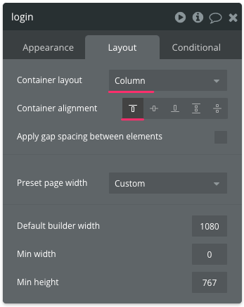

---

- 上記設定ができたら、先ほどと同じような手順で Components の中から画像付きの Log in コンポーネントをドラッグします
- 先ほどと同様、画面上部にピッタリ収まるよう配置されたかと思います

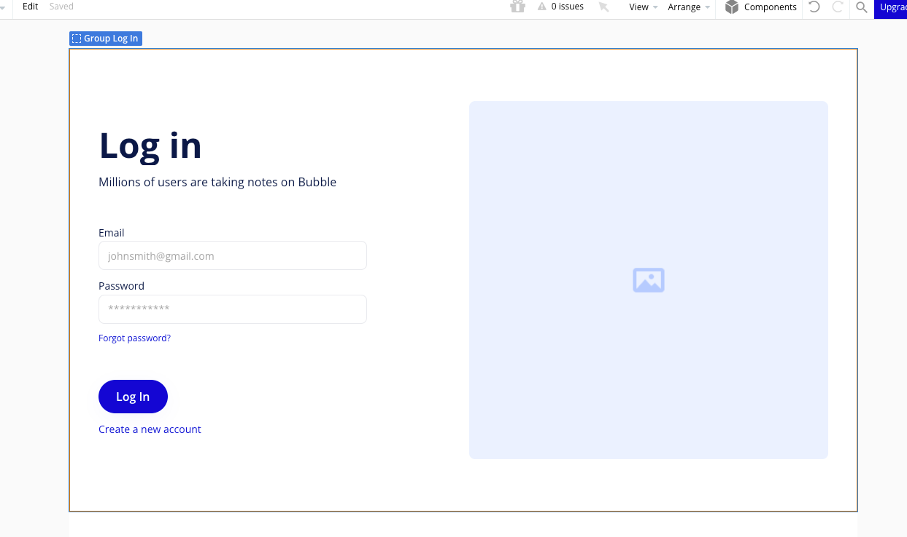

---

- あとは、先ほど機能していなかったログイン画面とユーザ登録画面を行き来できるようリンクの設定をしましょう

---

- ログイン部品の中にある `Create a new account` というリンクっぽい文字列をクリック

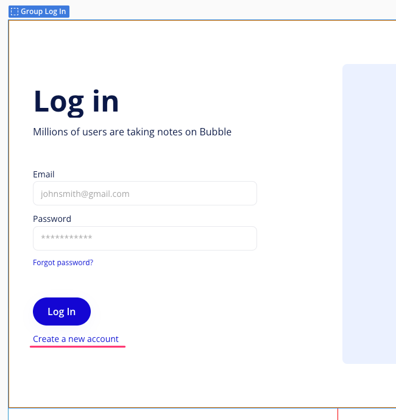

----

- `Link Create a new account` のダイアログが表示されたら "Appearance" タブを開く
- その中にある `Destination page` のプルダウンに `index` を選択してください
- これで、このリンクをクリックしたときの遷移先ページとしてユーザ登録画面である `index` を指定できました

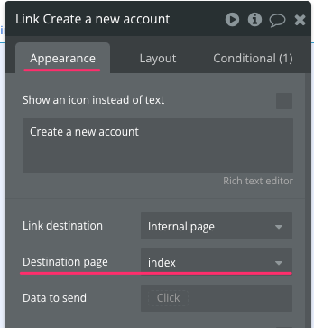

---

- これと同じ容量で、今度はユーザ登録画面からログイン画面へ遷移できるようリンク先の設定をしてみてください

# :hourglass_flowing_sand:
# :hourglass:


---

**答え合わせ :memo:**

- 左上から `index` を選択して Sign up ページを開く
- Sign up 部品の中にある `Already have an account?` のリンクをクリック

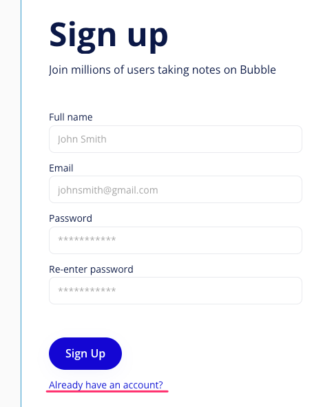

---

- `Link Already have an acco` のダイアログが表示されたら `Destination page` のプルダウンに `login` を選択してください

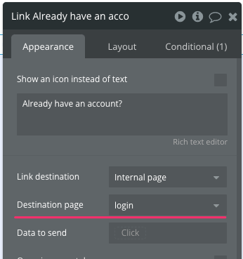

---

- ここまでできたらプレビューを実施して、ログイン画面とユーザ登録画面を行き来できることを確認してください！

---

- まだ今の時点では、"Sign Up" ボタンや "Log In" ボタンを押しても何も起きません
- これは、ボタンを押した時にどういうアクションを実行して欲しいか、Bubble にまだ教えていないからです
- この設定については追って説明していきますので、次に進んでいきましょう 🙋‍♀️

---

#### ここでちょっと :coffee: 

スマホ対応について

- 冒頭でお伝えした通り、Bubble のアプリは Web アプリケーションの前提となっています
- Bubble のアプリをスマホ対応させる場合、 **レスポンシブデザイン** という考え方を取り入れます

--- 

- まずは動きを見てみましょう
- ブラウザの横幅を縮めてみてください

https://matsushitahome.com/


---

- レイアウトが崩れることはなく、自動的に要素の配置が変わり、スマホサイズに適した配置になったと思います
- これがレスポンシブデザインというものです
- Google さんはこのように説明されています

```
ユーザーのデバイスの種類（パソコン、タブレット、モバイル、非視覚的ブラウザ）に関係なく、
同じ URL で同じ HTML コードを配信しつつ、画面サイズに応じてレンダリング方法を変更します。
```

参考資料
https://developers.google.com/search/mobile-sites/mobile-seo/?hl=ja

---

ポイントとしては下記の点ですね
1. 表示しているページの URL は同じ
2. 画面サイズに応じてレンダリング方法を自動的に変える

---

- もう少し噛み砕いて言うと、画面サイズに応じて、要素が伸びる／縮む、折り返す／折り返さない、表示する／表示しないを制御する
- これを各項目レベルで設定してあげることで、自動でレスポンシブデザインに対応させることができます
  - 実際の開発時には、設定してプレビューして動作確認していくと良いと思います
- Bubble のアプリケーションをレスポンシブ対応させていく話は Bubble 2 回目の講義で説明予定です🙋‍♀️

---

## Bubble でのアプリ開発の概要説明

それでは Bubble でのアプリ開発の概要を説明していきます

---

### 3 つのメイン操作

- 残りの 2 つの操作を見ていきます
  1. Design
  2. Workflow
  3. Data


---

#### Workflow

- 画面に動きをつけるためのモード
  - 例）ボタンが押された時に、画面遷移する
  - 例）ボタンが押された時に、データを操作する
- ここが、少しプログラミングの考え方を必要とする部分となります

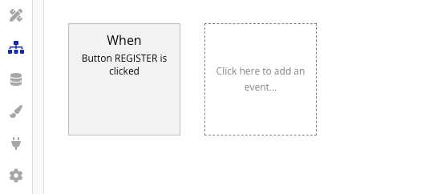

---

#### Data

- データを定義したり操作したりするモード
- データに関する説明（データベースの説明）については後ほど行いますね

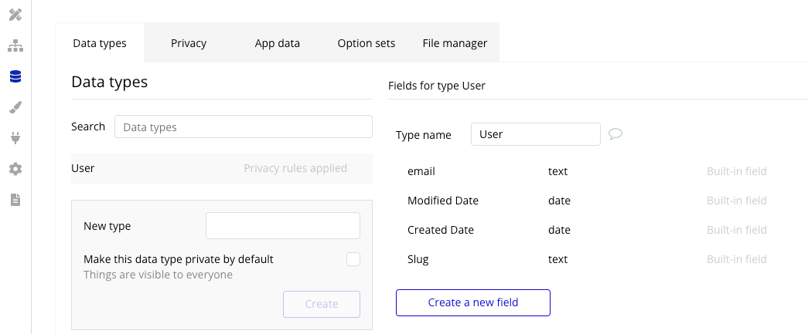

---

- "App data" タブを選び、 "All Users" のリンクをクリック
- すると、右パネルに登録済みのユーザ一覧のデータが表示されますが、まだサインアップ機能を作っていないので、ユーザがまだ 0 件だと思います


---

#### その他の操作について

その他の操作（メニュー）についても簡単に説明します

---

#### Styles

- スタイルに名前をつけてあげることで、アプリケーション全体で汎用的に使用可能（部品ごとに個別指定も可能）

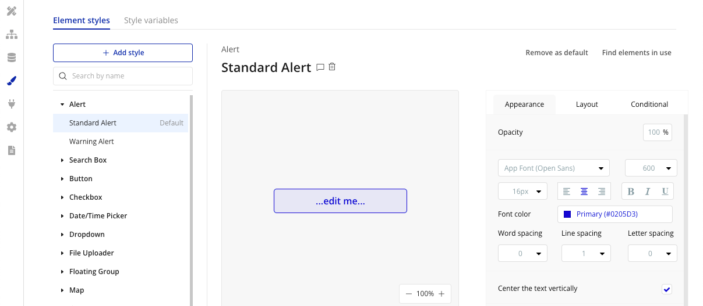

---

#### Plugins

- アプリケーションを拡張するための様々なコンポーネントが世界中に公開されています
- Bubble ではこれを「プラグイン」と呼びます
  - 例えば、折れ線グラフを描画するための様々なプラグイン
  - 例えば、Bubble のアプリケーションと ChatGPT を接続するためのプラグイン
- Bubble のプラグインには無料 / 有料のものがあるので、お使いになる際には確認しましょう

---

#### Settings

- Bubble のプランの変更やアカウントに関する操作
- 今回の講義では扱いません

---

- ちなみに、Settings の Languages では Bubble が提供しているメッセージを一元管理できます
  - アプリケーションを使うメインユーザ向けにロケール（言語設定）を変更可能
  - このメッセージを変更することで、システム全体でメッセージ管理を統一できます
  - アプリ全体で共通に使えるメッセージ類を変えられるし、デフォルトのメッセージを変えることも可能
  - アプリ固有のメッセージを追加することも可能
- 今回の講義では扱いません

---

#### Logs

- アプリケーションを動かしたときのログを見ることができます
- アプリケーションをプレビュー表示しながらログを見ることも可能です
- 今回の講義では扱いません

---

#### これから作っていく画面の全体像


---

## ユーザ登録、ログイン機能を作ってみよう

- ここまででユーザ登録、ログインの表側の開発は完了したので、実際のユーザ登録機能を作ってみましょう
- その前に、ユーザ登録が成功した時、ログインに成功した時に、それが動きとして分かるように成功時に遷移する画面の土台を作っておきましょう
- とりあえず左上の `Add a new page...` から `pet_list` という名前の画面を新たに作成しておきます
  - 今時点では中身は空で大丈夫です

---

それではユーザ登録機能を作っていきます
- やることとしては
  - Sing up ボタンを押した時に
  - 入力された「名前」と「メールアドレス」、「パスワード」をユーザ情報として登録する

---

#### 早速やっていきましょう！

---

### Sign up ボタンを押した時

- Bubble では動きを設定するのはすべて Workflow タブで操作をしていきます
- いきなり Workflow タブから設定も出来ますが、今回は動きをつける元となるボタンからワークフローの設定をしていきます

---

- index ページを開きます
- Sign up 部品にある `Sign up` ボタンをクリック
- 表示されたダイアログにある `Add workflow` という部分をクリック

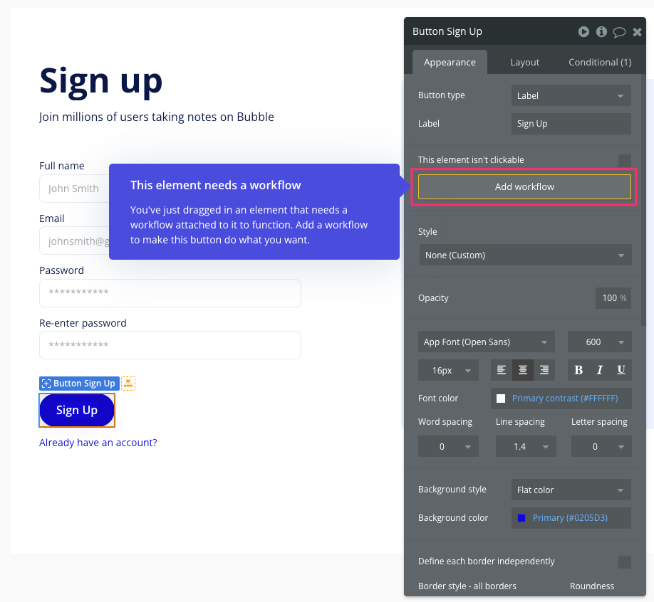

---

- すると、画面が Workflow に切り替わると思います
- 先ほど説明した通り、Workflow では、実際に動きをつけていく部分になりますので、`Sign up` ボタンをクリックしたらユーザデータを登録する、という動きをつけていきます


---

- おそらく `When Button Sign Up is clicked` という項目が選択状態だと思います
- これは文字通り、「Sign up ボタンをクリックした時」に、どういうアクションを実行するかを設定していきます


---

- 下に `Click here to add an action...` というボタンが表示されているかと思いますので、それをクリックして、Sign up ボタンクリック時の振る舞いを設定していきます


---

- `Click here to add an action...` を選択すると、様々なアクションを指定できるポップアップが表示されます
- 今回はユーザ操作に関する動きとなるため、一番上の `Account` を選びます


---

- すると下位要素がさらに表示されると思いますので、その中から `Sign the user up` をクリックします
- 文字通り、ユーザのサインアップに関する振る舞い設定です


---

- すると、Sign the user up のダイアログが表示されるかと思いますので設定していきます
- 内容としては、ログイン時に必ず必要となる「メールアドレス」と「パスワード」については、設定項目が表示されています
- これはつまり、Email / Password に関する設定をこれからしていきます


---

- まずは Email の右側にある `Click` をクリックすると、プルダウンメニューが表示されたと思います
- これは、今開いている index ページ内に存在するすべての要素（項目）の情報が候補として表示されています


---

- 今回の場合、Email に設定する値は、Email の入力フォームの値となります
- それっぽい項目がないか探してみると `ELEMENTS` ブロックの中に `Input Email (Sign up)` という項目があり、それをマウスホバーすると、実際の項目の表示イメージを確認できます


---

- `Input Email (Sign up)` をクリックすると、さらにプルダウンが表示されます
- 今回はこの `Input Email` の form に入力された「値そのもの」が必要なので `'s value` を選択します
- その他の選択肢である `is valid` と `isn't valid` は入力された値が正しいかどうかの判定結果を使いたい時に利用します

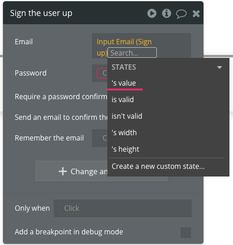

---

- これで、ユーザの Email 項目には、画面の `Input Email` form に入力された値を設定する、という意味になります


---

- これと同じ要領で、Passowrd とユーザ名を保存するための設定を行なってみてください

# :hourglass_flowing_sand:
# :hourglass:

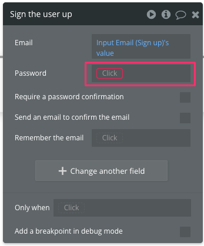

---

- 「ユーザ名」については、現時点でユーザテーブルにそのようなカラムがないため、新たに作成する必要があります
- `Change another field` から、Email / Password 以外の項目設定が可能です

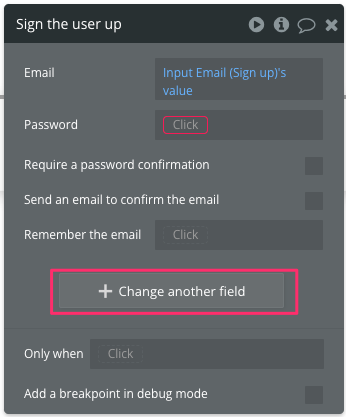

---

  - ユーザ名がまだ存在しないため `Create a new field...` をクリックし、そこからユーザ名を保存するフィールドを追加します
  - 名前は `name` としましょう

# :hourglass_flowing_sand:
# :hourglass:

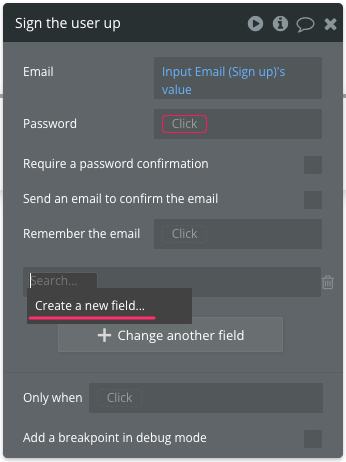

---

- 設定できましたかね？
- こんなイメージになると思います

- これで、Sign up ボタンをクリックした時に、画面に入力された内容でユーザデータを登録してくれるはずです

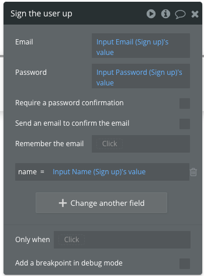

---

- では、動作確認のため、今設定した Step1 の `Sign the user up` の右側で、再度 `Click here to add an action...` を押して、画面遷移のアクションを選択します
- 何を選べば良さそうですかね？

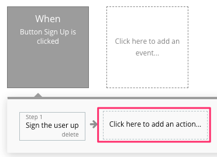

---

# :thinking:
# :thinking::thinking:
# :thinking::thinking::thinking:
# :thinking::thinking::thinking::thinking:

---

- そうです、 `Navigation` --> `Go to page...` をクリックします
- そして、表示されるダイアログから `Destination` に遷移先となる `pet_list` を選択すれば準備完了


---

- プレビューしてみましょう
- 確認ポイントは
  - 必須項目を入力して Sign up ボタンをクリックすると真っ白な pet_list 画面へ遷移すること
  - Sign up ボタンクリック時のユーザ情報がデータベースに登録されていること
    - パスワードは確認できないため、メールアドレスとユーザ名が正しく保存されていることを確認

---

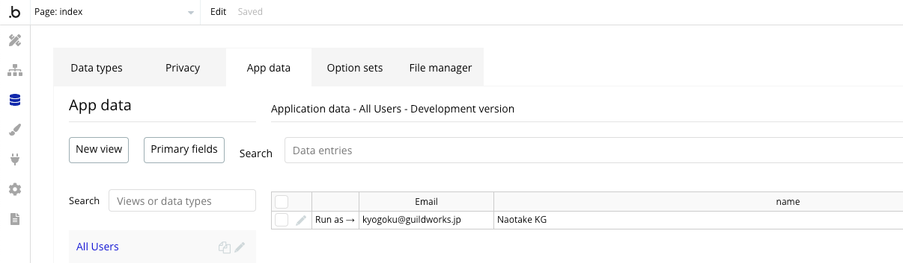

---

- お気づきかもしれませんが、この Sign up 画面ではパスワード誤りを防ぐため、パスワードの入力欄が 2 つあるにもかかわらず、現時点では1つ目と2つ目に異なる値を入力しても、1つ目の内容でアカウント登録が成功してしまいます
- これでは意味がないため、`Password` と `Re-enter password` の入力内容が異なっている場合は登録失敗させるよう修正してみてください

# :hourglass_flowing_sand:
# :hourglass:

---

**答え合わせ:memo:**

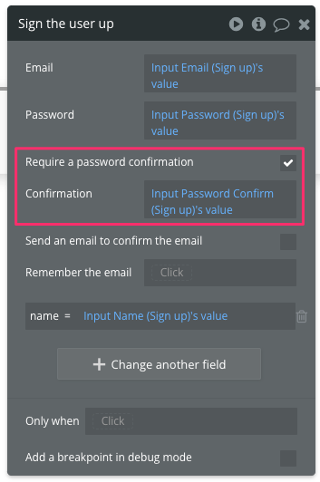

---

それでは続いてログインのワークフローを設定してみましょう! 🙋‍♀️

---

- 考え方は Sign up と同じですので、一度みなさん考えて設定してみてください！

# :hourglass_flowing_sand:
# :hourglass:

---

- まずは Sign up 画面である login ページを表示
- `Log In` ボタンをクリックしてダイアログから `Add workflow` をクリック


---

- Workflow 画面になるので、選択状態である `When Button Log In is clicked` の `Click here to add an action...` からログイン処理に必要なアクションを選択します


---

- 今回の場合は `Account` の `Log the user in` ですね
- 表示されたダイアログから、ログイン認証に必要な項目であるメールアドレスとパスワードとして利用する値を指定します


---

- これは Sign up の時と同様、選択肢の中にメールアドレス、パスワードの入力項目があるはずなので、それぞれの項目の `'s value` を選択


---

- 設定できたら、ログイン後の処理として、Sign up と同様 `pet_list` へ画面遷移するアクションを追加します

---

- ここまで設定できたらログインの動作確認もしてみましょう
- 先ほどサインアップ時に登録したアカウント情報でログインし、ペット一覧画面へ遷移することを確認


---

## データベースを学びペット登録から一覧表示まで作ってみよう

- それではユーザ管理機能もできたので、ペットの管理機能を作っていきます
- まず初めに、ペットに関するデータベースの準備を行います
- その上で、ペットの登録画面を作成し、そのペットを一覧に表示するところまで作ってみましょう

---

### データベースについて学ぶ

- アプリ開発において、そのアプリで扱うデータを整理しておくことで、その後の開発をスムーズに進めることができます
- まずは、データベースがどのようなものかを確認します

---

### データベース (Database) とは

- 整理されたデータの集合
- データベースを使ってデータを登録 (Create)、表示 (Read)、更新 (Update)、削除 (Delete)することができます
- これらの操作を総称して CRUD（"クラッド"）と呼びます

---

- データベースを学ぶ上での基本的な要素
  - テーブル
  - フィールド
  - レコード
  - リレーション

---

- テーブル
  - データを保存する「表」のようなものです。例えば「学生」というテーブルがあれば、その中にすべての学生情報が保存されています
- フィールド
  - テーブルの「列」にあたります。これは 1 つの情報の種類を表します。例えば「名前」や「年齢」がフィールドです

- レコード
  - テーブルの「行」にあたります。1つ1つのフィールドのまとまりです。例えば 1 人の学生の「名前」「年齢」「住所」などの情報が 1 つのレコードです

---

- ここまでをまとめると、テーブルは情報の集まり、フィールドはその情報の種類、レコードは具体的なデータの 1 つのセットを表すことができます

---


- データベースはよく「表計算ソフトのようなもの」と例えられます


---

- 先ほどのテーブル、フィールド、レコードを表計算に当てはめるとこんな感じになります


- しっくり... きますよね？ :sunglasses:

---

データベースを学ぶ上で、もう一つ重要な概念があります

- リレーション
  - 複数のテーブル同士をつなげて、データを関連付ける仕組みです
  - データベース内のテーブルは単独で動作するだけでなく、他のテーブルと関係を持たせることができます
  - 例えば「学生」テーブルと「クラス」テーブルがあった場合、1人の学生が複数のクラスに参加できるように、この 2 つのテーブルをリレーションで繋ぐことができます
  - これにより、学生がどのクラスに所属しているのか、逆にクラスにどの学生が参加しているのかを簡単に管理できます

---

リレーションには主に 3 つの種類があります

- 1対1 のリレーション
- 1対多 のリレーション
- 多対多 のリレーション

---

#### 1対1 のリレーション

- 「学生」テーブルと「学生証」テーブル
- 1 人の学生は 1 つの学生証しか持っておらず、学生証は 1 人の学生にしか対応しません
- 1 人の学生に 1 つの学生証

---

#### 1対多 のリレーション

- 「教師」テーブルと「クラス」テーブル
- 1 人の教師が複数のクラスを担当することはありますが、クラスには 1 人の教師しか存在しません
- 1 人の教師が複数のクラスを担当する

---

#### 多対多 のリレーション

- 「学生」テーブルと「クラス」テーブル
- 1 人の学生が複数のクラスに参加でき、かつ 1 つのクラスにも複数の学生が所属している
- 複数の学生が複数のクラスに所属する

---

- データベースに関する説明は以上です 🙋‍♀️

- 聞いているだけだとイメージが沸かないかもしれませんので、今回の講義内で開発するアプリケーションの画面をみながら、データベースに必要な項目などを整理、設計してみましょう
- 次ページ以降に開発予定の画面イメージと、データベース設計の手順を記載しています

---

#### サインアップ画面


---

#### ログイン画面


---

#### ペット一覧画面

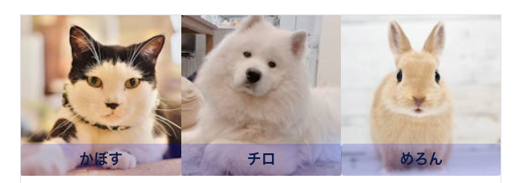

---

#### ペット登録画面

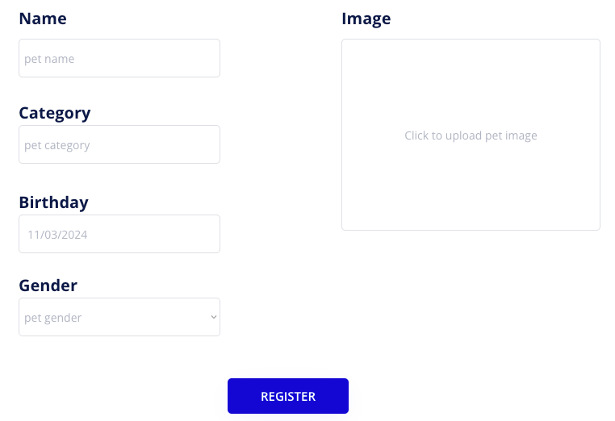

---

#### ペット詳細画面


---

#### ペット編集画面


----

データベース設計の手順

1. 画面を見ながら、保存が必要になるデータをリストアップしてテキストエディタなどに書き起こしてください
2. リストアップしたデータがどのようなテーブルに分類できるかを考えてみる
3. 1 でリストアップしたデータを適切なテーブルのフィールドとして追加してください
  その際、フィールドの種類についても明記してください
4. リレーションが必要なものについては、それを表すフィールドも追加してください

---

※次のスライド以降に解説がありますが、答えを見る前に一度自分で考えてみてください :eyes:
※絶対的な正解はないです。悩んだら直感に従って進めてみてください :brain:

---

### 解説

- 画面を見ながら保存が必要になるデータをリストアップすると、以下のようになりました

```
- ユーザの名前: 文字列
- ユーザのメールアドレス: 文字列
- ユーザのパスワード: 文字列
- ペットの名前: 文字列
- ペットの種類: 文字列
- ペットの誕生日: 文字列？
- ペットの写真: 画像？
- ペットの性別: 文字列
- ペットを所有するユーザ: ユーザ？
```

- これ以外のデータを上げられた人がいれば教えてください！

---

- リストアップしたデータがどのようなテーブルに分類できるか考えてみると、今回はこの 2 つに分類することにします
```
- User
- Pet
```

---

テーブルの分類に関する補足

- 「Aが決まればBが1つに決まる」という関係が成り立つ時、Aをテーブルに、Bをそのテーブルのフィールドにする場合が多いです。例えば、
  - ユーザが決まれば、ユーザの名前、メールアドレス、パスワードがそれぞれ 1 つに決まります
  - ペットが決まれば、ペットの名前、種類、誕生日、写真、性別がそれぞれ 1 つに決まります
    - ペットの写真は検討の余地がまだありそうですね :dog::camera:

---

- 「Aに対してBが複数存在する」という関係が成り立つ時、AとBは別々のテーブルに分割することが追いです
  - ペットに対してペットの写真は複数存在することも考えられますね :camera:
  - これも間違いではありません！
  - 今回の講義の中では、そのペットのお気に入りの一枚だけを設定できるものとし、ペットのテーブルの1フィールドとして考えていきますね :dog:

---

- ここまで決めれば一旦データベースの整理はここまでとし、具体的なテーブルが必要になったタイミングで作っていきます
- 最初にまとめてテーブルを作ってしまうことも方法としてはあります
- ただ、画面や機能を作り込んでいく過程で、整理したデータベースの内容がブラッシュアップされて変わることはよくあります
- そういった場合に最初にすべて作ってしまっていると手戻りが発生するリスクもあるため、その点については留意しておきましょう

---

#### ペット登録画面を作成していきます

- データベースの整理ができたので、ペットの登録画面を作成していきます
- 左上の `Add a new page...` から `pet_register` という名前の画面を新たに作成しておきます


---

#### ペット登録画面を組み立てる

- 画面イメージを参考にペット登録画面を作ってみましょう


---

#### ペットの名前

- まずはペットの名前を入力するテキストボックスを配置します
- 左パネルの "UI Builder" から `Input forms` の中にある `Input` を選択
- そして右パネル上で配置したい場所でクリックすると入力欄が表示されます


---

- 要素をダブルクリックすると要素の様々な情報を設定できるダイアログが表示されますので、必要な項目を設定していきます
- `Placeholder` はテキストボックスが未入力状態の時に表示される補助文言です
  - 今回は「pet name」とします


---

- `Content format` はテキストボックスに入力できる値の形式を指定できます
  - 今回は文字列の入力となるので "Text" のままとします


---

- `This input should not be empty` は入力必須にするかどうかを指定できます
  - 今回は必須としたいのでチェックをつけます


---

- ダイアログ先頭の部分をクリックすると、このテキストボックスの要素に対して名前を付けることができます
- これは後々ワークフローを定義するときに便利になるのでここでは "Input pet name" と指定しましょう


---

- まずはここまで設定したら OK です
  - ほかにも細かく指定ができますが、ここでは説明を省略します
  - 気になる方は見てみてください :mag:

---

#### ペットの種類

- 次にペットの種類を入力するための要素を配置します
- 先ほどと同じく左パネルから `Input` フォームを選択し、右パネル上でドラッグして要素を配置します

---

- この要素も同じくダブルクリックから要素の情報を設定します
  - 今回は `Placeholder` に "pet category" と入力します
  - 要素の名前として "Input pet category" を指定します
  - `This input should not be empty` はチェックをつけて必須にします


---

#### ペットの画像

- 次にペットの画像をアップロードする要素を配置します
- 左パネルから `Picture Uploader` を選択し、右パネル上でドラッグして要素を配置します

---

- この要素も同じくダブルクリックから要素の情報を設定します
  - 今回は `Placeholder` に "Click to upload pet image" と入力します
  - 要素の名前として "Input pet image" を指定します
  - `This input should not be empty` はチェックをつけて必須にします


---

#### ペットの誕生日

- 次にペットの誕生日を入力するための要素を配置します
- 左パネルから `Date/Time Picker` を選択し、右パネル上でドラッグして要素を配置します

---

- こちらも要素をダブルクリックして要素の詳細を設定します
  - `Input type` に Date を選択することで日付入力のみとなります
    - ここで Date & Time を選択することで日付と時刻の入力が可能です
    - 今回は Date とします


---

- `This input should not be empty` はチェックをつけて必須にします
- 要素の名前として `Input pet birthday` を指定します


----

#### ペットの性別

- 最後にペットの性別を選択するための要素を配置します
- 左パネルから `Dropdown` を選択し、右パネル上でクリックして要素を配置します

---

- こちらも要素をダブルクリックして要素の詳細を設定します
  - `Placeholder` に "pet gender" と入力します
  - `Choices` に "Male" と入力したら Enter キーで改行し、次の行に "Female" と入力します


---

- `This input should not be empty` はチェックをつけて必須にします
- 要素の名前として `Input pet gender` を指定します


---

#### 登録ボタン

- ここまでペット情報の入力ができたら登録ボタンを配置します
- 左パネルの `Visual elements` の中にある `Button` を選択し、右パネルでクリックして要素を配置します

---

- こちらも要素をダブルクリックして要素の詳細を設定します
  - Appearance タブの上部にある「...edit me...」と入力されている部分を編集して「REGISTER」と入力します

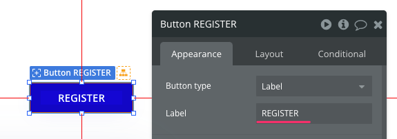

---

#### 各入力要素にラベルをつけましょう

- 各入力項目だけでは、それぞれが何の入力フォームか分かりづらいため、識別できるよう各要素の左上にラベルを用意しましょう
- 左パネルの `Visual elements` の中にある `Text` を選択し、右パネルでドラッグして要素を配置します

---

- 配置する際、高さは 30px 以上になるように配置してください
  - そうしないと、要素の中身が正しく表示されないためです！
  - 要素を配置した後に詳細ダイアログ Layout タブから `H` の値を編集することもできます！

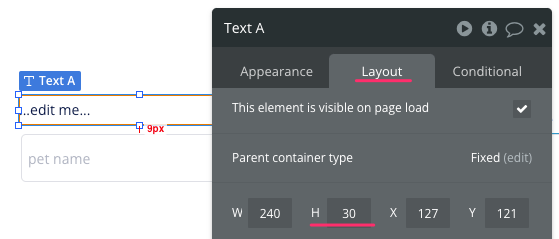

---

- こちらも要素の詳細を設定します
  - Appearance タブの上部にある「...edit me...」と入力されている部分を編集して「Name」と入力します
  - ダイアログ中段にある `Style` に `Heading 5` を選択します


---

- 同じ要領でその他のラベルもつけてみましょう
  - Category
  - Image
  - Birthday
  - Gender


---

- 同じ手順でもよいですが、先ほど作った Name のラベルをコピーして使い回すことで手間を省けます
  - コピー（Ctrl + C）してペースト（Ctrl + P）し、ラベルの内容だけ書き換える
  - Mac であればコピー（Command + C）とペースト（Command + P）


---

- 最後にペット画像以外の要素の幅を 250px に統一してください
- 各要素をダブルクリックしたときのダイアログから `W` (Width) の値を 250 に統一します
- 合わせて `X` (横軸の位置) の値を 適当な値（例えば 100）に統一します
  - これは見栄えを良くするためです
  - ペット画像は 2 列表示にしているので `X` の値も適宜調整してください


---

- 一つずつ変更していくこともできますが、要素が多いので一括で変更してみましょう
- 全て選択している状態で、どれか一つの要素を右クリック
- 表示されるサブメニューから Edit を選択

---

- するとダイアログが表示されるので、選択中の要素数が変更した要素数になっていることを確認
- 問題なければ、ダイアログの中から Layout タブを開き `W` (Width) の部分をクリック

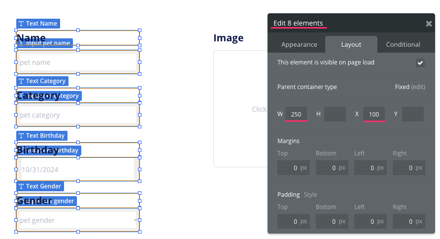

---

- すると選択中の要素に対して幅（W）と高さを一律で設定できるので、`W` に 250、`X` に 100 を入力して完了


---

- ここまで出来たら画面右上にある `Preview` をクリックしてプレビューを表示して動きを見てみましょう！

---

- すべての要素が表示されていますか？


---

- すべての入力フォームに値を入力できますか？
- 画像を指定すると表示されますか？

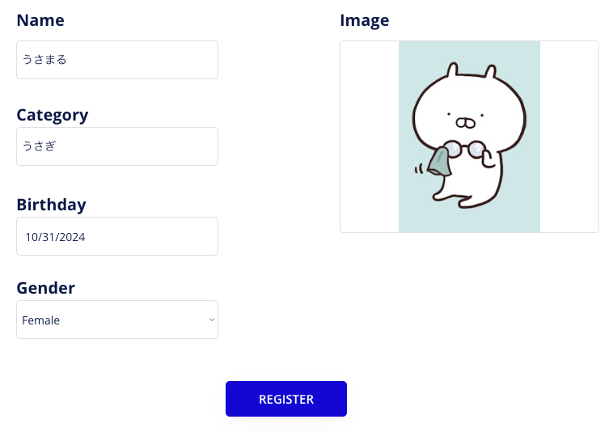

---

### データベースとつなげてみよう

- これで画面レイアウトが整ったので、いよいよデータベースとつなげてみましょう

---

#### まずはペットの情報を保存するための箱を用意します

- 左メニューのタブから Data を選択
- すると Data types タブを選択し、その下にある `New type` と書かれたテキストボックスに "Pet" と入力してください

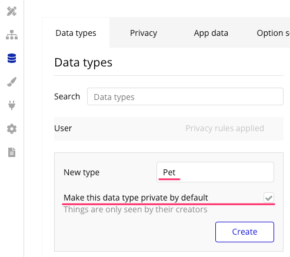

---

- そして `Make this data type private by default` のチェックをつけて `Create` ボタンをクリックします


---

- 作成した Pet の type に対して、先ほど整理したフィールドを追加していきます
- `Data types` から `Pet` を選択
- 右側の `Fields for type Pet` の下にある `Create a new field` をクリック


---

- するとポップアップが表示されるので必要な情報を入力します

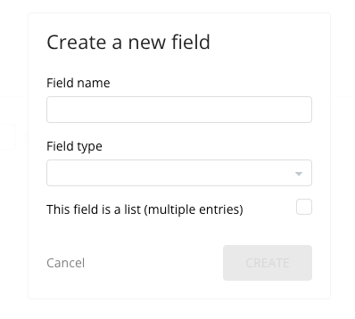

---

- `Field name` には要素の名前を入力します


---

- `Field type` には要素の種類（テキスト、数字、日付など）を選択します


---

##### それでは Pet type に必要な field を追加していきましょう

先ほどデータベース設計で考えた項目を設定していきましょう！

# :hourglass_flowing_sand:
# :hourglass:

---

こんな感じですね

- Name: text
- Category: text
- Image: image
- Birthday: date
- Gender: text

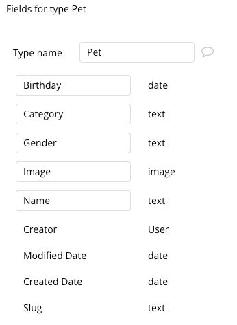

---

### 登録ボタンをクリックしたらペットを登録できるようにする

- ペットの情報を格納するための箱が準備できたので、いよいよ登録ボタンを押したときにデータベースに保存する動きをつけていきます

---

- 左メニューから Design タブを選択
- 左上から "pet_register" 画面を選択
- 右パネルからペット登録画面の "REGISTER" のボタンをダブルクリックします
- "Appearance" タブにある `Add workflow` をクリックします

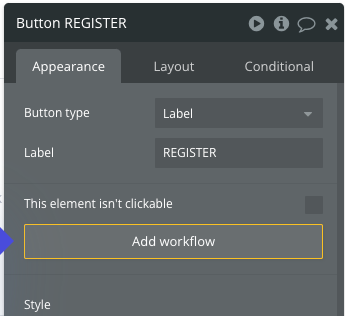

---

- すると Workflow タブに切り替わり、When の部分に `Button REGISTER is clicked` と表示されていると思いますので、`Click here to add an action...` を選択して、ボタン押下時の振る舞いを設定していきます


---

- `Click here to add an action...` を選択します
- 今回のように自分たちで作ったデータベース（テーブル）に関する操作（アクション）の場合 `Data(Things)` を選びます


---

- 下位要素の中から `Create a new thing...` を選択します


---

- `Create a new thing...` のダイアログが表示されるので、今回登録するタイプを指定します
  - 今回は Pet ですね
- すると `Set another field` というボタンが表示されるので、タイトルの通り画面で入力された項目を Pet の "field" にセットしていきます


---

- ここでは Pet に保存したい項目の "field" 名を左辺に指定し、右辺に実際にその "field" に保存する値を指定します
  - まず、左辺に `Name` を選択します

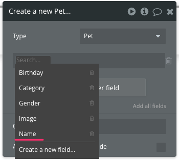

---

- 左辺を指定すると `=` に挟まれて今度は右辺に `Click` というのが表示されると思います


---

- 今回は自分で配置した「ペットの名前の入力項目の値そのもの」を指定します
- 皆さんならもう使い方をマスターされたと思うので、設定してみてください :wink:

---

- こんな感じですよね :wink:


---

- 残りも項目も全て設定してみましょう！

---

- もちろんこんな感じですよね :wink:

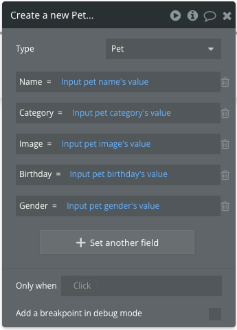

---

### 動かしてみよう！

- ここまで設定したら実際にプレビューでペットが登録されるかどうかを確認してみましょう
  - ちなみに "Ctrl + P" をクリックするとプレビュー表示ができます（ショートカットキー）
- 入力要素をすべて埋めて "REGISTER" ボタンをクリックしてみましょう
- 画面としては特に何も起こらないですが、実際にデータが登録されたかどうか見てみましょう

---

- プレビューを閉じ Data タブを開いて App data を選択、そして左パネル `All Pet` を選択したときに、先ほど画面から入力された情報が保存されていることを確認してください

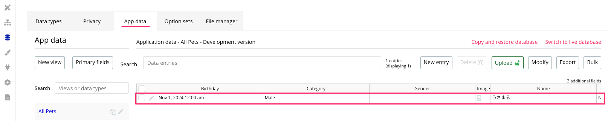

---

- これで画面で入力した内容をデータベースに保存するところまで出来ました！ :tada:

- 最後にログインなどと同じように、データベースへの保存が終わった後に `pet_list` へ遷移するアクションを追加します

# :hourglass_flowing_sand:
# :hourglass:

---

- それではプレビューしてみましょう
- ペット登録画面が表示されたと思うので、先ほどと同じようにペット情報を入力し "REGISTER" ボタンをクリックします
- すると、画面の動きとしてはペット一覧画面へ遷移することを確認しつつ、データベースに画面から入力したペット情報が保存されていることを確認できます

- 正しくペット情報は登録されていますか？ :raising_hand:

---

### ペットの一覧表示

- 次にペットの一覧画面を作り込んでいきましょう


---

#### ペット一覧画面を作り込んでいきます

- 左上のページ一覧から `pet_list` を選択
- 今回のように、同じ要素を繰り返し表示する場合、 `Containers` の中から `Repeating Group` を選択
- 右パネルのキャンバスにドラッグします


---

- 要素の詳細設定ポップアップが表示されるので設定していきます
- 一番上の要素名に `pet list` を入力
- `Type of content` には、繰り返し表示するデータのタイプを指定します
  - 今回は `Pet` ですね


---

- 一覧表の行数と列数を指定します
- 行数は動的に変わるものとしたいので、 `Set fixed number of rows` のチェックを外します
- 代わりに 1 行の最小となる高さを指定しておきます
  - 今回は "200px" とします


---

- 列数は今回 1 行当たり 3 つの画像を表示したいので `Set fixed number of columns` のチェックは ON のまま
- Columns の値を "3" とします


---

- 表全体の高さは 2 行分の高さを確保しておきたいので、 `Layout` タブを選択し `H` の値を "400" としておきます
- 1行当たりの画像のサイズを正方形にするため、`Layout` の `W` の値を "600" としておきます

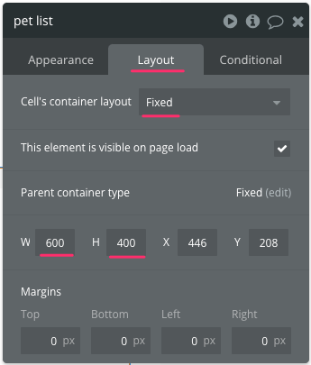

---

- また、各セル内の配置を固定の配置にするため `Cell's container layout` の項目に `Fixed` を選択しておきます


---

- 次に一覧表に表示するデータを指定します

- `Appearance` タブから `Data source` の Click から `Do a search for` をクリック
  - これは一覧表示対象のデータを指定するためのものです


---


- "Do a search for" のポップアップが表示されますので Type に `Pet` を指定
- これでペットの一覧検索だということを指定できました

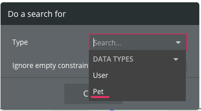

---

- これだけだと、登録されているすべてのペットの一覧が表示できてしまうため、ログインユーザが登録したペットだけを表示するように条件を追加していきます
- "Add a new constraint" をクリックし、さらに条件を追加します

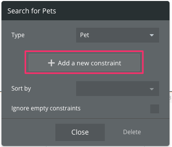

---

- 設定する条件としては「ペットの作成者（Created By）が "Current User" と同一であること」
- どんな設定内容になりますか？考えてみましょう！

- 次ページに答えが載っていますので、考えた後に見てみよう :eyes:


---

- こんな感じですね
- "A = B" という表現は Bubble を触っていると様々な場面で登場しますのでよく覚えておきましょう！

- これで一覧表で表示するデータの指定は完了です


---

- 次に繰り返し表示する内容を設定していきます
- 具体的には各セルの中に画像と名前を表示してみましょう


---

- まず `Visual elements` から `Image` を選択し、右パネルにドラッグ
  - このとき先ほど配置した "Repeating Group" の左上のセルに含める形でドラッグすると、後で移動する手間が無くなります
  - 後から Repeating Group に含めることも可能


---

- Repeating Group 内に配置したら `Layout` タブから画像のサイズと Repeating Group 内での位置を調整します


----

- `W`: 200 / `H`: 200 / `X`: 0 / `Y`: 0
  - セルの中いっぱいに表示するので、サイズ（W/H）はセルのサイズと同じで 200 x 200
  - 位置（X/Y）も左上から 0, 0 の位置に配置します


---

- 要素名には `pet list image` と名付けましょう

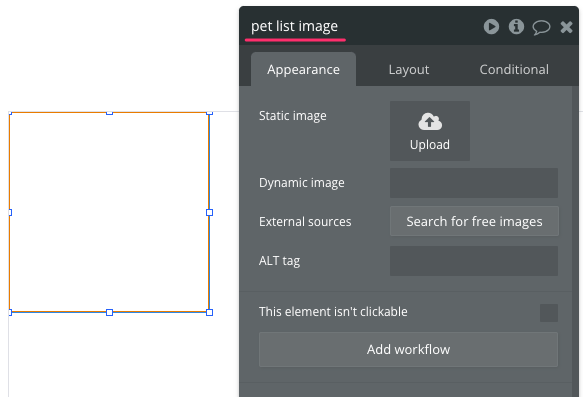

---

- 最後にどの画像を表示するかの設定を行なって行きます
- Appearance タブから "Dynamic image" を選択
- すると `Insert dynamic data` というボタン（のようなもの）が表示されるのでクリック
  - これは固定の値や画像を表示するのではなく、文字通り動的に値や画像を出したい時に利用する機能となります

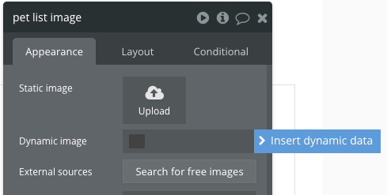

---

- クリックすると、プルダウンが表示されますので、そこから `Current cell's Pet` をクリック
- これは文字通り現在のセルのペットのデータを使いたい場合に利用できます

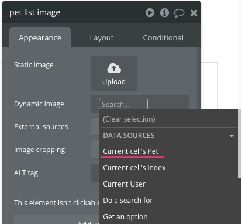

---

- `Current cell's Pet` を選ぶとさらにプルダウンが表示され、Pet タイプが持っている field が表示されますので `'s Image` をクリック
- これで、現在のセルのペットの画像を表示する、という命令になるため、ペットデータが複数存在する場合に、それぞれのセルにペットの画像が並ぶようになります

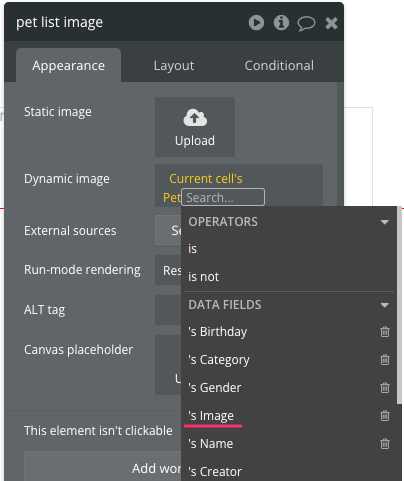

---

- 先ほどセルの横幅いっぱいに画像を表示する設定にしたのですが、画像要素の `Run-mode rendering` の値を "Stretch" から "Zoom" に変えておきましょう
- こうしないと、セルの中で画像の縦横比率を自動で変えられてしまうため、拡大表示に変更します

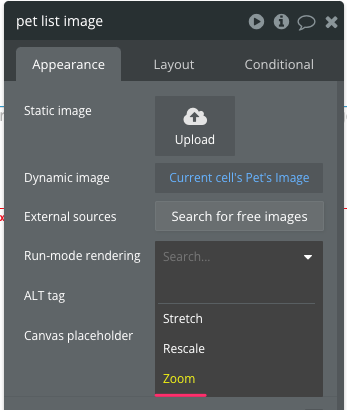

---

- 続いて画像下に表示する名前の背景を設定しましょう
- `Visual elements` から `Shape` を選択し、右パネルにドラッグ
- こちらも "Repeating Group" の中に含める形でドラッグ

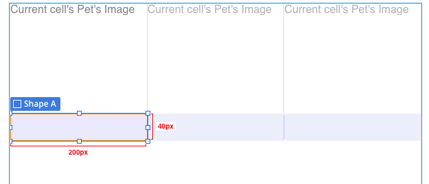

---

- この配置した要素の位置も `Layout` タブから設定しておきます
  - `W`: 200（画像と同じ幅）
  - `H`: 40
  - `X`: 0
  - `Y`: 160（高さ 40 のオブジェクトを下いっぱいに設置するため、200 - 40 = 160）

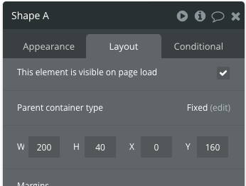

---

- 配置した Shape の下に薄く画像が見えるよう、透過率を少し下げてみましょう
- "Shape A" の Appearance タブを開く
- Style の内容が "Shape" になっていることを確認したらその下にある "Edit style" をクリック

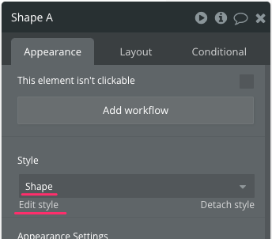

---

- すると、Styles タブに移動し、先程選択されていた "Shape" のスタイル編集画面が表示されます

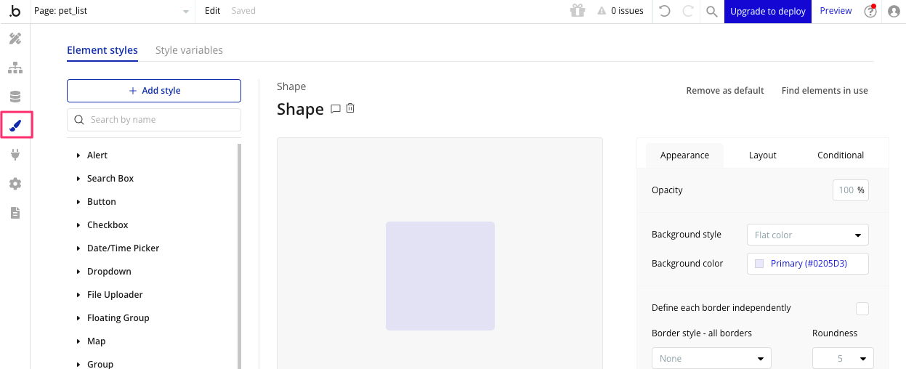

---

- ここで Background Color の内容を選択すると、色と透過率を変更するポップアップが表示されるので、"Primary" の右側の数値を `10%` から `20%` に変更します
- この数値が透過率となっており、100 が非透明、0 が透明となります

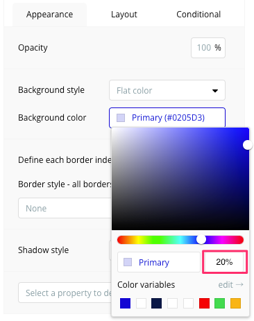

---

- 最後にペットの名前を表示します
- `Visual elements` から `Text` を選択し、先ほど配置した Shape の上にドラッグ
- こちらも Repeating Group の中に含める形でドラッグ

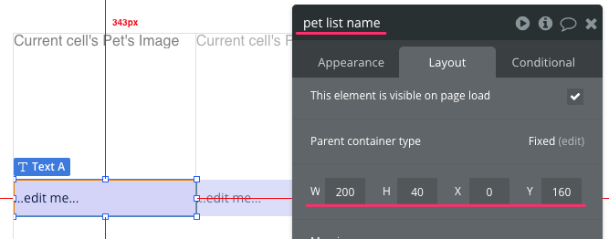

---

- 配置した後に Shape と同じサイズになるよう Layout タブから設定しておきます
- 要素名に `pet list name` と名付けましょう


---

- ペットの画像と同様、ペットの名前も Dynamic data を使います
- `...edit me...` となっている部分をクリックすると、画像の時と同様 `Insert dynamic data` が表示されるので、そこから「現在セルのペットの名前」を設定してみましょう


---

- `Current cell's Pet` --> `'s Name` を選択

- これで一覧表で表示する内容の設定は完了です


---

#### ここまで出来たらプレビューしてみましょう

- ペットの一覧として、ペットの画像とペットの名前が表示されていますか？


---

##### 演習1

ペットの名前を中央寄せにして文字を少し大きくしてみましょう


---

- Hint :bulb:
  - 新しい "Style" を作成して "pet list name" に設定する


---

#### ペット一覧から登録画面の導線を用意しましょう

- ペットの一覧画面が出来たので、一覧画面から登録画面への導線を用意しましょう
- この導線はペット一覧画面の上部に用意してみます

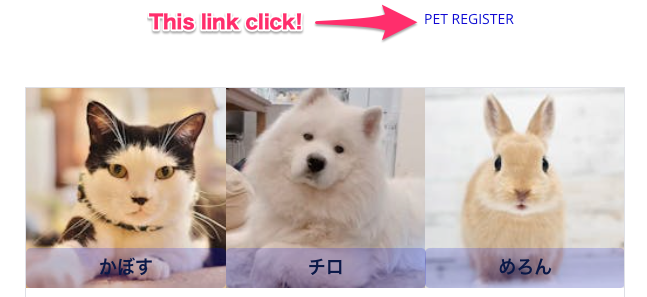

---

- "Sing up" / "Log in" で学んだ皆さんならすぐ設定できると思います！
- 設定してみましょう！


---

- こんな感じですね
- リンクの名前は "PET REGISTER" としました
- 遷移先である `Destination page` に "pet_register" を選択


---

#### ではプレビューしてみましょう！

- ペット一覧の上部に設置された "PET REGISTER" のリンクをクリックして、ペット登録画面へ遷移しましたか？


---

## ペット詳細画面を作ってみよう

- 続いてペット詳細画面を作っていきます
- ここでのポイントは、一覧画面で選択されたペットの情報の受け渡し部分ですね

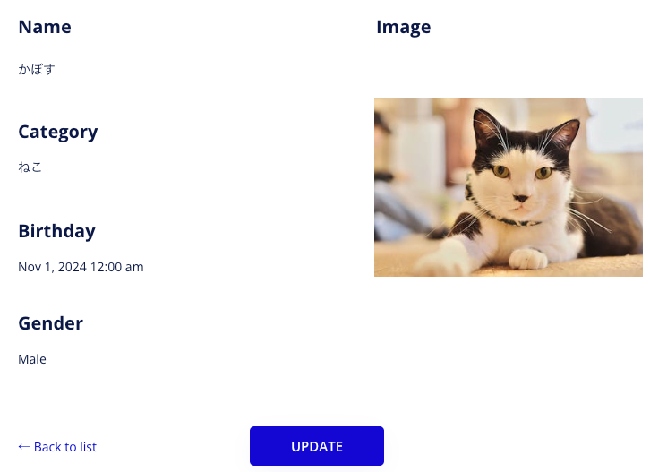

---

### まずは詳細画面を新たに用意

- 左上から "Add a new page..." を選択
- "Page name" は `pet_detail`
- "Clone from" は画面構成が似ているので `pet_register` を選びましょう


---

- クローン（コピー）してきたままだと、登録画面と同じになってしまうので見直していきます

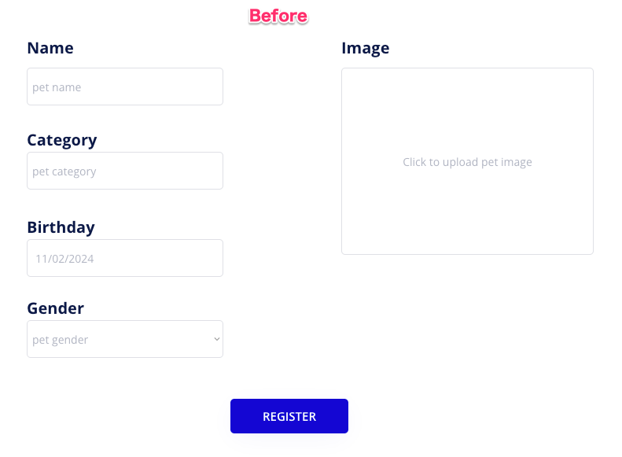

---

- まずは入力項目として用意した入力要素をすべて削除します


---

- 合わせて、ワークフロータブから、REGISTER ボタンを押した時の設定を削除しておきます
- REGISTER ボタンのワークフローを選択すると、右下にゴミ箱アイコンが出てくるので、それを押すとワークフローの定義を削除できます

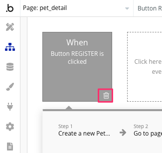

---

- 続いて表示用の要素を配置していきます
- "Visual elements" からそれぞれの要素ドラッグしてみましょう
  - Name: Text
  - Category: Text
  - Image: Image
  - Birthday: Text
  - Gender: Text


---

- 要素の幅（w）は Image 以外 250px としてください
- Image だけは少し大きく 300px x 300px としました

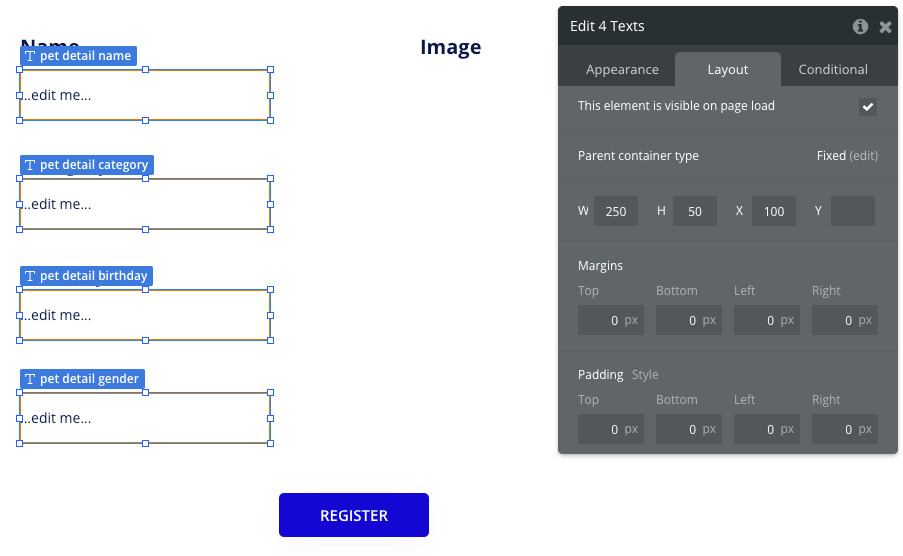

---

- 要素の準備が出来たら実際にデータベースから参照する値を定義していきます
- まず最初にこの画面自体の詳細設定用ダイアログを表示します

---

- 左上の部分から `pet_detail` を選択すると、ダイアログが表示されます
- 要素がいくつも重なっているときなどはここから要素を選ぶことも出来て便利です！


---

- ちなみに、左パネルの "UI Builder" の中にある "Elements Tree" の `pet_detaiL` を選んでも同様です

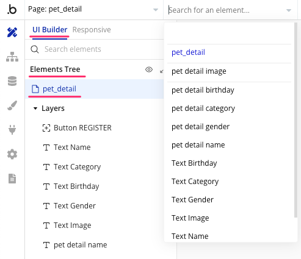

---

- pet_detail 画面の詳細設定ダイアログの "Appearance" タブを開く
- その中から `Type of content` という項目があるので、そこで `Pet` を指定します


---

- こうすることで、この画面を表示する元となるデータベースのタイプ（テーブル）が何なのかを指定でき、各項目にはそのタイプのどのフィールドを使うのかを指定するだけで済みます


---

- ちなみに、タイプは指定できましたが、具体的にどのペットの情報なのか（ポチなのかタマなのか）は一覧画面から遷移するときに指定しますが、これは後ほど設定しましょう :dog::cat:

---

- それでは表示用の要素と Pet タイプのフィールドを紐付けていきます
- まずは Name からやってみましょう
- 今回のように、データベースから取得した値を動的に表示したい場合、どうやるか覚えていますか？

:sunglasses:

---

- そうです！ "Dynamic data" を使います！
- Name の "Text" 要素をダブルクリックし `...edit me...` と書かれた部分をクリックすると `Insert dynamic data` というボタンが表示されるのでクリック


---

- すると、プルダウンが表示されるので、その中から `Current page's Pet` をクリック
- これは文字通り現在のページに割り当てられたペットの情報を指しています
- すると Pet タイプが持っているフィールドが表示されるので `'s Name` を選択

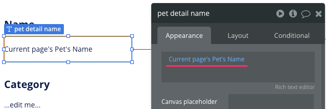

---

- 同じ要領で Category / Image / Birthday / Gender の Dynamic data を設定してみましょう

---

- 設定が済んだらプレビューしてみましょう
- 正しく値が表示されませんよね？


---

- これはまだ一覧画面からどのペットの情報なのか？を指定していないからです
  - `Lorem ipsum` と出ているのはよくあるダミーコンテンツのイディオムを Bubble が自動的に出しています


---

### それでは一覧画面と詳細画面をつなげてみましょう

- 左上のメニューから pet_list ページに切り替えます
- 画面操作のイメージとしては、ペット一覧画面で表示されているペットの画像をクリックしたら、そのペットの詳細画面へ遷移させたいですね
- なので、一覧画面のペット画像に対してワークフローを設定していきます

---

- 要素一覧から "pet list image" をクリック
- 詳細設定用ダイアログから `Add workflow` をクリックします

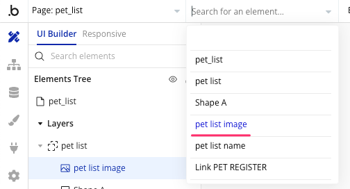

---

- すると "When pet list image is clicked" の箱に対して振る舞いを設定する前の状態になっているかと思いますので、このまま設定していきます


---

- 画面遷移の Action は何度も設定しているので分かりますよね :sunglasses:
- 今回はそれにプラスして、画面遷移時に選択された画像のペット情報を遷移先に渡す、という設定を行います
- きっと皆さんならわかると思いますので、設定してみて下さい！


---

- そうです！ "Data to send" の項目ですね
- ここを "Click" して表示される候補の中に見慣れた "Current cell's Pet" があるので、これが正解です


---

- それではプレビューしてみましょう
- 一覧画面でペットの画像を選択すると、そのペットの詳細画面が表示されることを確認できましたか？


---

- ここで表示のアドバイス
- Birthday と Gender の表示が少し味気ないので、表示の書式を変えてみましょう

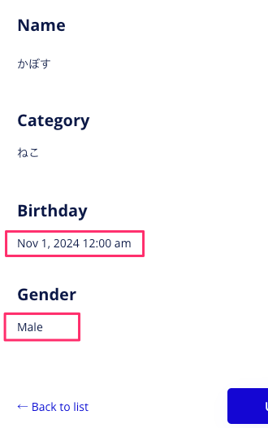

---

##### 演習2

誕生日の書式を `2024年11月9日` の形式に変えてみましょう

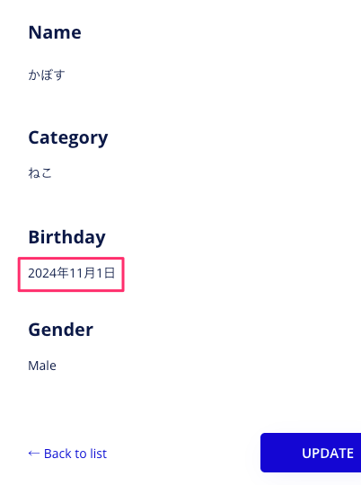

---

- pet_detail 画面で Design タブで開きます
- そして Birthday の表示要素をダブルクリックし、詳細設定用ダイアログを表示します

---

- そして `Current Page Pet's Birthday` の Birthday の部分をクリックすると、後ろに `More` という項目が表示されると思いますので、それをクリックします


---

- すると Birthday の値の表示フォーマットをさらに指定できるようになります
- 今回は一番上の `:formatted as DD/MM/YY` をクリックします
  - DD/MM/YY には本日日付が入っていると思います


---

- すると、さらに隣に `Date Formatting` のダイアログが表示されると思います
- ここでフォーマットの細かな指定が可能です
- 今回は `Format type` に `Custom` を選択し、 `Custom format` に `yyyy年m月d日` を指定します


---

- それではプレビューしてみましょう
  - 一度 index ページを開いた上で、プレビュー実行
- ペット一覧からペット詳細を開いてみると Birthday の日付が指定した書式になっていると思います


---

##### 演習3

性別のラベルを変えてみよう

- 性別が "Male" だったら "男の子"
- "Female" だったら "女の子" と表示してみましょう！

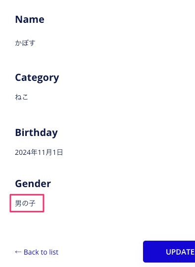

---

- pet_detail 画面を Design タブで開きます
- そして Gender の表示要素をダブルクリックし、詳細設定用ダイアログを表示します
- 今回は Conditional のタブから条件設定によって表示する文字列を変えてみましょう

---

- まず、先ほど Appearance タブで入力していた `Current Page Pet's Gender` の入力欄にカーソルを合わせ、Delete ボタンで入力内容を削除します

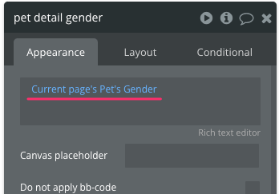

---

- 続いて Conditinal タブを開き、 `Definel another condition` ボタンをクリックし条件を追加します


---

- まず「現在表示しているペットの性別が "Male" の場合」という条件を When に指定します
- Male だけ手入力で、それ以外はプルダウンから選択ですね


---

- When が設定できたら、その条件が true の時の振る舞いを設定します
- 今回の場合、特定も文字列を表示したいので "Select a property..." のプルダウンから "Text" を選択します

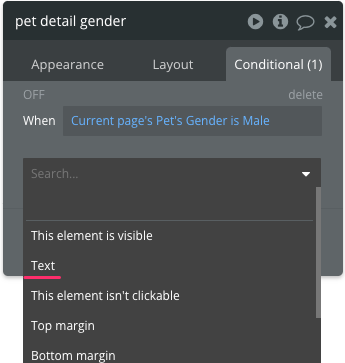

---

- すると、文字列の入力欄が表示されるのでそこに「男の子」と入力します

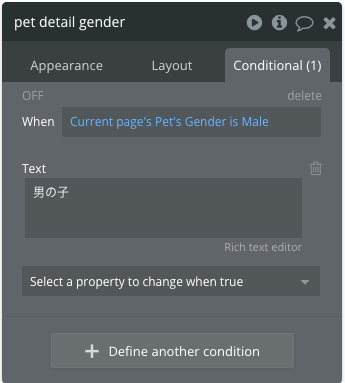

---

- 同じ要領の「女の子」の設定をしてみましょう

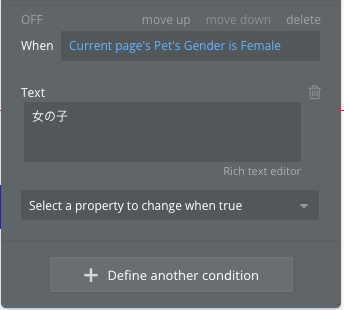

---

- 女の子の設定は、「現在表示しているペットの性別が "Male" ではない場合」という書き方でも OK


---

- これは下記の処理を書いていることになります

```
現在のペットの Gender（性別）が Male だった場合には「男の子」、
Female だった場合には「女の子」を表示する
```

ここで少しプログラミング的な要素が出てきましたね！

- Birthday のように要素自体の値を加工するような場合は Format を指定するのが良いですが、今回のように要素の値に応じて何か処理をしたい場合には Conditional を使うと良いでしょう！

---

- それでは index ページからプレビュー実行してみましょう
- ペット一覧からペット詳細を開いてみると Gender の値が「男の子」「女の子」になっていると思います


---

##### 演習4

詳細画面から一覧画面への導線を設けてみよう

- 詳細画面から一覧へ戻るための導線を用意してみましょう
- これまでの講義を踏まえるときっとイメージは沸いていると思うので、完成イメージだけ記載しておきます！

---

#### 完成イメージ


---

## 画面間の共通部品を作っていこう

- ここで画面作成から少し離れ、"共通部品" の作成をしていきます
- "共通部品" とは複数の画面で同じように使われる要素をまとめたものを指し、今回はヘッダー部品を題材に作成していきます

---

#### 作成するヘッダー部品の機能

- ペット登録画面へのリンク
- ログイン状態に応じたログイン / ログアウトボタンの制御

**ログアウト中**


**ログイン中**
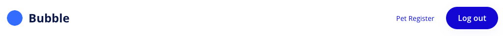

---

#### なぜ共通部品を作成するか？

- ヘッダー部品のような、複数の画面で利用したい要素を、それぞれの画面に個別に準備するのは手間ですよね
- また、個別に準備した場合、その内容を変更しようとした時に、それぞれの画面に対して修正が必要になり、開発の手間が増えてしまいます

---

- そこで Bubble では "Reusable elements" のコンポーネントを用いて、そのような問題を解決します
- 今回はヘッダー部品を "Reusable elements" として作成し、ペットの一覧・登録・詳細画面に配置していきます

---

#### ヘッダー部品の作成

- 左上の画面一覧を開き、その中にある "Add a new reusable element..." をクリック


---

- すると、画面作成時と同じポップアップが表示されるので、今回は共通部品の名前として "header" と入力して CREATE をクリック

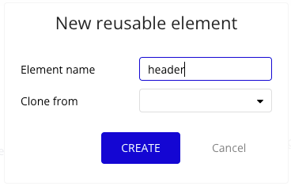

---

- すると右パネルに縦横 120px x 200px のエリアが表示されると思います
- このままでは少し横幅が狭いので、まずはエリアの領域を調整します


---

- 右パネルのエリア内で右クリック --> Edit
- 見慣れたポップアップが表示されるので "Layout" タブを選択
- Container layout を "Fixed" に変更し、 `Width` を "1200"、 `Height` を "72" に変更


---

- それではヘッダーの共通部品を作り込んで行くのですが、今回も Sign up などと同様 "Components" の中からヘッダー部品を流用してみます

---

- Header 部品を流用するにあたり、いくつかの Plugin をインストールしないと使えないものがあるため、Component ライブラリの "Plugins required" に表示されている通り Plugin の `Install` を実行します
- これで Header に関するコンポーネントを選択できるようになりました


---


- 今回はこの中にある "Headers" 部品の中から一番上の部品を選択して、右パネルにドラッグします
- 配置したら Component Library の右上の ×  ボタンをクリックして閉じます

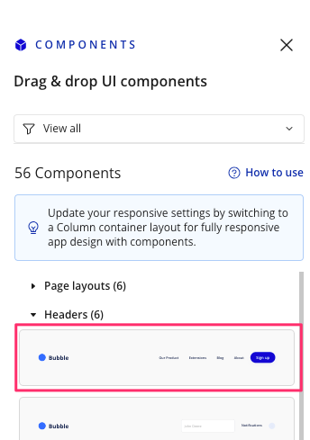

---

- すると Bubble が用意している Header のサンプルが右パネルに表示されていますね
- 今回はこれをカスタマイズしていきます


---

- まずは今回のヘッダー部品として不要なものを削除します
- 下記 3 つの要素を選択して削除しておきます
  - Our Product
  - Extensions
  - Blog
- "About" の要素は次のステップで使い回すので残しておきます
- 誤って他の要素を削除しないよう注意してくださいね

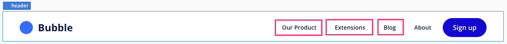

---

- 削除後はこんな感じです

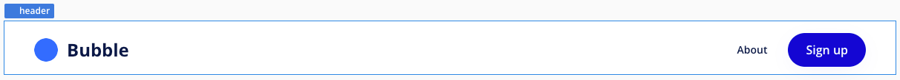

---

#### ペット登録画面へのリンクの設置

- まずはペット登録画面へのリンクを設置してみましょう

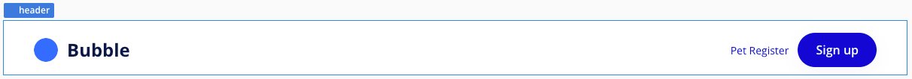

---

- 先程残しておいた "About" の要素をダブルクリックして編集ポップアップを表示します
- そのポップアップの下の方にある `Replace` というボタンをクリック

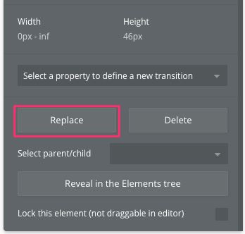

---

- これは、選択中の要素の種類を変更する機能となります
- 今回はこの Text 要素を Link 要素に置き換えていきます
- `New element type` の中から "Link" を選択して REPLACE をクリック


---

- これで要素の種類が Link に置き換わりました
- ただ、もともとの要素に設定されていた `Style` や `Conditional` は残っているので、これを変更していきます

---

- まずは `Style` をリンクに変更します
- 要素の編集ポップアップから `Style` に "Standard Link" を選択


---

- 文字列の内容も "Pet Register" に変更
- 遷移先も "pet_register" を設定


---

- Style を変更したことで `Conditional` の内容も削除されています
- キャプチャの通りになっていれば OK


---

- これでペット登録画面へのリンクの設置は完了です


---

#### ログイン状態に応じたログイン / ログアウトボタンの制御

- ログイン、ログアウトボタンの準備をしていきます

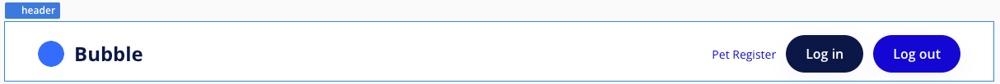

---

ここでやることは 5 つです

1. Sign up ボタンをコピーして Log in ボタンを用意する
2. ログインボタンは「未ログイン状態の時だけ表示する」
3. ログインボタンを押すとログイン画面（login）に遷移する
4. サインアップボタンをログアウトボタンに変更し、「ログイン済み状態の時だけ表示する」
5. ログアウトボタンを押すと、ログアウト状態にした上でログイン画面（index）に遷移する

早速やっていきましょう :muscle:

---

#### 1. Sign up ボタンをコピーして Log in ボタンを用意する

- Design タブの左メニュー "Elements Tree" から "Button Sign up" を右クリックして `Copy`


---

- 再度 "Button Sign up" を右クリックして `Paste`

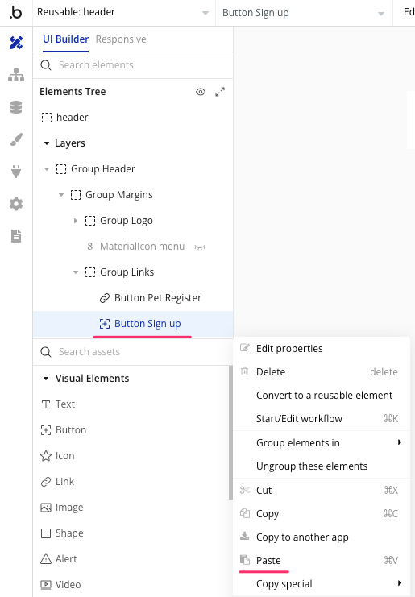

---

- "Button Sign up" が 2 つになったと思うので、上の要素を選択

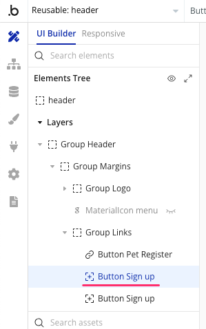

---

- 右パネルに詳細設定ダイアログが出ているので、まず要素名を `Button Log in` に変更
- Appearance タブから Label（ボタン名）を `Log in` に変更
- Sign up ボタンと Log in ボタンを区別しやすくするため、Sign up ボタンの背景色を適当に変更

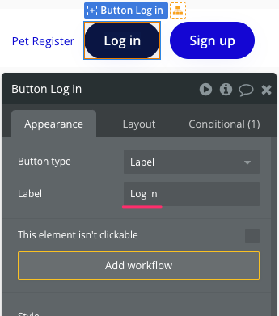

---

#### 2. ログインボタンは「未ログイン状態の時だけ表示する」

- 制御のイメージとしては下記のようになります
  - ログインボタンは非表示にしておく
  - Conditional の条件で、現在ユーザが未ログイン状態であれば、ログインボタンを表示する

---

- まずログインボタンの編集ダイアログを表示
- Layout タブの `This element is visible on page load` のチェックを外します
- これにより、画面表示時に、この要素は表示しない、という制御になります

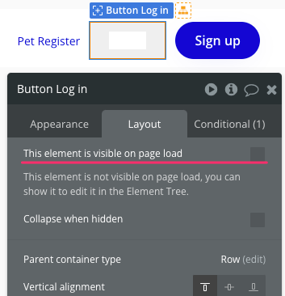

---

- 次に、ログイン状態による制御を行います
- Conditional タブから `Define another condition` をクリック
- When の条件に「現在ユーザが未ログイン状態」という内容を設定してみましょう


---

- こんな感じですね
- `Current User is logged out`

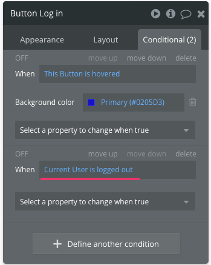

---

- そして、When の条件を満たした時に行う処理を `Select a property to change when true` で選択します
- 何を選択するか分かりますか？ :thinking:

---

- 答えは `This element is visible`
- これを選択し、チェックをつければ OK です

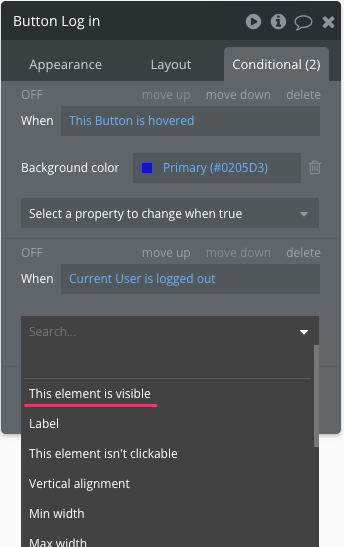

---

- これで、下記の状態が準備できました
  - ログインボタンは非表示にしておく
  - Conditional の条件で、現在ユーザがログアウト状態であれば、ログインボタンを表示する


---

#### 3. ログインボタンを押すとログイン画面（index）に遷移する

- 次に "Log in" ボタンを押したらログイン画面へ遷移するワークフローを設定します
- 単純な画面遷移だけなので、みなさん設定してみましょう！

# :hourglass_flowing_sand:
# :hourglass:

---

- 設定するワークフローは Go to page
- Destination にログイン画面である index を選択すれば OK

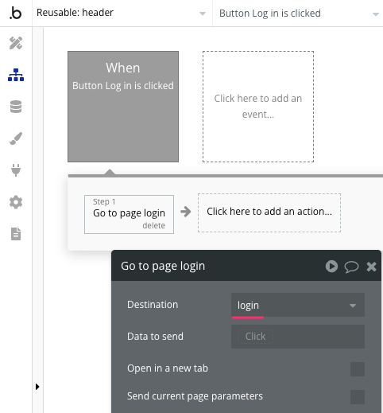

---

- これでログインボタンの制御は完了です
- 続いてログアウトボタンの制御を行っていきましょう

---

#### 4. サインアップボタンをログアウトボタンに変更し、「ログイン済み状態の時だけ表示する」

- まず "Sign up" ボタンのラベルを "Log out" に変更しておきます


---

- そして表示・非表示の制御については、先ほどのログインボタンとほぼ同じです
  - ログアウトボタンは非表示にしておく
  - Conditional の条件で、現在ユーザがログイン済み状態であれば、ログインボタンを表示する

- 先ほどの内容を参考に、設定してみましょう

# :hourglass_flowing_sand:
# :hourglass:

---

- まずログインボタンの編集ダイアログを表示
- Layout タブの `This element is visible on page load` のチェックを外します
- これにより、画面表示時に、この要素は表示しない、という制御になります


---

- そして Conditional の内容はこんな感じです
- When の条件としては `Current User is logged in`
- これで、下記の状態が準備できました
  - ログアウトボタンは非表示にしておく
  - Conditional の条件で、現在ユーザがログイン済み状態であれば、ログアウトボタンを表示する

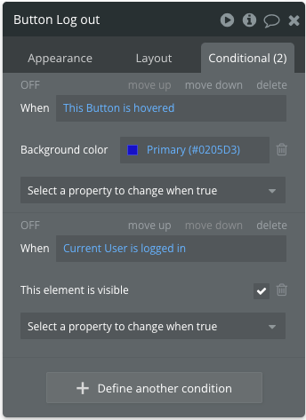

---

- 実はもう 1 箇所、これと同じ Conditional の条件を設定して、現在ユーザがログイン済み状態の時だけ要素を表示する制御を行う箇所があります
- どこか分かりますか？ :thinking:

---

- 最初に追加した "Pet Register" のリンクです
- ペットのデータは、ログイン中のユーザに対して関連づけるデータです
- そのため、ログイン済み状態のときだけペット登録画面へ遷移できるよう "Pet Register" のリンクにも Conditional をセットしておきましょう

---

- 先ほどのログアウトボタンと同じ制御なので分かりますよね :smile:

---

- こんな感じです :+1:


---

#### 5. ログアウトボタンを押すと、ログアウト状態にした上でログイン画面（index）に遷移する

- 最後に "Log out" ボタンを押した時のワークフローを設定します
- こちらもまずはみなさんで設定してみましょう！

---

#### Hint :bulb:

- ログアウト状態にするワークフローのヒントは "Account" の中のどれかのアクションです

# :hourglass_flowing_sand:
# :hourglass:


---

- ログアウト状態にするアクションは "Account" の "Log the user out" です
- その後に画面遷移のアクションを設定すれば OK

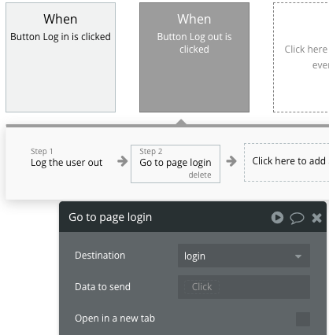

---

- これでヘッダー部品に関する設定が完了しました


---

やったこと

- ペット登録画面へのリンク
- ログイン状態に応じたログイン / ログアウトボタンの制御
  1. Sign up ボタンをコピーして Log in ボタンを用意する
  2. ログインボタンは「未ログイン状態の時だけ表示する」
  3. ログインボタンを押すとログイン画面（login）に遷移する
  4. サインアップボタンをログアウトボタンに変更し、「ログイン済み状態の時だけ表示する」
  5. ログアウトボタンを押すと、ログアウト状態にした上でログイン画面（index）に遷移する

---

ちなみに...

- みなさんのヘッダー部品では先ほど設定した 3 つの要素が表示されていないと思います
- これは設定の中で、初期状態では非表示設定にしたからですが、その状態でも要素を表示する方法があります

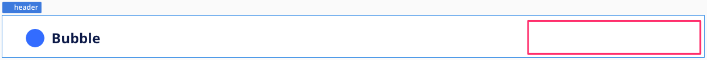

---

- 左パネルの中から `Elements tree` を開き、"Element tree" と書かれた右端にある "Collapse all" をクリック
- するとアイコンが変わり "Expand all" に切り替わるので再度クリック


---

- すると、現在の画面（もしくは共通部品）内に配置されているすべての要素がツリー形式で表示されます
- この表示順序にも意味があり、下に表示されているのが、画面上でいうところの前面に表示されているものになります

---

- ここに表示されている要素は、今表示している画面（共通部品）に含まれている全ての要素です
- 表示順序にも意味があり、下に表示されているのが、画面上でいうところの最前面に表示されているものになります

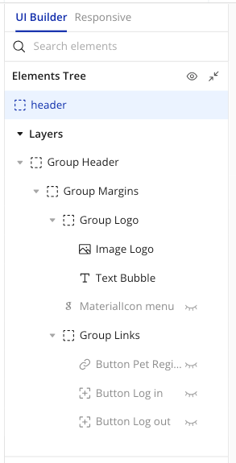

---

- そして、その中で下の方にある "Group Links" のグループの中に、先ほど操作していた下記 3 つの要素が表示されているはずです
  - Button Pet Register
  - Button Log in
  - Button Log out


---

- この 3 つの要素それぞれの右にある「目」のアイコン👁️
- これが ON と OFF の状態があり、ON が右パネル上に表示、OFF が右パネル上に非表示、を表します


---

- 今回操作した 3 つの要素についても、この「目」のアイコンを一度 OFF にして、再度 ON にすると、右パネル上でもボタンが表示されます
- これは右パネル上での表示 / 非表示の制御であり、実際のアプリケーション上での表示 / 非表示とは関係ないので注意してください


---

- 最後に、現在のヘッダー部品の幅と、画面の幅を合わせるため、`Elements tree` から、下記要素を選択し "Layout" タブから `Width` or `W` の値を "1080" に変更します

---

- 共通部品自体である "header"

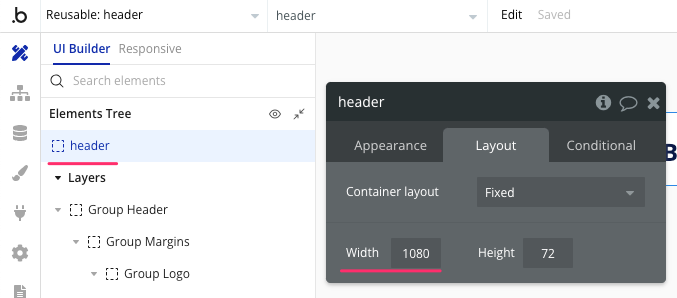

---

- "Group Header"


---

- `Width` を変更したことで、"Pet Register" のリンクやログインのボタンが見えなくなった場合は、先ほどと同じ手順で、`Elements tree` からボタンなどの要素の「目」のアイコンをクリックして表示 ON にすると見えるはずです

---

### 各画面に組み込んでみよう

- ヘッダー部品ができたので、まずはペット一覧画面に組み込んでみましょう

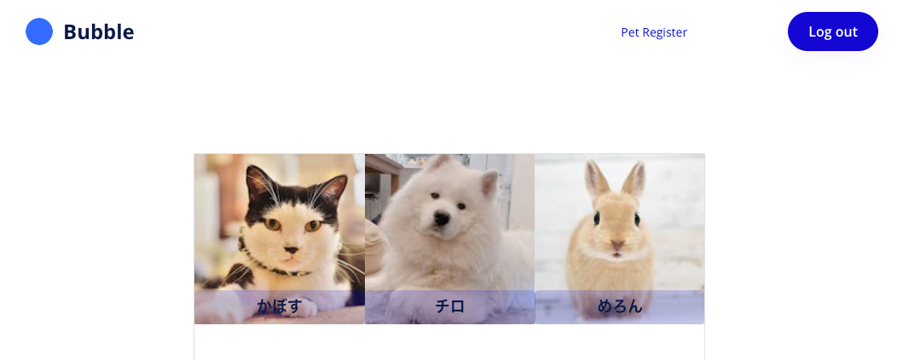

---

- "pet_list" を開き、最初に配置した "PET REGISTER" のリンクを削除します


---

- 左パネルから `Reusable elements` の中にある "header" をクリックして、右パネルの上部にドラッグします
- 画面の最上部に設置しておきましょう


---

それではプレビューしてみましょう 🙋‍♀️

---

#### ログイン状態の場合

- ペット登録のリンクが表示されていること
- ログアウトボタンが表示されていること
- ログアウトボタンを押すと Log in 画面へ遷移すること


---

#### ログアウト状態の場合

- ペット登録のリンクが表示されていないこと
- ログインボタンが表示されていること
- ログインボタンを押すと Log in 画面へ遷移すること

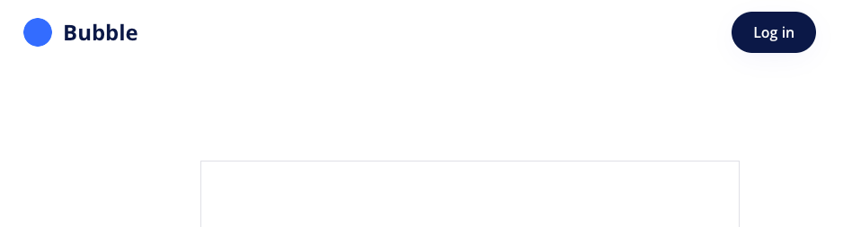

---

- 問題なければ残りの画面へ同じように組み込んでおきましょう
  - ペット登録画面
  - ペット詳細画面

Let's Try!! :fire:

---

# :hourglass_flowing_sand:
# :hourglass_flowing_sand:
# :hourglass_flowing_sand:
# :hourglass:
# :hourglass:

---

- 念の為プレビューを行い、各画面で共通ヘッダーが正しく表示されていることを確認しておきましょう！

---

#### ペット登録画面

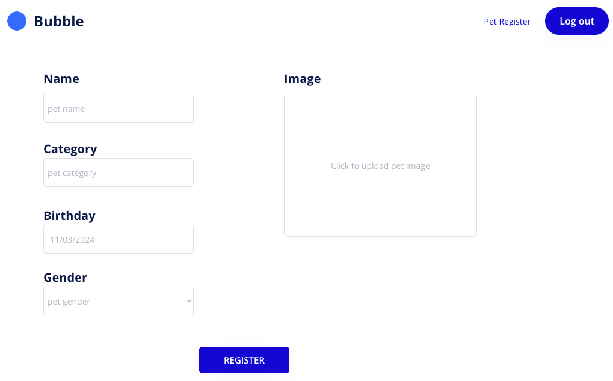

---

#### ペット詳細画面


---

##### 演習5

ペット登録画面のリンクも出し分けしてみよう

- 余裕のある人はペット登録画面ではヘッダーの "Pet Register" のリンクを表示しない設定をしてみましょう
- Hint :bulb:
  - "Current page name"
  - ペット登録画面のページ名は "pet_register"

---


##### 演習6

詳細画面から更新画面への導線を設け、更新機能を作ってみよう


---

ポイントとしては次のシートの通りです！ぜひ実践してみてください！

- 更新画面は登録画面とほぼ同じ画面要素を持つので `pet_register` を Clone して `pet_update` を作ってみましょう
- 登録画面では、各入力要素（名前や誕生日など）の中身は空っぽでしたが、更新画面では既に登録済みのデータの値を画面表示時点でセットしてあげる必要があります
- 各入力要素のダイアログからそれっぽい項目がありますので、そこに初期値となる値を指定します
  - Hint:bulb: Insert dynamic data
  - Hint:bulb: Initial content

---

- 更新ボタンを押したときの振る舞いについては、新規登録時には `Data(Thing)` の `Create a new thing...` でしたが、今回は更新ですよね
  - 更新といえば change... お、それっぽいアクションがありそうですね :yum:
- 最後に詳細画面から更新画面へ遷移するとき、詳細画面で表示しているペットの情報を渡してあげる必要がありますね。これは今日の講義で学んだ部分です！
  - Hint:bulb: Data to send

---

##### 演習7

ペットの体重管理機能を作ってみよう

- 1匹のペットに対して日毎の体重を複数管理できるようにし、その体重の変遷をグラフで表現してみよう


---

ポイントとしては以下の通りです！ぜひ実践してみてください！

- 新たなテーブルとして PetWeight を作成
  - 必要な項目は何がありそうだろう 🤔
    - 体重
    - 体重を測った日付
    - 元となるペットとの関連付け
    - 他にある？

- 体重管理の画面に必要な要素は
  - 体重の情報（重さと計測日）を入力する部品
  - 体重のグラフ

---

##### 演習8

未ログイン状態では常にログイン画面へ遷移させてみよう

- ヘッダー部品を配置した画面は、全てログイン状態でなければ使わせたくないですよね
- そこで、ヘッダー部品を配置した画面に、未ログイン状態で遷移した場合にはログイン画面（index）へ強制遷移させるようにしてみましょう

---

- Hint :bulb:
  - ヘッダー部品を配置した各画面に対してワークフローを設定するのではなく、ヘッダー部品そのものにワークフローを設定します
  - 設定する内容はシンプル
  - When: 現在ユーザが未ログインであれば "Go to page index"

- 次のページに答え（設定内容）を書いています！

---

- ヘッダー部品に対して
  - When: User is logged out
  - Go to page login
- ※他のワークフローと違ってボタンをトリガーにしないため、分かりやすく色を変えました


----

##### 演習9

今日学んだことを活かして新たな機能を作ってみよう

今日学んだ機能を使って、自由に機能追加してみてください
できたら Slack でログイン画面の URL を共有して、みなさんに見てもらいましょう

---

##### 演習9の結果発表

(時間があれば)

演習で作った画面・機能を紹介してみませんか :smile: ?

---

## まとめ

- 本日の講義ではノーコードツールである Bubble について、使い方から始まり、実際に画面をデザインしてデータベースとの連携まで行いました
- 次回はゼロからアプリケーションを開発する場合に必要な基礎知識を学んでいきます

---

# 以上です！
# お疲れさまでした！
