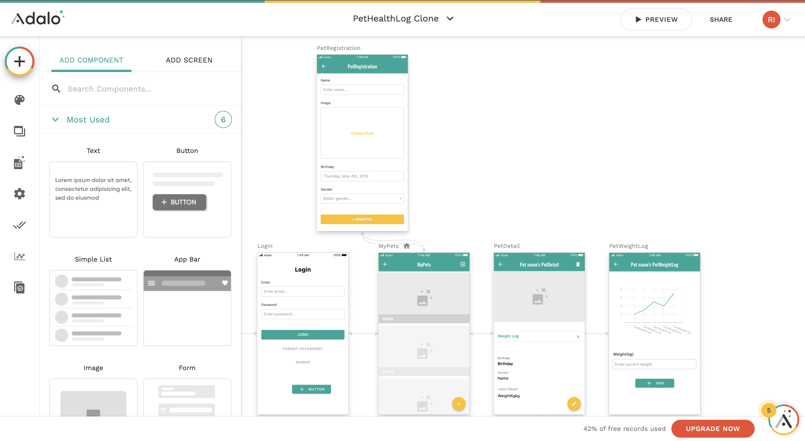

**Programming Boot Camp**

# ノーコード開発とは

**東京工業大学 2023/11/3**
　
　
　
　
　
　　　　　　　　　　　　　　　　　　　　　　　　**Ryo Imahashi**

---
## 目次
  - ノーコード開発とは
  - ノーコード開発のメリット、デメリット
  - なぜノーコード開発をするのか
  - ノーコード開発ツールにはどのようなものがあるか
  - Programming Boot Campで扱うノーコード開発ツールの紹介
---
## ノーコード開発とは
ノーコード開発とは、プログラミング言語でコードを書くことをせずにアプリやWebサービスの開発をすることです。

プログラミング言語でコードを書く従来のアプリ開発(スクラッチ開発)と比較して、ノーコード開発では、短時間でアプリを開発できる場合が多いです。

プログラミングの知識を持つエンジニアでなくても、ノーコード開発であれば、アプリをつくることが可能になります。

<!-- 参考: ローコード開発というものもある。ソースコードをまったく記述しないノーコードに対して、ローコードは「極力ソースコードを書かない」ようにしたサービスです。一部ソースコードを記述する必要がある分、ローコードの方が拡張性が高く、高性能なWebサービス開発が可能という特徴を持ちます。
ノーコードはソースコードを書かない開発、ローコードはソースコードの記述量を最小限に抑えて開発することを意味しています。 -->

---
ノーコード開発を行うためのツールは数多く提供されています。

それぞれに特徴は異なりますが、共通して、イメージ通りのアプリをコードを書かずに簡単に開発できるような工夫がされています。すでに完成したパーツをドラッグ＆ドロップで組み合わせて画面をつくるようなツールも多く、直感的にアプリを開発できます。

また、多くのノーコード開発ツールでは、開発したアプリを実行する環境も整っているため、修正した後はすぐに動作を確認して、トライアンドエラーを素早く繰り返しながら、迅速に開発を進めることができます。

---
参考: Adaloの画面イメージ

---
## ノーコード開発のメリット、デメリット
### メリット
- プログラミングの知識が必要ない
- エンジニアに発注する費用がかからない
- アプリが速く開発できる

---
### デメリット
- 複雑なことをやりたい時に、実現が難しい場合がある
  - シンプルな機能で簡単に開発できる反面、定型的なことしかできない場合が多く、コードを書いてアプリを作る場合と比べて、実現できることが限られます。(複数のツールを組み合わせたりすることで、解決できる場合もあります)
- 使用するノーコード開発ツールに依存することになる
  - 使用するツールによって、デザインや機能などに制約を持つことになります。またツールのサービスが終了すれば、開発したものが使用できなくなる恐れがあります。

---
## なぜノーコード開発をするのか
- 期間やコストをかけずに実際にユーザーが操作することのできるプロトタイプを開発できるため、サービスのアイデアを素早く手軽に検証することができるから
- プログラミング言語でコードを書く従来のアプリ開発(スクラッチ開発)と比較して、行き詰まるポイントが少なく、楽しく開発できるから :smile:

---
## ノーコード開発ツールにはどのようなものがあるか
先ほど「ノーコード開発を行うためのツールは数多く提供されています」と言いましたが、どのくらいあるかというと...

---
一般社団法人NoCoders Japan協会作成のノーコード・カオスマップには155個(多分)のツールが掲載されていました。

<!-- https://no-coders-japan.org/nocode-chaosmap-2 -->

---
これだけたくさんのツールがあると、どれを選べば良いのか迷ってしまうと思います。選び方のポイントとして、ノーコード開発ツールによって作りやすいものが異なるため、「作りたいものが何か」から考えることをおすすめします。

作りたいものの例としては、以下のようなものが挙げられます。
- モバイルアプリ
- Webアプリ
- Webサイト
- ECサイト
- 業務効率化ツール

<!-- 参考: WebサイトとWebアプリはどう違うか？ https://engineer-pro.org/hp-and-web-app -->

<!-- Adalo: スマホアプリ開発
Bubble: WEBアプリ開発(スマホも可)
Shopify: ECサイト制作
AppSheet: データを利用したアプリ制作
Zapier: 自動化 -->

---
## Programming Boot Campで扱うノーコード開発ツールの紹介
Programming Boot Campでは、2つのノーコード開発ツールを学んでいきます。

- Adalo
  - 使い方が分かりやすく、シンプルなモバイルアプリであれば簡単に開発をすることができる
- Bubble
  - できることが多いので色々なものが作れる反面、少し使い方が難しい

<!-- 参考: https://walker-s.co.jp/media/free-nocode-tool/ -->
<!-- ---
### Adalo
Adaloは、パーツを組み立てるだけでモバイル用のWeb&ネイティブアプリを簡単に作成できるツールです。

Bubbleよりも開発が非常に簡単で、テンプレートも豊富であるためプログラミングに知識がない方でもおすすめすることができます。

ただし、モバイル用のアプリしか作ることができないため自由度がかなり低く、パソコンで使うようなアプリを作りたいという方にはおすすめできません。
---
### 2.Bubble
Bubbleは、ドラッグ&ドロップや設定を行うだけでWebアプリを開発できるノーコードツールになります。

ノーコードツールの中でも1番汎用性が高いと言われているのがBubbleで、WEBアプリの開発要素であるフロントエンド・バックエンド・データベースの全ての開発を行うことができます。

さらにコードを書き加えて機能を拡張したり、外部サービスと連携することによってネイティブアプリを作成することもできるため、工夫次第で高度なアプリも作成することが可能となっています。 -->

---
最初に分かりやすいAdaloでノーコードでのアプリ開発を体験し、次に、多機能なBubbleの使い方を学んでいきましょう。

それでは、1つ目のノーコード開発ツールであるAdaloのレクチャーに移ります。

<!-- 参考: https://www.sei-info.co.jp/webdatabase/keyword/nocode1.html#:~:text=%E3%83%8E%E3%83%BC%E3%82%B3%E3%83%BC%E3%83%89%E3%81%A8%E3%81%AF%E3%80%81%E3%82%BD%E3%83%BC%E3%82%B9,%E3%81%8C%E5%8F%AF%E8%83%BD%E3%81%AB%E3%81%AA%E3%82%8A%E3%81%BE%E3%81%99%E3%80%82 -->
<!-- 参考: https://persol-tech-s.co.jp/hatalabo/it_engineer/524.html -->
<!-- 参考: https://udemy.benesse.co.jp/development/system/no-code-development.html -->