**Programming Boot Camp**

# Bubble Basics

**Institute of SCIENCE TOKYO 2024/11/09**
　
　
　
　
　
　　　　　　　　　　　　　　　　　　　　　**Naotake KYOGOKU**

---

## Table of Contents
- What is Bubble?
- First, let's create a user registration screen using the signup component.
- Overview of application development with Bubble
- Let's create user registration and login functions.
- Let's learn database and create a screen from pet registration to pet list display.
- Let's create a screen for pet details
- Let's create common parts between screens
- Summary

---

## What is Bubble?

- [Bubble](https://bubble.io/)  is called a visual programming tool, and although it is a no-code tool, it requires programming ideas.
- The operations are intuitive and easy to understand, such as selecting the parts you want to use from the prepared parts and dragging and dropping them on the screen.
- However, the part of adding movement to the placed parts requires a programming mindset.
- The application to be developed with Bubble will be developed on the premise of a web application, and will be adapted for smartphone display.

---

#### Examples of applications made with Bubble

- あいホームバーチャル展示場: https://aihome-vr.com/
  - Online property viewing application
  - This is an application that allows you to preview properties online in the form of a street view.
  - reference: https://note.com/apopopo/n/n155b0df7f78c
    - It contains more no-code development insights than Bubble know-how.

- There are many more, so look up “Bubble cases” and so on!
  - 例: https://www.c3reve.co.jp/post/nocode-app-development

---

### Sign up for Bubble!

- Register an account by entering your email address from Bubble's TOP screen
  - https://bubble.io/
  - Click “Get started

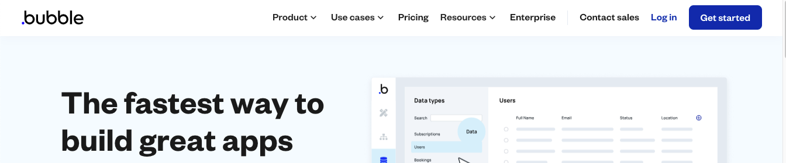

---
- Register for a free account
- Enter your email address and a password of your choice and click “Start building”.


---

- When asked how you heard about Bubble, select “Friend or colleague”.


---

- You will be asked if you want to incorporate AI features into your development, but since we are mainly going to show you how to use Bubble, we will proceed without using it.
- So, select “Skip and take me to the editor” at the bottom of the page.

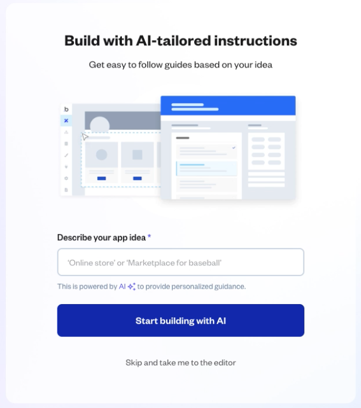

---

- Finally, you will be asked which plan you would like to use.
- Since we will be using the free plan, select “Start with basic features” below.


---

- Then, the screen will switch and you will see a white editing screen.
- This is the main screen of Bubble.


----

- In parallel, a confirmation email will be sent to the email address you entered, so check your mailbox.
- You will receive an email from Bubble titled “Verify Your Bubble Account”, click on the “Click here to confirm your email address” link in the body of the email.


---

- If the Bubble screen appears and says “Thanks for confirming!

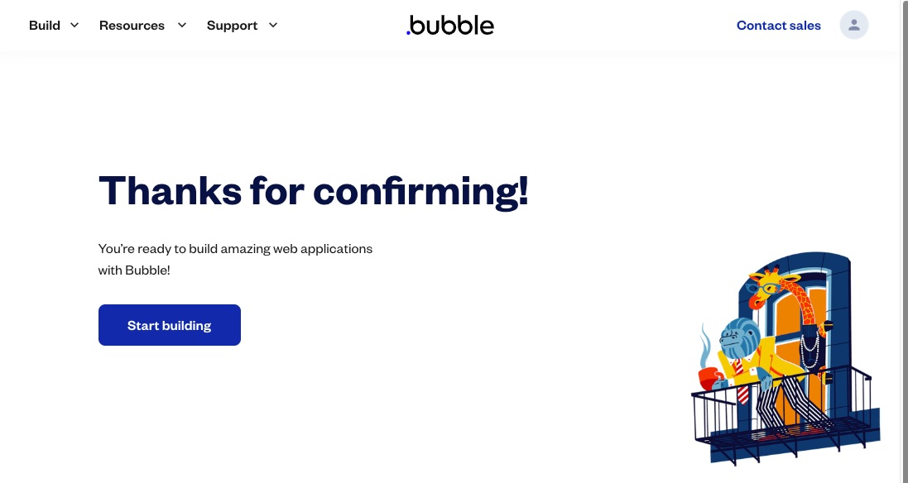

---

### First, let's get the Bubble template working.

- Click on the Preview link in the upper right corner of the screen

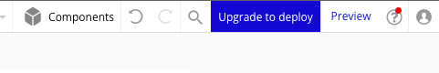

---

- The preview screen appears in a separate tab
- However, only a blank screen is displayed
- This is not a problem because no objects have been placed on the blank canvas :+1:

---

- As expected, we want to see it in action a bit, so let's try it out by creating a sign-up screen right away!
- Bubble does not provide a typical sign-up and login “screen”, but it does provide “components”.
- I'd like to create a sign-up screen by incorporating those parts.
- :warning: The actual sign-up and login functions will be developed after this, so right now it only works as a paper screen.

---

## Let's create a user registration screen with sign-up components

- :warning: We will touch various parts of the screen and explain each part later.
- First, let's explain the minimum number of parts, and then we will try to create a user registration screen.

---

### Three main operations

- In Bubble, there are three main types of operations
- The three operations are listed from the top, although it is difficult to understand because there are no labels, etc
  1. Design
  2. Workflow
  3. Data


---

- You can go back and forth between each of them from the left menu


---

#### Design

- Of these, only Design will be explained first.
- Design is the mode in which components are placed on the screen to create the user interface.
- The left panel contains the UI components and the right panel is the actual screen editing area.

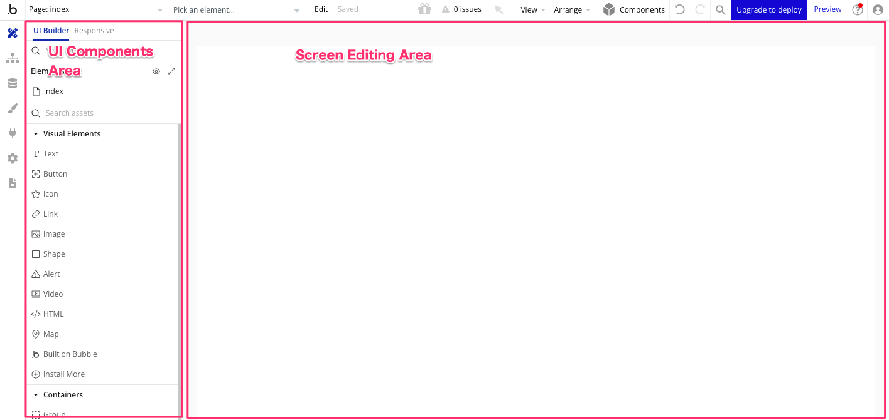

---

- Let's get started with the user registration screen!


---

- First, let's place the standard signup components in Bubble
- Click on “Components” on the top right side of the screen


---

- Then you will see an area called `Components` (UI Componets) from the right side of the screen.
- This is literally a list of common components available in Bubble.


---

- Open the Inputs & forms category at the bottom of this area and drag & drop the Sign up part with its image into the Drawing area.


---

- Perhaps it could be positioned to fit perfectly at the top of the screen like this

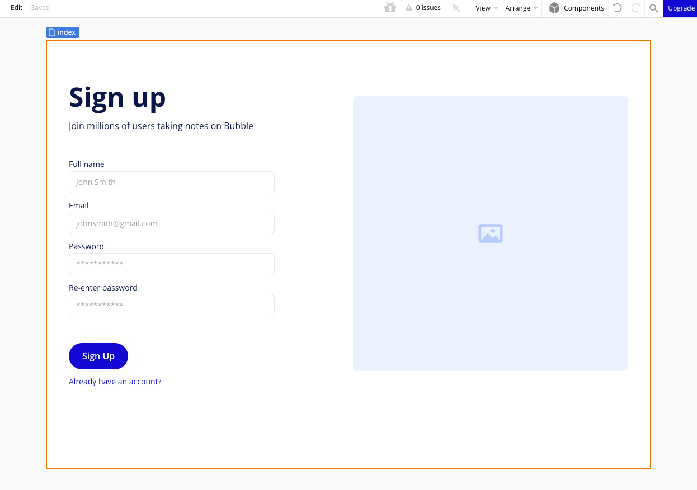

---

- Here is a preview
- I hope you can see the Sing up component without any problems.

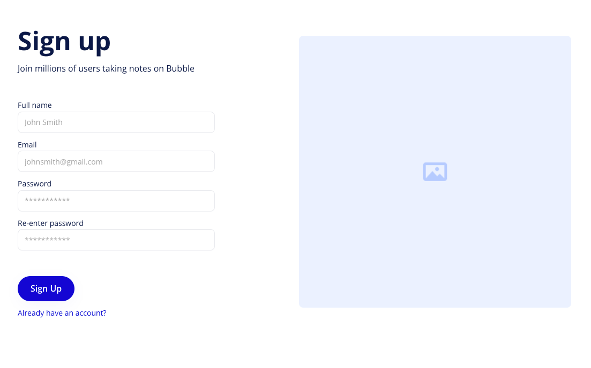

---

- In this part, there is a link `Already have an account?` under the Sign up button, which makes the UI look as if it takes you to the login screen, but nothing happens when you press the link now because the login screen is not prepared yet.


---

- So we will continue to prepare the login screen.

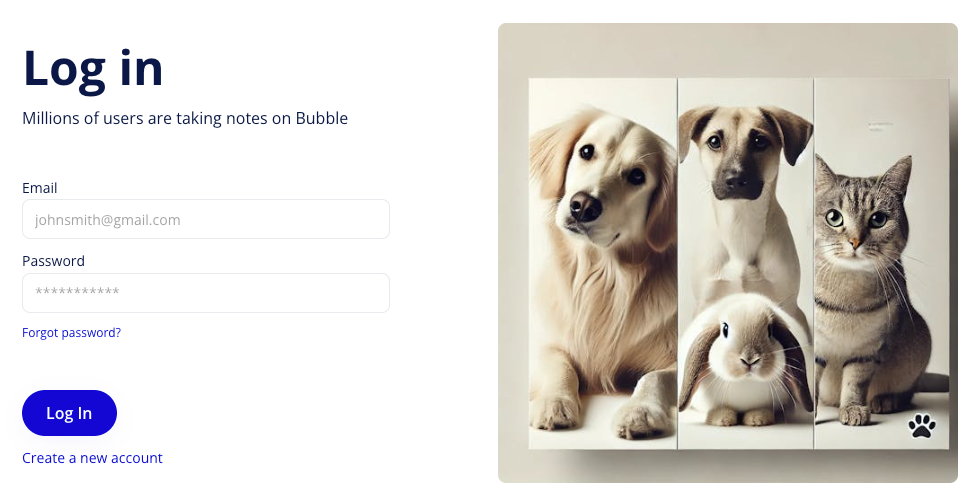

---

- Click `Page: index` in the upper left corner of the screen to display a pop-up window
- Click `Add a new page... ` in the pop-up window.

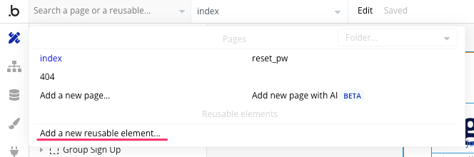

---

##### By the way...

- Here you can see a list of “Pages” and “Common Components” in the application you are currently creating.
- In Bubble, you will be manipulating one screen on one canvas.
- Therefore, it is important to remember that you will need to make changes here to move from one screen to another. :raising_hand:

---

- `Add a new page... ` to pop up a new page...
- The `Page name` is the name of the page, so enter only alphanumeric characters without spaces.
  - In this case, enter `login`.


---

- `Clone from` allows you to create a copy of a screen by selecting the screen from which you want to create a similar screen.


---

- For example, since the elements of the registration screen and the edit screen are almost the same, you can reduce development man-hours by selecting the registration screen as “Clone from” when creating the edit screen after the registration screen is created.


---

- Leave unselected for this time
- Click the “CREATE” button


---

- Once the new screen is created, the first step is to match the “layout” of the screen with the user registration screen
- We won't go into specifics in this session, but it is possible to specify the positioning of components on the screen on a page-by-page basis.

----

- Click near the center of the screen to display the Advanced Settings dialog
  - We will touch this dialog in various places in the future.
- In this case, from the Layout tab
  - Container layout: `Column`
  - Container alignment: Upside icon


---

- Once the above settings have been made, drag the Log in component with the image from Components in the same way as before.
- As before, the Log in component should now fit perfectly at the top of the screen.


---

- Now, let's set up a link so that users can go back and forth between the login screen and the user registration screen, which was not working earlier.

---

- Click on the link-like string `Create a new account` in the login component.


----

- When the `Link Create a new account` dialog appears, open the “Appearance” tab.
- Select `index` in the `Destination page` pull-down menu.
- Now you can specify `index`, the user registration page, as the destination page when you click this link.


---

- With the same capacity, try to set up the link so that the user can move from the user registration screen to the login screen.

# :hourglass_flowing_sand:
# :hourglass:


---

**答え合わせ :memo:**

- Select `index` from the top left to open the Sign up page
- Click on the `Already have an account?` link in the Sign up section


---

- When the `Link Already have an acco` dialog appears, select `login` in the `Destination page` pull-down.


---

- Once you have completed this step, preview the screen and confirm that you can go back and forth between the login and user registration screens!

---

- At this point, nothing happens when you press the “Sign Up” or “Log In” buttons!
- This is because we have not yet told Bubble what action we want it to take when the buttons are pressed!
- We will explain this setting later, so let's move on!

---

#### Here's a little break. :coffee: 

About Smartphone Support

- As we mentioned at the beginning of this document, Bubble's application is based on the premise of a web application.
- When adapting Bubble's application for smartphones, we will adopt the concept of **responsive design**.

---

- Let's see how it works first
- Try shrinking the width of your browser

https://matsushitahome.com/


---

- The layout is not broken, and the elements are automatically rearranged to be suitable for the smartphone size!
- This is what responsive design is all about!
- Google explains it like this

```
Regardless of the user's device type (PC, tablet, mobile, non-visual browser),
Deliver the same HTML code with the same URL, but change the rendering method based on screen size.
```

reference doc
https://developers.google.com/search/mobile-sites/mobile-seo/?hl=ja

---

The key points are as follows
1. the URL of the page being displayed is the same
2. the rendering method is automatically changed according to the screen size

---

- To put it a little more simply, it controls whether the element will stretch/shrink, wrap/not wrap, and display/not display according to the screen size.
- By setting these at the item level, you can automatically make the design responsive.
  - When actually developing, it is a good idea to preview the settings and check the operation.
- (The story of making Bubble applications responsive will be explained in the second Bubble lecture.🙋‍♀️

---

## Overview of Application Development with Bubble

Let's start with an overview of app development with Bubble

---

### Three main operations

- We will look at the other two operations
  1. Design
  2. Workflow
  3. Data


---

#### Workflow

- Mode for adding movement to the screen
  - Example: Screen transitions occur when a button is pressed.
  - Example: Data is manipulated when a button is pressed.
- This is the part that requires a bit of programming thinking.


---

#### Data

- Modes of defining and manipulating data
- I will explain more about data (explanation of databases) later!


---

- Select the “App data” tab and click on the “All Users” link
- You will then see the data of the list of registered users in the right panel, but since we have not yet created the sign-up function, I think there are still 0 users.

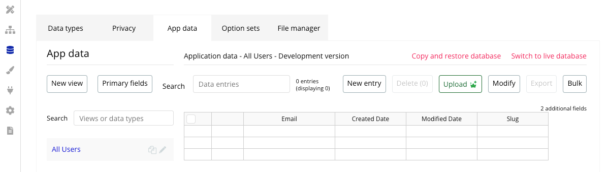

---

#### Other Operations

Other operations (menus) are also briefly explained

---

#### Styles

- By naming styles, they can be used universally throughout the application (or individually for each component)


---

#### Plugins

- Various components are available worldwide to extend your application
- In Bubble we call these “plug-ins
  - For example, various plug-ins for drawing line graphs
  - For example, plug-ins to connect Bubble applications to ChatGPT.
- Bubble plug-ins can be free or paid for, so please check with us before using them!

---

#### Settings

- Bubble plan changes and account operations
- Not covered in this lecture.

---

- Incidentally, Languages in the Settings section allows you to centrally manage the messages provided by Bubble.
  - Change the locale (language settings) for the main user of the application.
  - By changing these messages, you can unify message management throughout the system.
  - You can change the messages that are commonly used throughout the application, or change the default messages.
  - You can also add application-specific messages.
- Not covered in this lecture.

---

#### Logs

- You can view the log of the application when it is running.
- You can also view the log while previewing the application
- Not covered in this lecture.

---

#### Overall view of the screen we are going to make

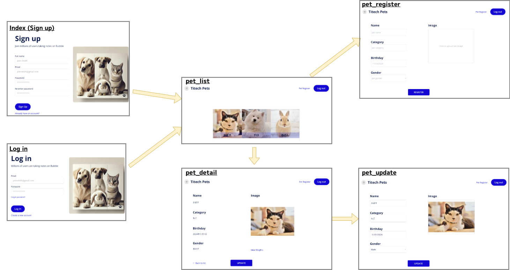

---

## ユーザ登録、ログイン機能を作ってみよう

- Now that we have completed the development of the front side of user registration and login, let's create the actual functionality!
- Before that, let's make the frame of the screen to which the user will move when he/she successfully registers or logs in, so that we can see the movement of the user when he/she successfully registers or logs in.
- Let's make a frame of the screen to be displayed when a user is successfully registered and logged in. ` Add a new page...` and create a new page named `pet_list`.
  - The contents of the page can be empty at this point.

---

Now let's create a user registration function.
- What we need to do is
  - When the “Sing up” button is pressed
  - Register the entered “Name”, “Email address” and “Password” as user information.

---

#### Let's get right to it!

---

### When the Sign up button is pressed

- In Bubble, all the workflow settings are done in the Workflow tab.
- You can start from the Workflow tab, but this time, we will start from the button that will be the source of the movement.

---

- Open the index page
- Click the `Sign up` button on the Sign up part.
- Click on `Add workflow` in the dialog that appears


---

- The screen will then switch to Workflow.
- As explained earlier, the Workflow is the part where we will actually add the movements, such as registering user data when the `Sign up` button is clicked.

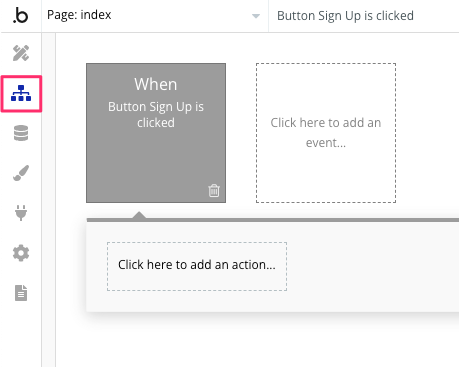

---

- The item `When Button Sign Up is clicked` is probably selected.
- This is literally the action to be taken when the Sign up button is clicked.


---

- You will see a button at the bottom that says `Click here to add an action... Click here to add an action...` button at the bottom of the screen, and set the behavior when the Sign up button is clicked.

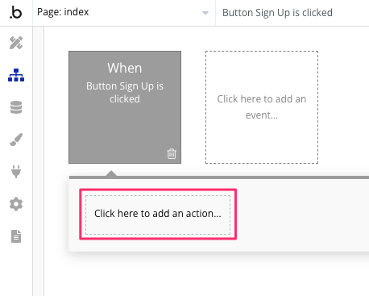

---

- `Click here to add an action... `, you will get a pop-up window where you can specify various actions
- In this case, we will choose `Account` at the top, since this action is related to user operation.


---

- すると下位要素がさらに表示されると思いますので、その中から `Sign the user up` をクリックします
- 文字通り、ユーザのサインアップに関する振る舞い設定です

- You will then see more sub-elements, click on `Sign the user up`
- Literally, the behavior settings related to user sign-up.


---

- Then, the “Sign the user up” dialog box will appear.
- The “Email address” and “Password” that are required to log in are displayed.
- This means that we will now configure the settings for Email and Password.

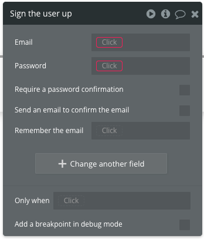

---

- First, click on the `Click` to the right of Email, and you will see a pull-down menu
- This will show you the information of all the elements (items) that exist in the index page that you are currently opening.

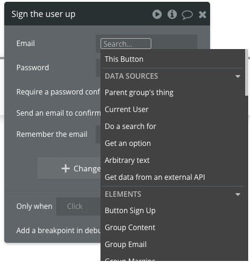

---

- In this case, the value set for Email is the value of the input form for Email.
- If you look for an item that looks like that, you will find `Input Email (Sign up)` in the `ELEMENTS` block, and if you hover your mouse over it, you will see the actual item displayed.

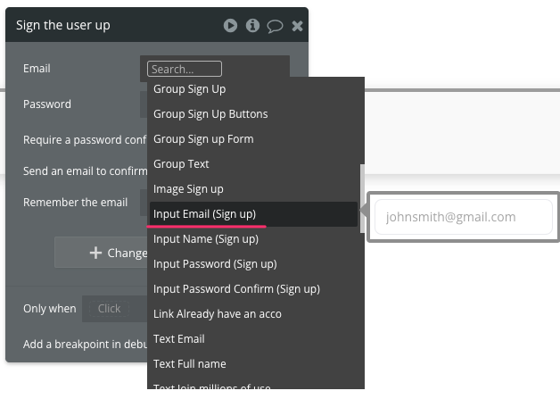

---

- Click on `Input Email (Sign up)` and a further pull-down will appear
- In this case, we need the value entered in the `Input Email` form, so select `'s value`.
- The other options, `is valid` and `isn't valid`, are used when you want to check if the value entered is valid or not.


---

- This means that the user's Email field will be set to the value entered in the `Input Email` form on the screen.


---

- Follow the same procedure to save the Passowrd and user name.

# :hourglass_flowing_sand:
# :hourglass:


---

- "User name” must be newly created, since there is no such column in the user table at this time.
- `Change another field` to set other fields than Email/Password.


---

- Since the username does not yet exist, click `Create a new field... ` and from there add a field to store the username
- The name should be `name`.

# :hourglass_flowing_sand:
# :hourglass:


---

- Have you set it up yet?
- It should look something like this

- Now, when you click the Sign up button, your user data should be registered based on what you have entered on the screen.


---

- Now, to make sure it works, on the right side of `Sign the user up` in Step 1, press `Click here to add an action...` again. ` to select an action for the screen transition.
- What looks good to choose?


---

# :thinking:
# :thinking::thinking:
# :thinking::thinking::thinking:
# :thinking::thinking::thinking::thinking:

---

- Yes, `Navigation` --> `Go to page... `...
- Then, in the `Destination` field of the dialog that appears, select the `pet_list` that you want to go to, and you are ready to go!

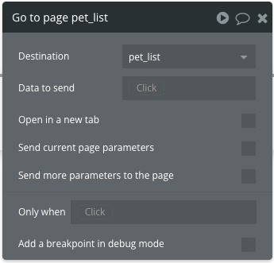

---

- Let's preview it.
- The key points to check are
  - After filling in the required fields and clicking the Sign up button, a blank pet_list screen should appear.
  - User information at the time of clicking the Sign up button is registered in the database.
    - Confirm that the email address and user name are saved correctly, as passwords cannot be confirmed.

---


---

- You may have noticed that the Sign up screen has two password input fields to prevent password errors, but at the moment, even if you enter different values for the first and second fields, the first field will succeed in registering your account.
- This makes no sense, so please try to fix it so that registration fails if the `Password` and `Re-enter password` are different.

# :hourglass_flowing_sand:
# :hourglass:

---

**verifying one's answers:memo:**


---

Let's continue and set up the login workflow! 🙋‍♀️

---

- The concept is the same as Sign up, so please think about it and try to set it up!

# :hourglass_flowing_sand:
# :hourglass:

---

- First, go to the login page, which is the Sign up screen.
- Click the `Log In` button and click `Add workflow` in the dialog box.

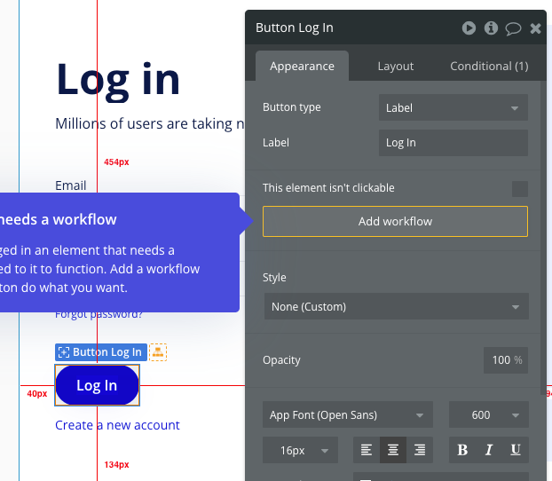

---

- You will be taken to the Workflow screen, where you will select `When Button Log In is clicked` and `Click here to add an action... Select the action you need for the login process from `When Button Log In is clicked`.

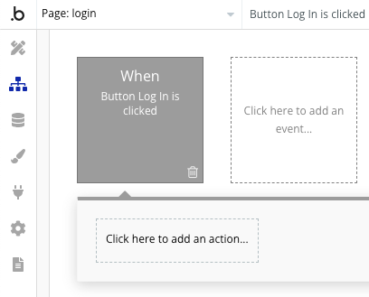

---

- In this case, it is `Log the user in` for `Account`.
- From the dialog that appears, specify the values to be used as the email address and password, which are required for login authentication.

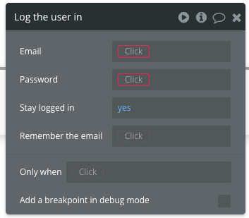

---

- As with Sign up, there should be an option to enter your email address and password, so select `'s value` for each item.

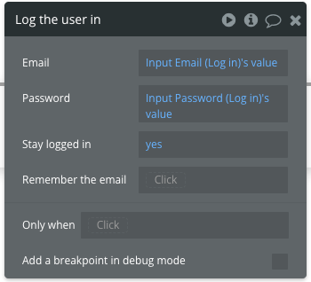

---

- Once set up, add an action to move to the `pet_list` screen as well as Sign up as a process after login

---

- Now that you have set up the system, let's check the login operation.
- Log in with the account information you registered when you signed up earlier, and confirm that you are taken to the Pets List screen.

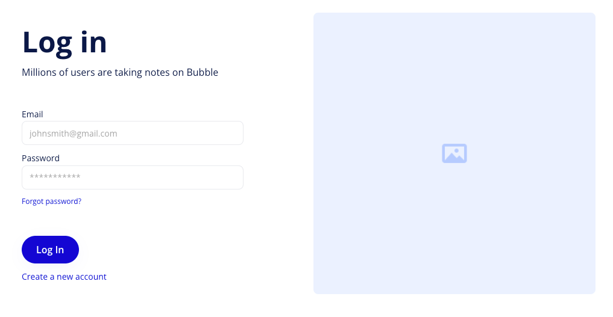

---

## Let's learn the database and create a list of pets from registration to listing.

- Now that the user management function is ready, let's create the pet management function!
- First, let's prepare a database for pets.
- First, let's prepare a database for pets. Then, let's create a screen for registering pets and displaying a list of the pets.

---

### Learn about databases

- In developing an app, organizing the data to be handled in that app will make subsequent development go smoothly!
- First, let's look at what a database is.

---

### What is a Database?

- An organized collection of data
- A database allows you to Create, Read, Update, and Delete data.
- These operations are collectively called CRUD (“cladding”).

---

- Basic Elements of Learning Databases
  - Tables
  - Fields
  - Records
  - Relation

---

- Table.
  - A table is like a “table” that stores data. For example, if there is a table called “Students”, all student information is stored in it

- Field
  - This is the “column” of a table. This represents a single type of information. For example, “name” or “age” is a field

- Record
  - A record is a row in a table, a collection of fields. For example, a record is a single row containing the name, age, address, etc. of a student.

---

- To summarize so far, a table can represent a collection of information, a field a type of that information, and a record a single set of concrete data

---


- Databases are often likened to “something like a spreadsheet.”

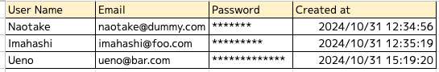

---

- If we apply the tables, fields, and records from earlier to a spreadsheet, we get something like this

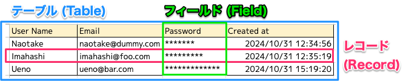

- It feels right... It feels right, doesn't it? :sunglasses:

---

There is another important concept to learn about databases

- Relation
  - A mechanism for connecting multiple tables and relating data to each other
  - Tables in a database not only work alone, but can also be related to other tables
  - For example, if you have a “Students” table and a “Classes” table, you can link these two tables together so that a student can participate in multiple classes.
  - This makes it easy to keep track of which students belong to which classes, and vice versa.

---

There are three main types of relationships

- One-to-One relationships
- One-to-Many relationships
- Many-to-Many relationships

---

#### One-to-One relationship

- Student” and ‘Student ID’ tables
- A student can only have one student ID card, and a student ID card can only correspond to one student
- One student, one student ID card

---

#### One-to-Many relationships

- Teacher” and ‘Class’ tables
- One teacher may be in charge of several classes, but there can only be one teacher in a class
- One teacher is responsible for multiple classes

---

#### Many-to-Many relationships

- Students” and ‘Classes’ tables
- A student can be in multiple classes, and a class can have multiple students
- Multiple students belong to multiple classes

---

- That's all for the explanation of databases. 🙋‍♀️

- Since you may not get an image of the database just by listening to the lecture, let's organize and design the necessary items for the database while looking at the screens of the application to be developed in this lecture.
- The following page shows an image of the screen to be developed and the procedure for designing the database.

---

#### Sign Up Screen


---

#### Login screen


---

#### Pet List Screen


---

#### Pet Registration Screen


---

#### Pet Detail Screen

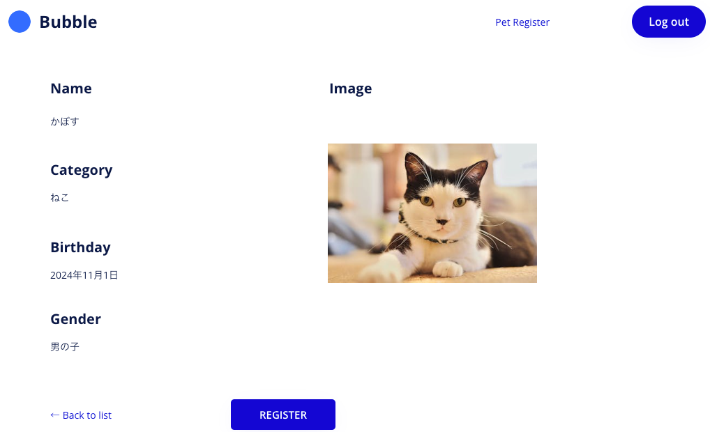

---

#### Pet Edit Screen

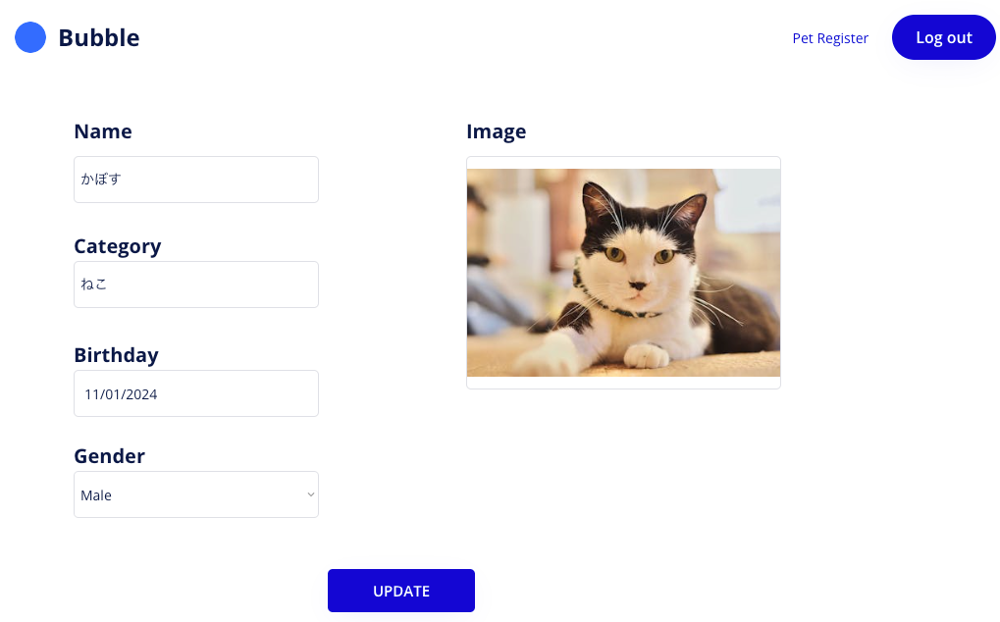

----

Database Design Procedure

1. while looking at the screen, list the data that will need to be stored and transcribe them into a text editor, etc.
2. think about what kind of tables the listed data can be classified into
3. add the data listed in step 1 as fields in the appropriate tables
  Please specify the type of field
4. if a relation is needed, please add a field to represent it as well

---

*The explanations are given on the next and subsequent slides, but please think for yourself once before looking at the answers :eyes:
*There is no absolute right answer. If you have any doubts, please follow your intuition :brain:.

---

### explanation

- The following is a list of data that will need to be saved while viewing the screen

```
- User's name: string
- User's email address: string
- User's password: string
- Pet name: string
- Pet type: string
- Pet's birthday: string?
- Pet's photo: image?
- Pet's gender: string?
- User who owns the pet: user?
```

- If anyone can raise any other data than this, please let me know!

---

- Considering what kind of tables the listed data can be classified into, we will classify them into these two categories
```
- User
- Pet
```

---

Supplementary information on table classification

- When the relationship “if A is determined, B is determined by one” holds, we often make A a table and B a field in that table. For example,
  - If a user is determined, then the user's name, e-mail address, and password are each determined to be one.
  - If a pet is determined, there will be one for the pet's name, type, birthday, photo, and gender
    - Pet photos are still an area to be considered :dog::camera:.

---

- When the relation “there is more than one B for A” is valid, A and B can be split into separate tables.
  - It is also conceivable that there are multiple pictures of pets for every pet :camera:.
  - This is not a mistake either!
  - In this lecture, we will assume that you can set only one favorite picture of that pet, and consider it as one field of the pet table :dog:.

---

- Once you have decided on this point, you can organize the database and create specific tables as and when they are needed.
- (It is also possible to create all the tables at once at the beginning of the process.
- However, in the process of creating screens and functions, the contents of the organized database are often brushed up and changed.
- However, it is important to keep this in mind because there is a risk of rework if all the tables are created at the beginning.

---

#### We will create a pet registration screen.

- データベースの整理ができたので、ペットの登録画面を作成していきます
- 左上の `Add a new page...` から `pet_register` という名前の画面を新たに作成しておきます

- Now that the database is organized, let's create the pet registration page!
- Create a new page named `pet_register` from `Add a new page...` on the top left corner.

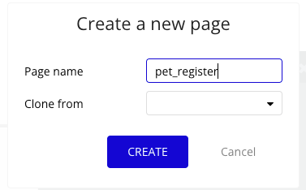

---

#### Assemble pet registration screen

- Let's create a pet registration screen by referring to the screen image.


---

#### Pet Name

- First, we place a text box for the pet's name
- Select `Input` in `Input forms` from the “UI Builder” menu in the left panel.
- Then, click on the place where you want to place the text box in the right panel, and the input box will appear.

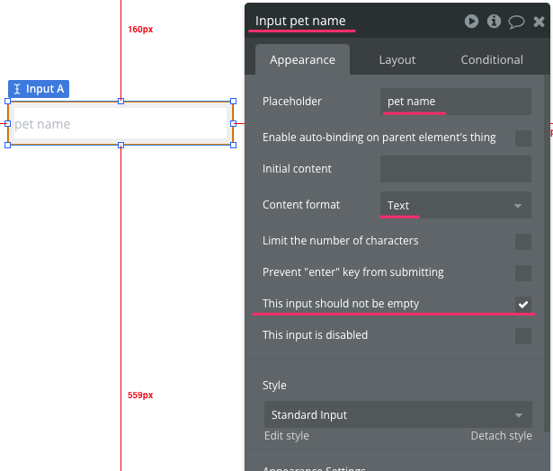

---

- Double-click on an element to open a dialog box where you can set various information about the element.
- Placeholder` is an auxiliary text that will be displayed when the text box is not filled in.
  - In this case, we will use “pet name”.


---

- The `Content format` allows you to specify the format of the value that can be entered into the text box
  - In this case, we will leave it as “Text” since we will be entering a string.


---

- The `This input should not be empty` option allows you to specify whether or not the input is required.
  - In this case, we want it to be required, so we check the box.


---

- If you click on the top of the dialog, you can name the elements in this text box
- This will come in handy later when defining the workflow, so let's specify “Input pet name” here.


---

- After setting up to this point, you are ready to go.
  - You can also specify other details, but I won't explain them here.
  - If you are interested, please take a look. :mag:

---

#### Pet Type

- Next, we place the elements for entering the pet's type
- As before, select the `Input` form from the left panel and drag the elements on the right panel to place them.

---

- Double-click on this element as well to set the element information
  - In this case, enter “pet category” in the `Placeholder` field.
  - Specify “Input pet category” as the name of the element.
  - Check `This input should not be empty` to make it mandatory.

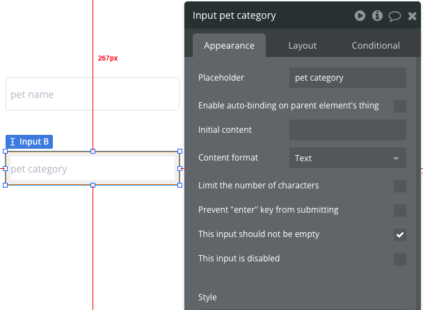

---

#### Pet Image

- Next we will place the elements to upload the pet image
- Select `Picture Uploader` from the left panel and drag the element on the right panel to place it

---

- Double-click on this element as well to set the element information.
  - In this case, enter “Click to upload pet image” in the `Placeholder` field.
  - Specify “Input pet image” as the element name.
  - Check `This input should not be empty` to make it mandatory.


---

#### Pet's Birthday

- Next we will place the elements for entering the pet's birthday
- Select the `Date/Time Picker` from the left panel and drag the element on the right panel to place it

---

- こちらも要素をダブルクリックして要素の詳細を設定します
  - `Input type` に Date を選択することで日付入力のみとなります
    - ここで Date & Time を選択することで日付と時刻の入力が可能です
    - 今回は Date とします

- Double-click on the element to set the element details
  - Select "Date" for the `Input type` to allow only date input.
    - Select `Date & Time` here to allow date and time input.

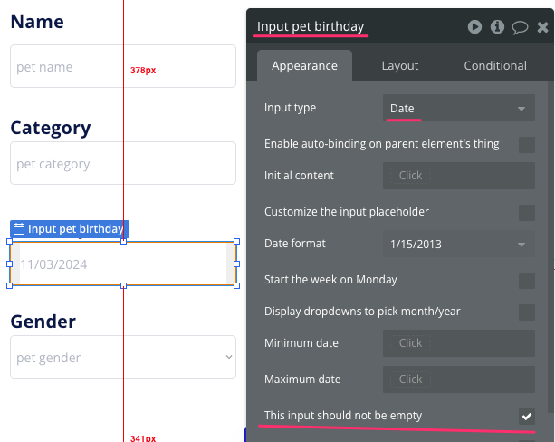

---

- Check `This input should not be empty` to make it mandatory.
- Specify `Input pet birthday` as the name of the element.

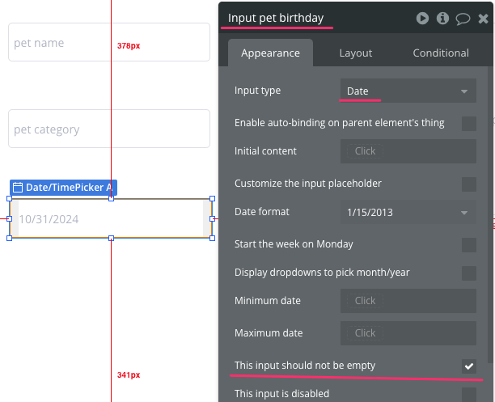

----

#### Pet Gender

- Finally, we place an element to select the gender of the pet
- Select `Dropdown` from the left panel and click on the right panel to place the element

---

- Double-click on the element to set the element details
  - In the `Placeholder` field, type “pet gender”.
  - In the `Choices` field, type “Male”, press Enter to start a new line, and type “Female” on the next line.

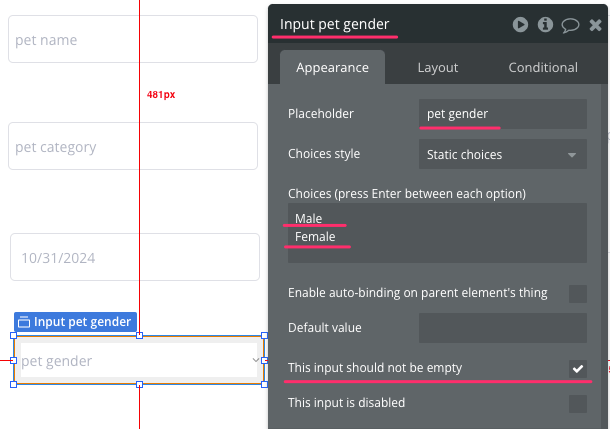

---

- Check `This input should not be empty` to make it mandatory.
- Specify `Input pet gender` as the name of the element.


---

#### Registration Button

- Now that you have entered your pet's information, place the registration button
- Select the `Button` in the `Visual elements` in the left panel and click on it in the right panel to place the element.

---

- Double-click on the element to set the details of the element
  - At the top of the Appearance tab, click “.... . edit me...” at the top of the Appearance tab. at the top of the Appearance tab and type “REGISTER


---

#### Label each input element

- Since it is hard to tell what each input form is if we only have input items, let's add a label in the upper left corner of each element to identify it.
- Select `Text` in `Visual elements` in the left panel and drag the element in the right panel.

---

- When placing, make sure that the height of the element is at least 30px!
  - Otherwise, the contents of the element will not be displayed correctly!
  - You can also edit the `H` value from the Layout tab of the Advanced dialog after placing the element!


---

- This is also where you set the details of the element
  - At the top of the Appearance tab, click “.... .edit me...” at the top of the Appearance tab. at the top of the Appearance tab and type `Name
  - Select `Heading 5` for `Style` in the middle of the dialog.

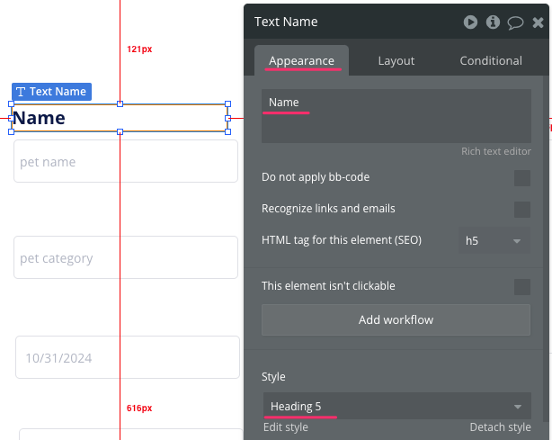

---

- Let's add other labels in the same way
  - Category
  - Image
  - Birthday
  - Gender

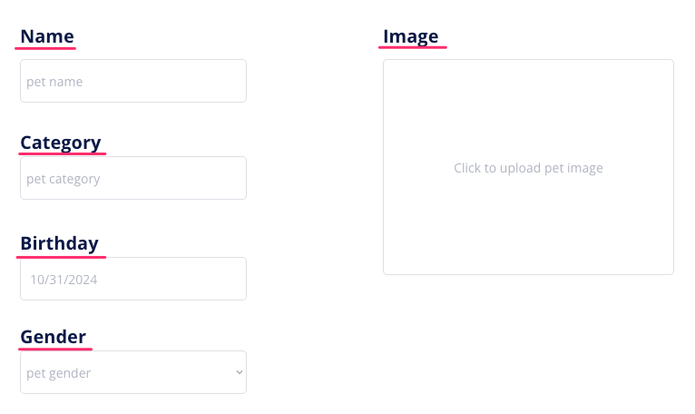

---

- The same procedure can be used, but you can save time by copying and using the label for the Name you just created
  - Copy (Ctrl + C) and paste (Ctrl + P) and rewrite only the label contents.
  - On Mac, copy (Command + C) and paste (Command + P)


---

- Finally, unify the width of all elements except the pet image to 250px
- Double-click on each element and set the value of `W` (Width) to 250.
- Set the value of `X` (position of the horizontal axis) to an appropriate value (e.g. 100).
  - This is to improve the appearance.
  - Adjust the value of `X` accordingly, since the pet image is displayed in two columns.

---

- You can change them one by one, but since there are so many elements, let's change them all at once!
- With all elements selected, right-click on any one of them
- Select Edit from the submenu that appears.

---

- Then a dialog box will appear, confirming that the number of elements in the selection is the number of elements you changed.
- If all is well, open the Layout tab in the dialog and click on the `W` (Width) part.


---

- Then you can set the width (W) and height uniformly for the selected element, so enter 250 for `W` and 100 for `X` and you are done!


---

- Once you have done this, click `Preview` in the upper right corner of the screen to preview and see how it works!

---

- Are all elements visible?

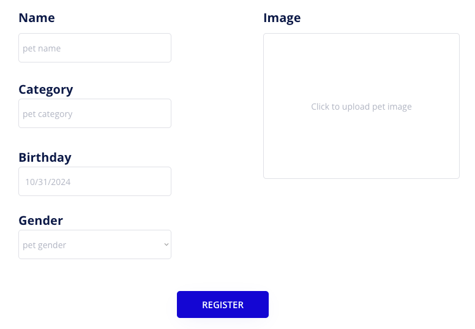

---

- Can I enter values for all input forms?
- Can I specify an image to be displayed?


---

### Let's connect to the database

- Now that the screen layout is ready, it's time to connect to the database!

---

#### First, prepare a box to store your pet's information

- Select Data from the tabs on the left menu
- Then select the Data types tab, and below it, type “Pet” in the text box marked `New type`.


---

- Then check `Make this data type private by default` and click the `Create` button.


---

- For the Pet type you just created, add the fields you just organized
- Select `Pet` from `Data types`.
- Click `Create a new field` under `Fields for type Pet` on the right side

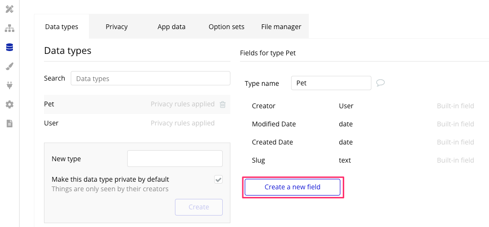

---

- A pop-up will then appear and you will enter the required information.


---

- Enter the name of the element in the `Field name` field.


---

- Select the element type (text, number, date, etc.) for the `Field type`.


---

##### Now let's add the necessary fields to Pet type!

Let's set up the fields we considered earlier in the database design!

# :hourglass_flowing_sand:
# :hourglass:

---

It looks like this.

- Name: text
- Category: text
- Image: image
- Birthday: date
- Gender: text


---

### Enabling the registration of pets when the registration button is clicked

- Now that the box for storing pet information is ready, it is time to add the movement to save the information to the database when the registration button is clicked!

---

- Select the Design tab from the left menu
- Select the “pet_register” screen from the upper left panel
- Double-click the “REGISTER” button on the “pet_register” screen from the right panel
- Click `Add workflow` in the “Appearance” tab.


---

- You will then switch to the Workflow tab, where you will see `Button REGISTER is clicked` in the When section.
- Select `Click here to add an action...` and set the behavior when the button is clicked.

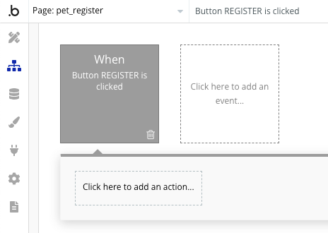

---

- `Click here to add an action... Select `Data(Things)` for actions on databases (tables) that you have created yourself.
- If you want to perform an action on a database (table) that you have created, select `Data(Things)`.

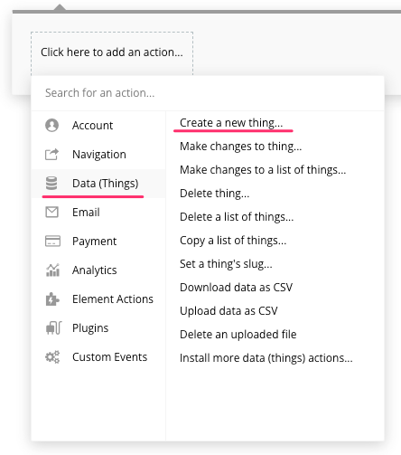

---

- Select `Create a new thing... ` from among the lower elements.


---

- The `Create a new thing... ` dialog box will appear, and you need to specify the type of registration this time.
  - In this case, it is `Pet`.
- Then the button `Set another field` will be displayed.

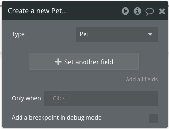

---

- Here we specify the “field” name of the item we want to store in Pet on the left-hand side, and the actual value to store in that “field” on the right-hand side
  - First, select `Name` for the left-hand side


---

- If you specify the left side, you will see `=` and now `Click` on the right side.

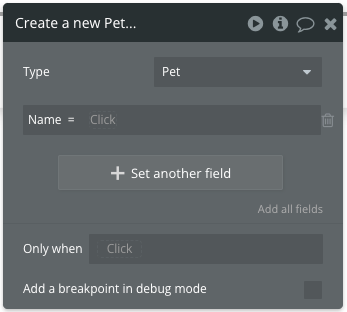

---

- This time, specify the “value of the pet name entry field itself” that you have placed yourself!
- I'm sure you have already mastered how to use this, so please try to set it up :wink:.

---

- It's like this. :wink:

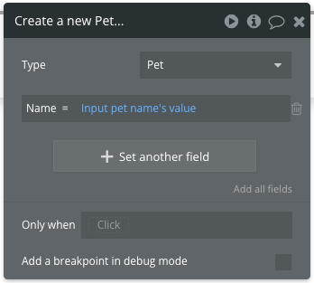

---

- Let's set up all the rest and all the items!

---

- Of course it looks something like this. :wink:


---

### Let's try to move it!

- Now that you've set up your pet, let's see if it actually registers in the preview!
  - By the way, you can preview by clicking “Ctrl + P” (shortcut key)
- Fill in all the input elements and click the “REGISTER” button!
- Nothing special happens on the screen, but let's see if the data is actually registered.

---

- Close the preview, open the Data tab, select App data, and make sure that the information you just entered from the screen is saved when you select `All Pet` in the left panel.


---

- Now we have reached the point where we can save what we entered on the screen to the database! :tada:.

- Finally, add an action to go to the `pet_list` after saving the data to the database, just as we did for login, etc.

# :hourglass_flowing_sand:
# :hourglass:

---

- Now let's preview it.
- Enter the pet information as before and click the “REGISTER” button.
- Then, you can confirm that the screen will move to the Pets List screen and that the pet information you entered on the screen is saved in the database.

- Is the pet information registered correctly? :raising_hand:

---

### Listing Pets

- Next, let's build the pet list screen!


---

#### Let's build the pet list screen.

- Select `pet_list` from the list of pages in the upper left corner.
- Select `Repeating Group` from `Containers` if you want to display the same elements repeatedly as in this case.
- Drag it to the canvas in the right panel.

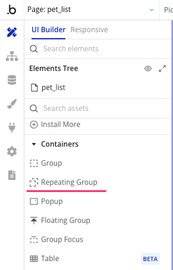

---

- The element detail settings popup will appear, so let's set it up
- Enter `pet list` for the top element name.
- In the `Type of content` field, specify the type of data to be repeated.
  - In this case, it is `Pet`.

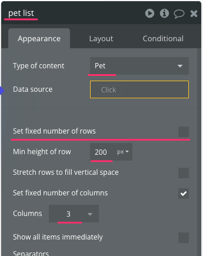

---

- Specify the number of rows and columns in the list
- Uncheck `Set fixed number of rows`, since we want the number of rows to change dynamically.
- Instead, specify the minimum height of a row
  - In this case, set it to “200px”.


---

- Leave the `Set fixed number of columns` checkbox ON since we want to display 3 images per row.
- Set the value of Columns to “3"


---

- Select the `Layout` tab and set the value of `H` to “400” to keep the height of the entire table for two rows.
- Set the value of `W` in `Layout` to “600” to make the image size per row square.


---

- Also, select `Fixed` for `Cell's container layout` to set a fixed layout in each cell.


---

- Next, specify the data to be displayed in the list

- From the `Appearance` tab, click on `Data source`, then `Do a search for`.
  - This is to specify the data to be listed

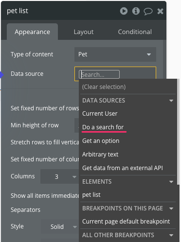

---

- “Do a search for” popup will appear, specify `Pet` for Type
- Now you can specify that you want to search for a list of pets.


---

- Since this alone will display a list of all registered pets, we will add a new constraint to display only pets registered by the logged-in user.
- Click “Add a new constraint” and add more conditions


---

- The condition to be set is that the “Created By” of the pet must be the same as the “Current User.”
- What would be the content of the setting? Let's think about it!

- The answer is on the next page, so let's take a look after you think about it! :eyes:

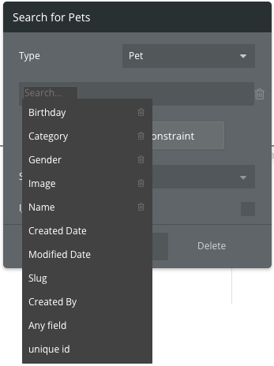

---

- Like this.
- The expression “A = B” will appear in various situations when using Bubble!

- This completes the specification of the data to be displayed in the list.

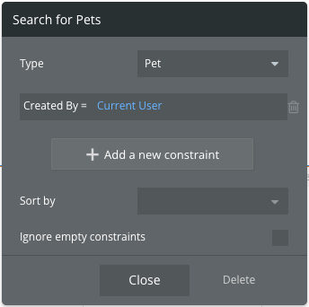

---

- Next, let's set the contents to be displayed repeatedly
- Specifically, let's display an image and a name in each cell

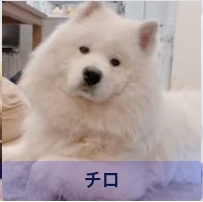

---

- First, select `Image` from `Visual elements` and drag it to the right panel.
  - If you drag it to the upper left cell of the `Repeating Group`, you will not have to move it later.
  - It is also possible to include it in the Repeating Group later.

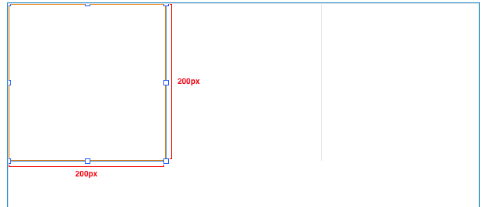

---

- Once placed in the Repeating Group, adjust the image size and position in the Repeating Group from the `Layout` tab.


----

- `W`: 200 / `H`: 200 / `X`: 0 / `Y`: 0
  - The size (W/H) is the same as the cell size, 200 x 200
  - The position (X/Y) is also placed at 0, 0 from the top left


---

- The element name should be `pet list image`.


---

- Finally, we will configure which image to display.
- Select “Dynamic image” from the Appearance tab.
- Click on the `Insert dynamic data` button.
  - This function is used when you want to display values and images dynamically instead of displaying fixed values and images.


---

- Click on it and a pull-down will appear, from there click on `Current cell's Pet`.
- This can be used if you literally want to use the data of the current cell's pet.


---

- Select `Current cell's Pet` and a pull-down will appear, displaying the field that the Pet type has, and click `'s Image
- This will cause the image of the pet in the current cell to be displayed, so that if there are multiple pet data, the pet's image will be lined up in each cell.


---

- We have just set the image to fill the entire width of the cell, but we should change the `Run-mode rendering` value of the image element from “Stretch” to “Zoom”!
- Otherwise, the image will automatically change its aspect ratio in the cell, so change it to Zoom.


---

- Next, let's set the background for the name that will appear below the image
- Select `Shape` from `Visual elements` and drag it to the right panel.
- Drag it to the right panel to include it in the “Repeating Group”.


---

- The position of this placed element is also set from the `Layout` tab
  - `W`: 200 (same width as the image)
  - `H`: 40
  - `X`: 0
  - `Y`: 160 (200 - 40 = 160 to place an object of height 40 all the way down)


---

- Let's lower the transparency a little so that we can see a thin image under the placed shape
- Open the Appearance tab of “Shape A
- Confirm that “Style” is set to “Shape” and click “Edit style” below it


---

- You will then be taken to the Styles tab, where you can edit the style of the “Shape” you have just selected.


---

- Selecting the Background Color will bring up a pop-up window that allows you to change the color and transparency.
- Change the number to the right of “Primary” from `10%` to `20%`. This number is the transparency rate, where 100 is non-transparent and 0 is transparent.


---

- Finally, we display the pet's name
- Select `Text` from `Visual elements` and drag it over the shape you just placed.
- Drag it into the Repeating Group as well.


---

- Set the size of the element to be the same as the Shape after placement from the Layout tab.
- Name the element `pet list name


---

- Like the pet image, the pet name uses Dynamic data
- `.... . edit me... `....edit me...`, you will see `Insert dynamic data` as you did for the image, so let's set the “pet name in the current cell” from there.


---

- Select `Current cell's Pet` --> `'s Name

- This completes the configuration of the contents to be displayed in the list.

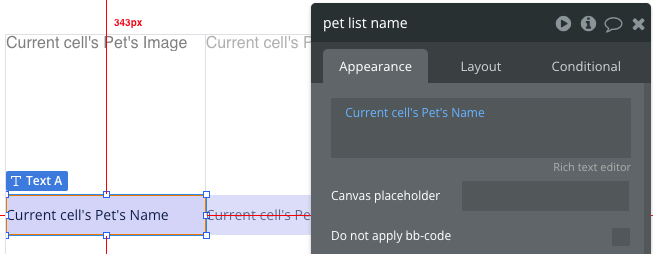

---

#### Now that you're done, let's preview it!

- Do you see the pet's image and pet's name as a list of pets?

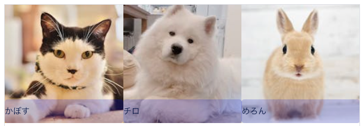

---

##### Exercise 1

Center your pet's name and make the text a little larger!


---

- Hint :bulb:
  - Create a new “Style” and set it to “pet list name

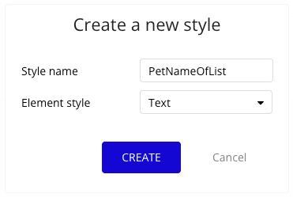

---

#### Let's prepare a lead from the pet list to the registration screen.

- Now that we have a list of pets, let's prepare a lead from the list screen to the registration screen.
- Let's prepare this line at the top of the Pets List screen.


---

- I'm sure everyone who has learned from “Sing up” / “Log in” will be able to set it up in no time!
- Let's set it up!

---

- It looks like this.
- Name the link “PET REGISTER”.
- Select “pet_register” as the destination `Destination page


---

#### Now let's preview it!

- Have you clicked on the “PET REGISTER” link at the top of the pet list to get to the pet registration page?


---

## Let's create a Pet Detail screen.

- Next, let's create the pet details screen.
- The key point here is the information transfer part for the pets selected in the list screen.


---

### First, prepare a new detail page

- Add a new page...” from the upper left from the top left corner.
- Page name” should be `pet_detail`.
- For “Clone from”, choose `pet_register` since the screen structure is similar.


---

- If you have cloned (copied) it, it will be the same as the registration screen, so we will review it.


---

- First, delete all input elements prepared as input items

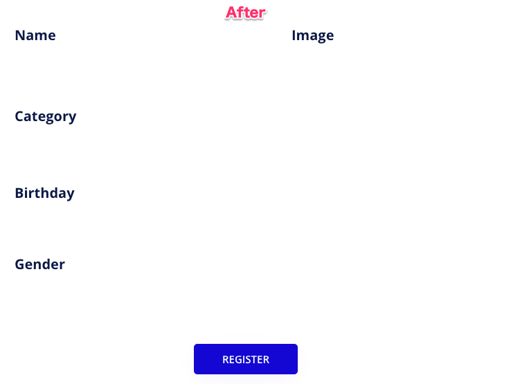

---

- In addition, delete the settings when the REGISTER button is pressed from the Workflow tab
- When you select a workflow with the REGISTER button, a trash can icon will appear in the lower right corner, and you can delete the workflow definition by pressing the trash can icon.


---

- Next, let's place the elements for display
- Let's drag each element from the “Visual elements” section
  - Name: Text
  - Category: Text
  - Image: Image
  - Birthday: Text
  - Gender: Text

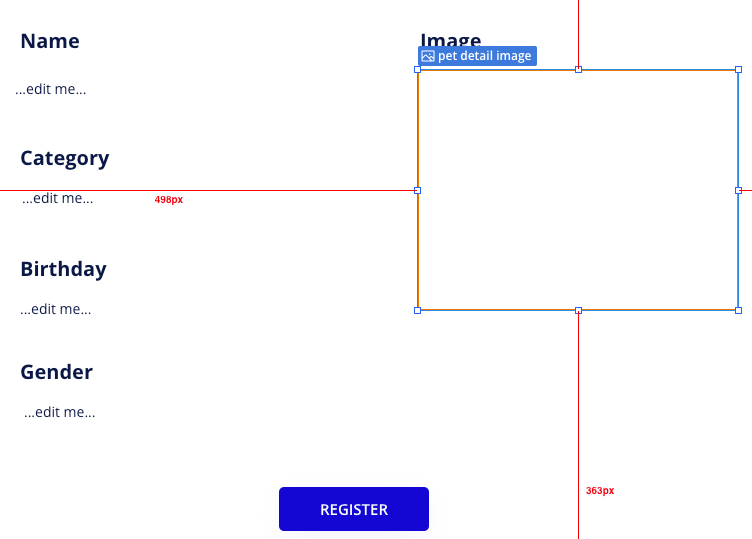

---

- Element width (w) should be 250px except for Image
- Only the Image element is slightly larger than the other two, 300px x 300px.


---

- Once the elements are ready, we will define the actual values to be referenced from the database
- First, we will display a dialog for advanced configuration of the screen itself

---

- Select `pet_detail` from the upper left part of the dialog box.
- It is also convenient to select an element from here if there are several overlapping elements!

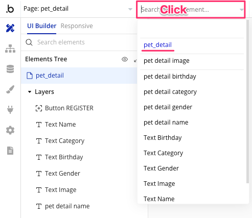

---

- By the way, the same applies if you select `pet_detaiL` in the “Elements Tree” in the “UI Builder” in the left panel.


---

- Open the “Appearance” tab of the Advanced Settings dialog on the pet_detail screen.
- In the “Appearance” tab, select `Type of content` and specify `Pet`.

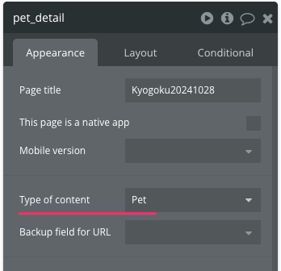

---

- This way, you can specify the type of database (table) from which you want to display this screen, and for each item, you only need to specify which fields of that type to use.


---

- By the way, you could specify the type, but you need to specify which pet information (Porgy or Tama) when you move from the list screen, which will be set later. :dog::cat:

---

- Now let's link the elements for display with the Pet type fields.
- Let's start with Name.
- If you want to dynamically display a value retrieved from a database, as in this case, remember how to do it?

:sunglasses:

---

- Yes, I do! Use “Dynamic data”!
- Double-click on the “Text” element of the Name and click `.... . edit me... Click on the `...edit me...` and you will see a button `Insert dynamic data`, click on it.


---

- Then a pull-down will appear, click on `Current page's Pet` from the list
- This literally means the information of the pet assigned to the current page.
- Then the fields that the Pet type has will be displayed, select `'s Name`.


---

- Let's set up Dynamic data for Category / Image / Birthday / Gender in the same way

---

- After setting up, let's preview it!
- The values are not displayed correctly, are they?

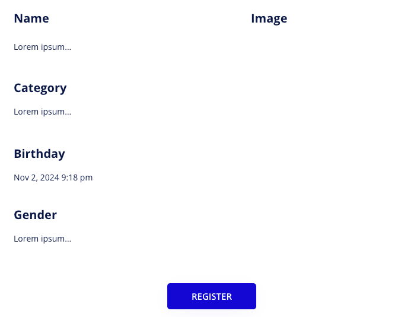

---

- This is because you have not yet specified which pet's information is from the list screen? This is because you have not yet specified which pet you are looking for in the listings.
  - The `Lorem ipsum` is a common dummy content idiom that Bubble automatically generates.


---

### Now let's connect the list page and the detail page.

- Switch to the pet_list page from the top left menu
- As an image of the screen operation, we would like to move to the detail screen of the pet when the image of the pet displayed on the pet list screen is clicked.
- So, let's set up a workflow for the pet image on the list screen.

---

- Click on “pet list image” from the element list
- Click `Add workflow` in the dialog for advanced settings


---

- Then, you will see that the box “When pet list image is clicked” is in the state before setting the behavior, so we will set it as it is.

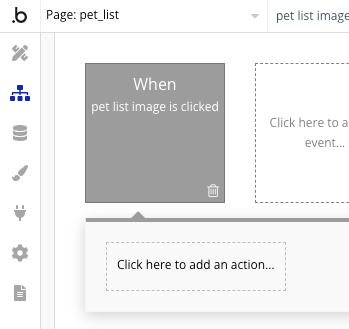

---

- You know how many times we have set up Action for screen transitions, don't you :sunglasses:?
- This time, in addition to the Action, we are going to pass the pet information of the selected image to the destination.
- I am sure you will be able to understand this, so please try it out!

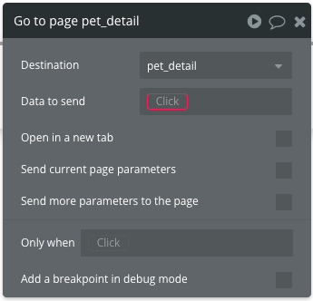

---

- Yes, that's right! The “Data to send” field.
- Click” here and you will see the familiar ‘Current cell's Pet’ in the list of candidates, which is the correct answer.

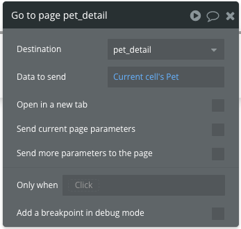

---

- Now let's preview it!
- Did you see that when you select an image of a pet in the list screen, the details screen for that pet appears?


---

- Here's some display advice
- The Birthday and Gender displays are a little bland, so change the display format!


---

##### Exercise 2

Let's change the birthday format to the form `2024年11月9日`


---

- On the pet_detail screen, open the Design tab.
- Double-click on the Birthday display element to open the Advanced Settings dialog box.

---

- Then click on the Birthday section of the `Current Page Pet's Birthday`, and you will see a `More` item at the back.

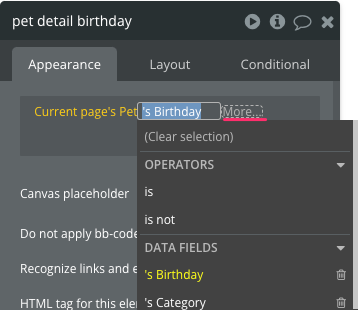

---

- Then you can further specify the format in which the Birthday values are to be displayed
- This time, click `:formatted as DD/MM/YYY` at the top
  - DD/MM/YYY should contain today's date.

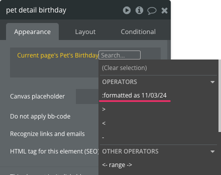

---

- Then you will see the `Date Formatting` dialog next to it.
- Here you can specify the formatting in detail.
- In this case, select `Custom` for `Format type` and set `Custom format` to `yyyy年m月d日`.

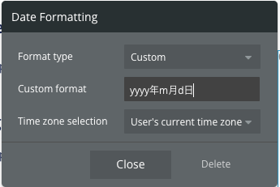

---

- Now let's preview it.
  - Open the index page once and then preview
- If you open the pet details from the pets list, you will see that the Birthday date is in the format you specified.


---

##### Exercise 3

Let's change the gender labels

- If the gender is “Male”, then it should be labeled “Boy”.
- If it is “Female”, let's label it as “Girl”!


---

- Open the pet_detail screen in the Design tab.
- Double-click on the Gender display element to display the dialog for detailed settings.
- This time, let's change the string to be displayed by setting the condition from the Conditional tab

---

- First, move the cursor to the `Current Page Pet's Gender` field that you have just entered on the Appearance tab, and delete the entry with the Delete button.


---

- Then open the Conditinal tab and click the `Definel another condition` button to add a condition.

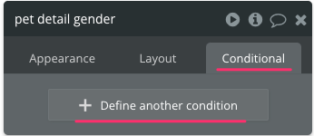

---

- First, specify the condition “If the currently displayed pet's gender is ‘Male’” in the When field.
- Only Male is manually entered, the others are selected from the pull-down menu.

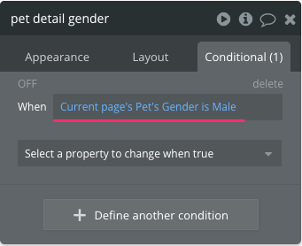

---

- Once the “When” condition is set, set the behavior when the condition is true
- In this case, we want to display a specific string, so we select “Text” from the “Select a property...” pull-down menu. In this case, we want to display a specific string, so select “Text” from the “Select a property...” pull-down menu.


---

- Then, a text input field will appear, and enter “boy” there.


---

- Let's set up the “girl” in the same way


---

- The girl setting can be written as “if the currently displayed pet's gender is not ‘Male’”.

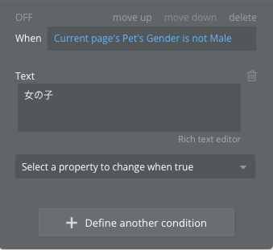

---

- This would be writing the following process

```
If the current pet's Gender is Male, it will be displayed as “Boy”,
If the current pet's Gender is Female, it will display “Girl”.
```

Here we have a bit of a programming element!

- If you want to process the value of the element itself, as in Birthday, it is better to specify Format, but if you want to do something based on the value of the element, as in this case, you should use Conditional!

---

- Let's run the preview from the index page.
- If you open the pet details from the pet list, you will see that the Gender values are “boy” and “girl”.


---

##### Exercise 4

Let's provide a lead from the detail screen to the list screen

- Let's set up a lead to return to the list from the details screen.
- I am sure you have a good idea of what you want to do, so let's just describe the final image!

---

#### Completion image

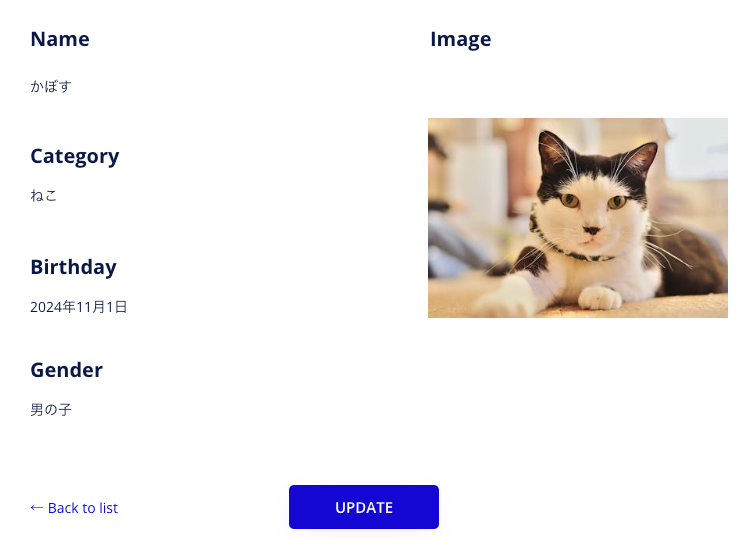

---

## Let's create common parts between screens.

- Let's take a short break from screen creation to create “common parts”.
- A “common part” is a collection of elements that are used in the same way on multiple screens.

---

#### Function of the header component to be created

- Link to pet registration page
- Control login/logout buttons based on login status

**logged out**


**logged in**


---

#### Why create common parts?

- It is time-consuming to prepare elements, such as header parts, that you want to use on multiple screens separately for each screen, isn't it?
- Also, if you prepare them individually, when you want to change their contents, you need to modify them for each screen, which increases the time and effort of development.

---

- Bubble solves such problems by using “Reusable elements” components!
- In this case, we will create a header component as “Reusable elements” and place it on the pet list, registration and details screens

---

#### Creating a header component

- Open the list of screens in the upper left corner and in it “Add a new reusable element...” Click on “Add a new reusable element...” in the list.

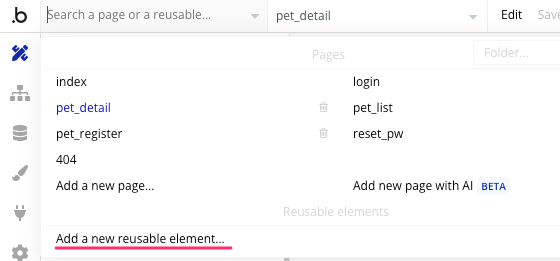

---

- Then, the same pop-up window is displayed as when creating a screen. This time, enter “header” as the name of the common part and click CREATE.


---

- Then an area of 120px x 200px will appear in the right panel.
- The width of the area is a little narrow as it is, so first adjust the area.

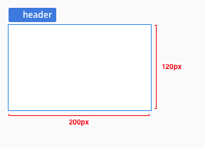

---

- Right-click in the right panel area --> Edit
- Select the “Layout” tab in the familiar pop-up window.
- Change Container layout to “Fixed”, change `Width` to “1200” and `Height` to “72

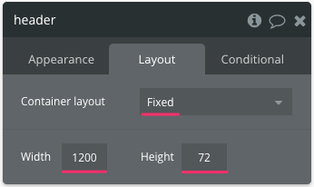

---

- Now let's create a common header component. As with Sign up, we will use a header component from “Components”.

---

- Since some of the Header components cannot be used without installing some plug-ins, we need to `Install` the plug-ins as indicated in the “Plugins required” section of the Component library.
- Now you can select the Header related components


---

- In this case, select the topmost component in the “Headers” section and drag it to the right panel.
- Once placed, click the × button in the upper right corner of the Component Library to close it.


---

- Then, the sample Header that Bubble provides is displayed on the right panel.
- This time, we will customize it.

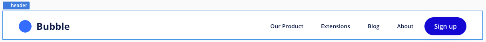

---

- First, let's delete what we don't need as a header component this time
- Select and delete the following three elements
  - Our Product
  - Extensions
  - Blog
- Leave the “About” element as it will be used in the next step.
- Be careful not to delete other elements by mistake!


---

- Here's what it looks like after deletion


---

#### Setting up a link to the pet registration page

- First, let's set up a link to the pet registration page.


---

- Double-click on the “About” element you just left to bring up the edit popup
- Click on the button `Replace` at the bottom of the popup


---

- This function changes the type of the currently selected element.
- In this case, we will replace the Text element with a Link element.
- Select “Link” in the `New element type` and click REPLACE

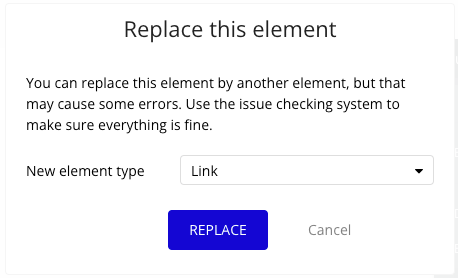

---

- The element type is now replaced by Link.
- However, the `Style` and `Conditional` elements that were set on the original element are still there, so we will change them.

---

- First, change the `Style` to Link
- Select “Standard Link” for `Style` from the Edit Element popup.


---

- String content also changed to “Pet Register”.
- Set “pet_register” as the transition destination

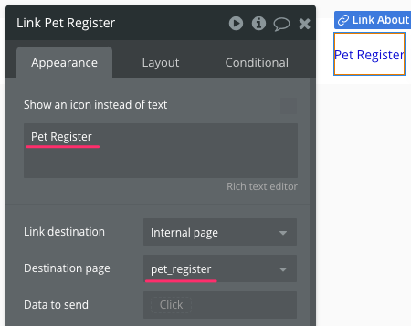

---

- Style has been changed and the `Conditional` content has been removed
- If it is as shown in the capture, it is OK.

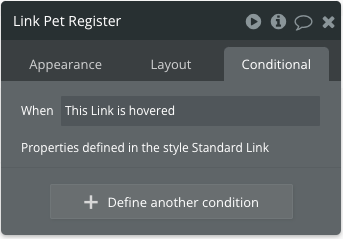

---

- This completes the installation of the link to the pet registration page.


---

#### Control Login / Logout buttons based on login status

- We will prepare login and logout buttons


---

There are 5 things to do here

1. Copy the Sign up button and prepare a Log in button
2. The login button is “displayed only when the user is not logged in.”
3. Pressing the login button takes you to the login screen (login).
4. Change the sign up button to a logout button and “only show when in the logged in state.”
5. When the logout button is pressed, the user is placed in a logout state and then transferred to the login screen (index).

Let's get right to it. :muscle:

---

#### 1. Copy the Sign up button and prepare a Log in button

- On the Design tab, right-click on “Button Sign up” in the “Elements Tree” menu on the left and `Copy` it.

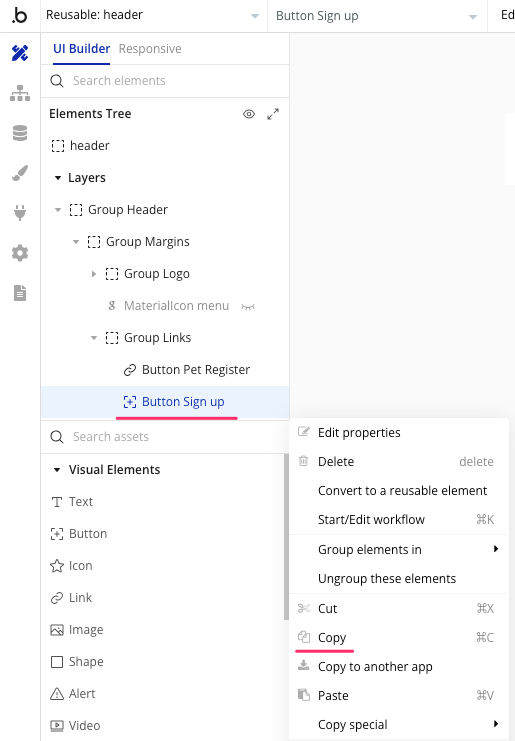

---

- Right-click “Button Sign up” again and `Paste`.


---

- “Button Sign up” should now be two, select the top element


---

- In the right panel, change the element name to `Button Log in` in the Advanced Settings dialog.
- From the Appearance tab, change the Label (button name) to `Log in
- Change the background color of the Sign up button to an appropriate color to distinguish between the Sign up button and the Log in button.


---

#### 2. The login button is “displayed only when the user is not logged in.”

- The image of the control is as follows
  - The login button is hidden.
  - If the user is currently not logged in under Conditional conditions, the login button is displayed.

---

- First, display the Edit Login Button dialog
- On the Layout tab, uncheck `This element is visible on page load
- This will make this element invisible on page load.


---

- Next, control by login status
- From the Conditional tab, click `Define another condition
- Set the When condition to “The user is currently not logged in”.

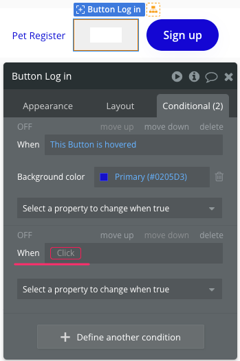

---

- Something like this.
- `Current User is logged out`


---

- Then, select the process to be performed when the When condition is met with `Select a property to change when true`!
- Do you know what to select? :thinking:

---

- The answer is `This element is visible`.
- Select it, check the box, and you are good to go.


---

- Now the following state is ready
  - The login button should be hidden.
  - Show the login button if the user is currently logged out under Conditional conditions.

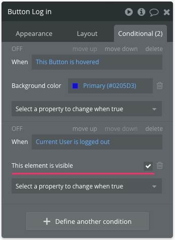

---

#### 3. Pressing the login button takes you to the login screen (login).

- Next, we will set up a workflow that will take us to the login screen when the “Log in” button is clicked.
- Since this is a simple screen transition, let's set it up for everyone!

# :hourglass_flowing_sand:
# :hourglass:

---

- The workflow to set up is Go to page
- Select the index of the login screen for the Destination and you are good to go.


---

- This completes the control of the login button.
- Next, let's control the logout button

---

#### 4. Change the sign up button to a logout button and “only show when in the logged in state.”

- First, change the label of the “Sign up” button to “Log out

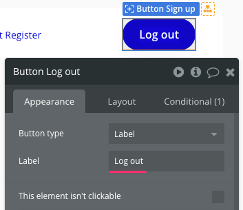

---

- And the controls for showing and hiding are almost the same as for the login button mentioned earlier
  - The Logout button should be hidden.
  - If the Conditional condition is that the user is currently logged in, the login button is displayed

- Let's set it up with reference to what we just discussed.

# :hourglass_flowing_sand:
# :hourglass:

---

- First, display the Edit Login Button dialog
- On the Layout tab, uncheck `This element is visible on page load
- This will make this element invisible on page load.


---

- And here is what the Conditional looks like
- The condition for When is `Current User is logged in
- Now the following conditions are ready
  - The logout button is hidden.
  - If the Conditional condition is that the user is currently logged in, the logout button is displayed.


---

- In fact, there is one more place where this same Conditional condition is set to control the display of elements only when the user is currently logged in
- Can you guess where it is? :thinking:

---

- Here is the link to the first “Pet Register” we added
- Pet data is data associated with a logged-in user.
- Therefore, we should also set the “Pet Register” link to “Conditional” so that the user can go to the pet registration page only when he/she is logged in.

---

- You can tell because it's the same control as the logout button I mentioned earlier. :smile:

---

- It looks like this. :+1:


---

#### 5. When the logout button is pressed, the user is placed in a logout state and then transferred to the login screen (index).

- Finally, let's set up the workflow when the “Log out” button is pressed.
- Let's start by setting this up as well!

---

#### Hint :bulb:

- The workflow hint for logout status is one of the actions in “Account”

# :hourglass_flowing_sand:
# :hourglass:

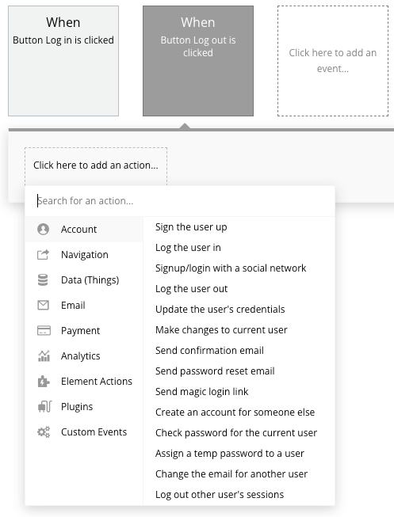

---

- The action to log out is “Log the user out” in “Account”.
- After that, set the action for the screen transition and you are good to go.


---

- This completes the configuration for the header component.


---

What we did

- Link to pet registration screen
- Control login / logout buttons based on login status
1. Copy the Sign up button and prepare a Log in button
2. The login button is “displayed only when the user is not logged in.”
3. Pressing the login button takes you to the login screen (login).
4. Change the sign up button to a logout button and “only show when in the logged in state.”
5. When the logout button is pressed, the user is placed in a logout state and then transferred to the login screen (index).

---

By the way...

- I assume that your header part does not show the three elements that I just set up.
- This is because they are initially hidden in the settings, but there is a way to display them even in that state.


---

- Open the `Elements tree` in the left panel and click “Collapse all” on the right side of the “Element tree”.
- Then the icon changes to “Expand all” and click it again.


---

- Then, all the elements placed in the current screen (or common parts) will be displayed in a tree format.
- The order in which the elements are displayed also has a meaning: the one at the bottom is the one in front of it on the screen.

---

- The elements shown here are all the elements included in the screen (common parts) that is currently displayed.
- The order of display also has a meaning: the elements at the bottom are those displayed at the top of the screen.


---

- Then, in the “Group Links” group at the bottom of the page, you should see the following three elements that you have just manipulated
  - Button Pet Register
  - Button Log in
  - Button Log out


---

- The “eye” icon to the right of each of these three elements: 👁️
- This has an ON and OFF status, ON means it is visible on the right panel, OFF means it is not visible on the right panel.

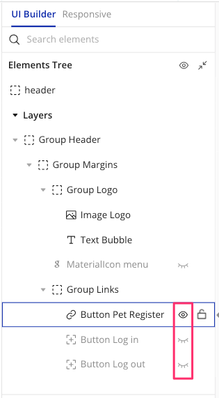

---

- For the three elements we have manipulated this time, if you turn the “eye” icon OFF and ON again, the buttons will appear on the right panel as well.
- Note that this is a display / non-display control on the right panel and has nothing to do with the actual display / non-display on the application.


---

- Finally, to match the width of the current header component with the width of the screen, select the following element from the `Elements tree` and change the value of `Width` or `W` to “1080” from the “Layout” tab

---

- header” which is the common component itself


---

- "Group Header"

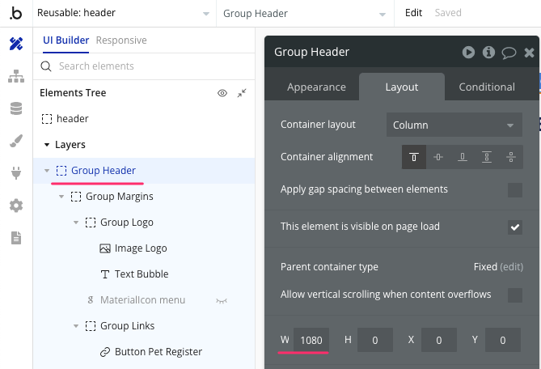

---

- If you can no longer see the “Pet Register” link or the login button because you changed the `Width`, follow the same procedure as before and click on the “eye” icon of the button or other element in the `Elements tree` and turn the display ON.

---

### Let's incorporate it into each screen.

- Now that we have the header component, let's first incorporate it into the Pets List screen!


---

- Open “pet_list” and remove the “PET REGISTER” link you placed first

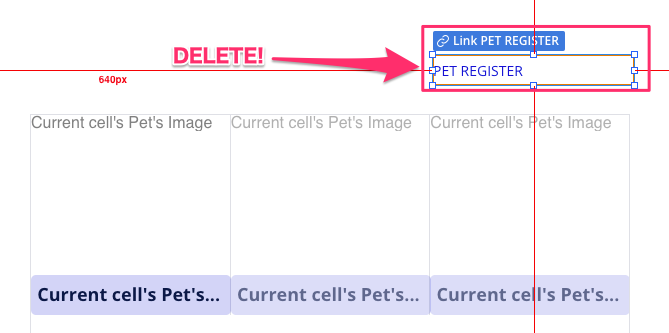

---

- From the left panel, click on “header” in `Reusable elements` and drag it to the top of the right panel
- Place it at the top of the screen!

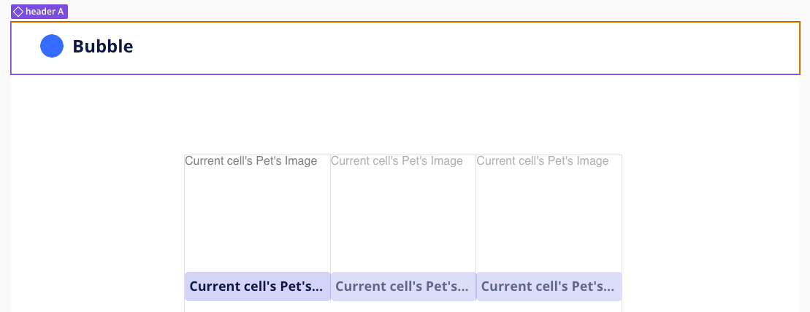

---

Let's preview it now 🙋‍♀️

---

#### If you are logged in

- The link for pet registration should be displayed
- Logout button should be displayed.
- Logout button must be displayed to go to the Log in screen.


---

#### If you are in a logged out state

- The link for pet registration is not displayed.
- Log in button should be displayed.
- When the login button is pressed, the Log in screen should be displayed.


---

- If there are no problems, let's incorporate it into the rest of the screen in the same way.
  - Pet Registration Screen
  - Pet Details Screen

Let's Try!! :fire:

---

# :hourglass_flowing_sand:
# :hourglass_flowing_sand:
# :hourglass_flowing_sand:
# :hourglass:
# :hourglass:

---

- Preview to be sure and confirm that the common header is displayed correctly on each screen!

---

#### Pet Registration Screen


---

#### Pet Detail Screen


---

##### Exercise 5

Separate links on the pet registration page

- If you can afford it, let's set the “Pet Register” link in the header not to be displayed on the pet registration page.
- Hint :bulb: “Current page name”.
  - “Current page name”.
  - The page name of the pet registration page is “pet_register”.

---

##### Exercise 6

Let's create an update function by providing a lead from the detail screen to the update screen.


---

The following sheet is the key point! Please try to put it into practice!

- The update screen has almost the same screen elements as the registration screen, so let's clone `pet_register` and create `pet_update`!
- In the registration screen, each input element (name, birthday, etc.) is empty, but in the update screen, we need to set the values of data already registered at the time of displaying the screen!
- In the update screen, we need to set the values of the already registered data at the time the screen is displayed.
  - Hint:bulb: Insert dynamic data
  - Hint:bulb: Initial content

---

- As for the behavior when the update button is pressed, it was `Create a new thing... ` in `Data(Thing)` when a new registration was made, but this time it is an update, right? `, but this time it is an update, right?
  - Speaking of update, change... Oh, there seems to be an action like that :yum:.
- Finally, when we move from the detail screen to the update screen, we need to pass the information of the pet displayed in the detail screen. This is the part I learned in today's lecture!
  - Hint:bulb: Data to send

---

##### Exercise 7

Let's create a pet weight management function!

- Let's make it possible to manage multiple daily weights for one pet, and show the weight transition in a graph.

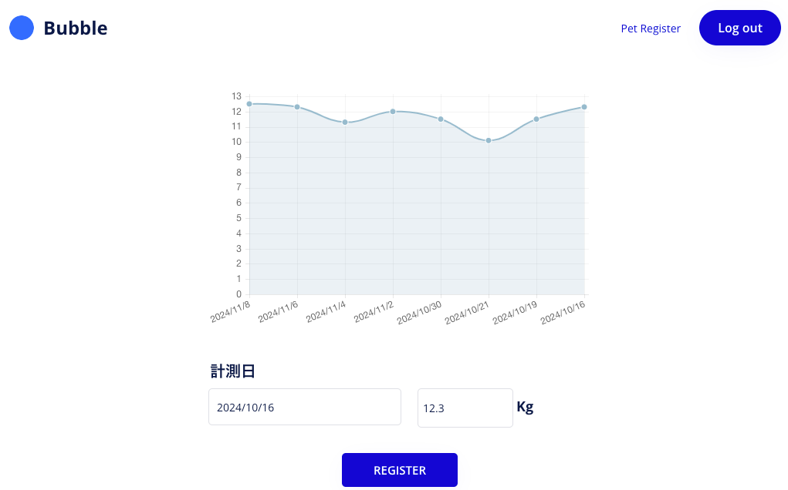

---

The key points are as follows! Please try to put them into practice!

- Create PetWeight as a new table
  - What might be the items we need 🤔
    - Weight
    - Date of weighing
    - Association with the original pet
    - Anything else?

- The elements needed for the weight management screen are
  - Components to enter weight information (weight and date measured)
  - A graph of weight

---

##### Exercise 8

Let's always transition to the login screen when the user is not logged in.

- We don't want all the screens where header components are placed to be used only when the user is logged in, do we?
- So, let's force the transition to the login screen (index) when the user is not logged in to the screen where the header component is placed.

---

- Hint :bulb:
  - Instead of setting up a workflow for each screen where a header component is placed, a workflow is set up for the header component itself.
  - The configuration is simple
  - When: “Go to page index” if the user is currently not logged in

- The answer (configuration details) is written on the next page!

---

- For the header component
  - When: User is logged out
  - Go to page login
- Unlike other workflows, the button is not triggered, so the color has been changed for clarity.

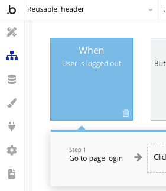

----

##### Exercise 9

Let's create a new function using what you learned today!

Feel free to add new functionality using the features you learned today!
When you are done, share the URL of the login screen on Slack for everyone to see!

---

##### Presentation of the results of Exercise 9

(if you have time)

Introduce the screens/functions you created in the exercise :smile: ?

---

## Summary

- In today's lecture, we learned about Bubble, a no-code tool, starting from how to use it, to actually designing a screen and integrating it with a database.
- In the next lecture, we will learn the basic knowledge required to develop an application from scratch.

---

# That's all!
# Thank you for your hard work!
