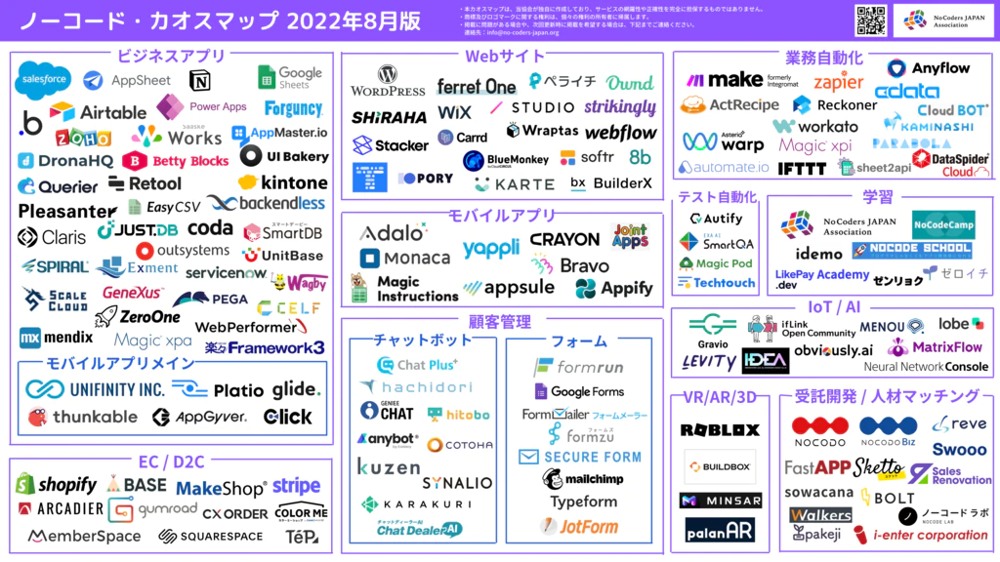

**Programming Boot Camp**

# What is No-Code Development?

**Institute of SCIENCE TOKYO 2024/11/09**
　
　
　
　
　
　　　　　　　**Ryo Imahashi Supported by Naotake KYOGOKU**

---

## Table of Contents

- What is No-Code Development?
- Advantages and Disadvantages of No-Code development
- Why No-Code development?
- What kind of No-Code development tools are available?
- Introduction of No-Code Development Tools used in Programming Boot Camp.

---

## What is No-Code Development?

No-Code development is the development method of apps and web services without writing code in a programming language.

Compared to traditional application development (scratch development) writing code in a programming language, No-Code development can often develop an application in a shorter amount of time.

Even if you are not an engineer with programming knowledge, No-Code development makes it possible to create an app.

---

There are many tools available for No-Code development.

Each of them has different features, but they all have in common the idea of making it easy to develop an application as imagined without writing any code. Many tools allow you to create screens by combining ui components by drag and drop, allowing you to develop apps intuitively.

Many No-Code development tools also provide an environment for running the developed app, so you can check the operation immediately after modifying it and proceed with development quickly, repeating trial-and-error quickly.

---

This is screen image of Adalo.

---

## Advantages and Disadvantages of No-Code development
### Advantages

- No programming knowledge required
- No cost to order engineers
- Fast development of apps.

---

### Disadvantages

- When you want to do something complicated, it may be difficult to do.
  - While No-Code development tool's simple functions allow us to develop apps easily, there is a limit to what we can do compared to traditional development writing code. (In some cases, this can be solved by combining multiple No-Code development tools.)
- You will be dependent on the No-Code development tool you use.
  - Depending on the tool you use, there may be restrictions on design, functionality, etc. Also, if the tool is no longer in service, you will be forced to stop your service (or not be able to modify your app anymore).

---

## Why No-Code Development?

- Because it is possible to develop a prototype that can actually be operated by users without spending a lot of time or money, and it is a quick and easy way to validate service ideas.
- Compared to traditional application development, there are fewer points at which you get stuck, so it is easier and more enjoyable for beginners :smile:

---

## What kind of No-Code development tools are available?

I mentioned earlier that "there are many tools available for No-Code development" but how many are there?

---

The NoCode Chaos Map created by the NoCoders JAPAN Association listed 150 or more tools (on my count).

---

With so many tools, you may be at a loss as to which one to choose. The key to choosing the right one is to think about what you want to create, because each No-Code development tool has different type of app that is easy to create.

Examples:
- Mobile app
- Web app
- Website
- E-commerce site
- Business efficiency tools

---
## Introduction of No-Code Development Tools used in Programming Boot Camp.

At the Programming Boot Camp, we will be using a tool called Bubble to learn!

Let's start with a lecture on Bubble :fire: !
