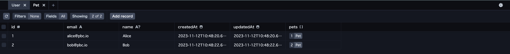
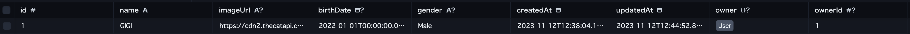
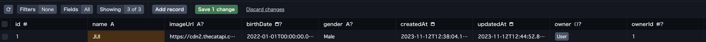
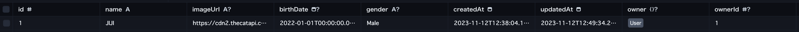
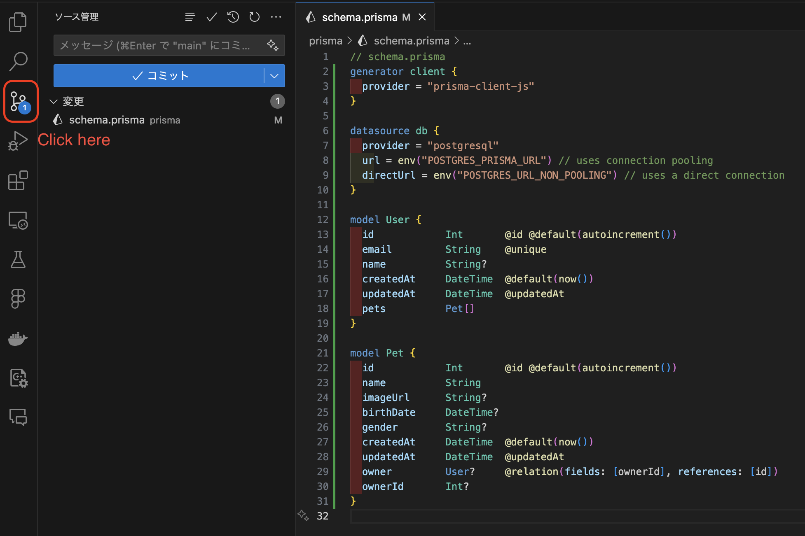
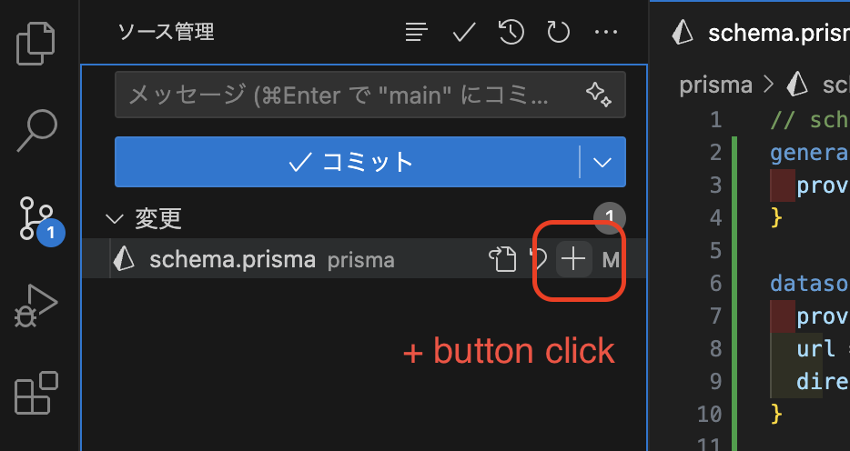
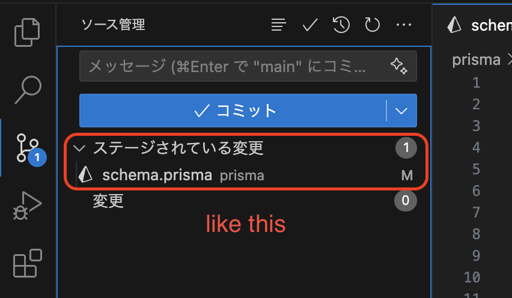
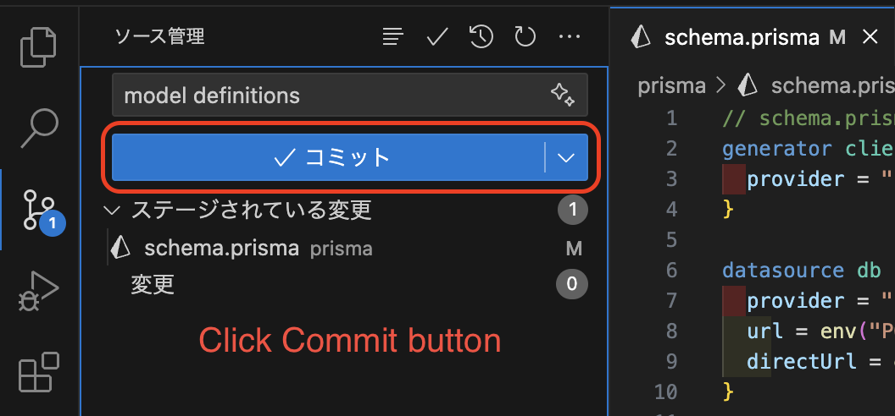
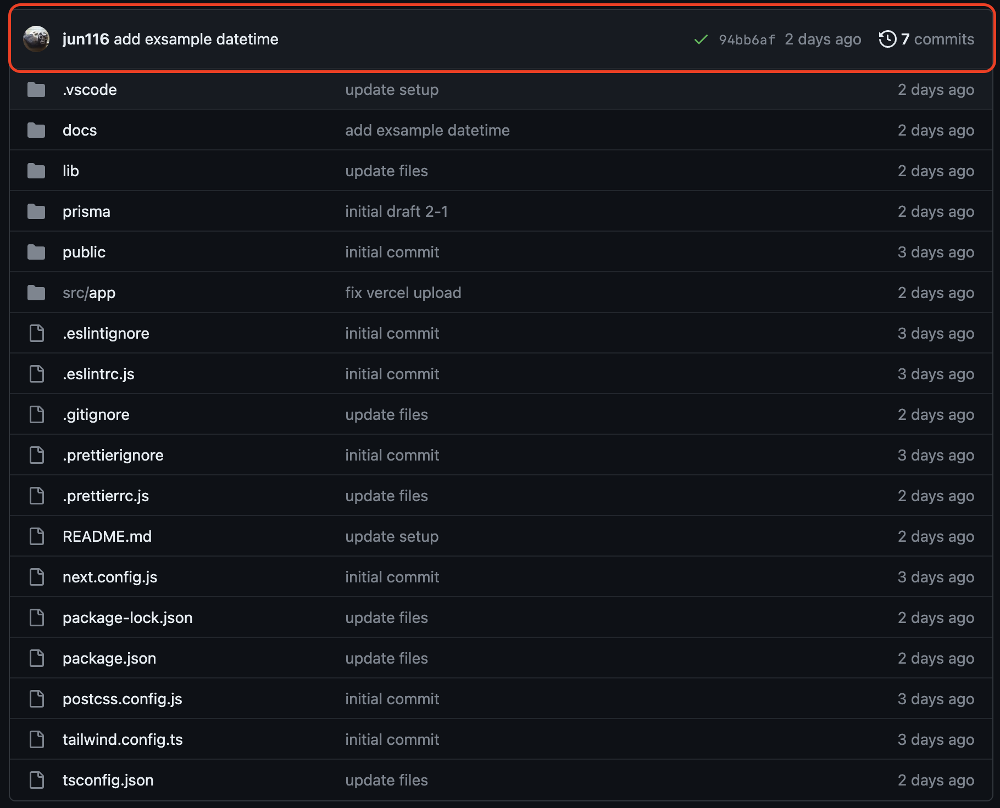

# Experience API Development Basics #1

## Connect to the database

### 1. Settings for connecting to the database you created

Open file: [prisma/schema.prisma](../../learning-phase-2/prisma/schema.prisma)

`schema.prisma` so that it looks like this:

```ts
// schema.prisma
generator client {
  provider = "prisma-client-js"
}

datasource db {
  provider = "postgresql"
  url = env("POSTGRES_PRISMA_URL") // uses connection pooling
  directUrl = env("POSTGRES_URL_NON_POOLING") // uses a direct connection
}
```

### 2. The model definitions

Pet model learned in learning phase #1 and #2

**User**

```ts
model User {
  id            Int       @id @default(autoincrement())
  email         String    @unique
  name          String?
  createdAt     DateTime  @default(now())
  updatedAt     DateTime  @updatedAt
  pets          Pet[]
}
```

**Pet**

```ts
model Pet {
  id            Int       @id @default(autoincrement())
  name          String
  imageUrl      String?
  birthDate     DateTime?
  gender        String?
  createdAt     DateTime  @default(now())
  updatedAt     DateTime  @updatedAt
  owner         User?     @relation(fields: [ownerId], references: [id])
  ownerId       Int?
}
```

**Explanation:**

```ts
// number
// ex: 1, 2, 3
Int

// text
// ex: kim, kyogoku, imahashi
String

// Date & time
// ex: 2023-11-18T01:00:00.000Z
DateTime
```

```ts
// auto-incremented primary key
// ex: 1, 2, 3, ...
@id @default(autoincrement())

// @unique is a constraint in the database
@unique

// @default sets a default value in the database
// ex: Current Date & Time
@default(now())

// Relationship User
// Here, "Owner" is used as an item that refers to the User model
// @relation defines a relation between models
@relation(fields: [ownerId], references: [id])

// User can have multiple pets
// pets plural
// Pet[] array
// @relation("owner")
pets Pet[]
```

### 3. Create and seed the database

Add the following model definitions to your `schema.prisma` so that it looks like this:

```ts
// schema.prisma
generator client {
  provider = "prisma-client-js"
}

datasource db {
  provider = "postgresql"
  url = env("POSTGRES_PRISMA_URL") // uses connection pooling
  directUrl = env("POSTGRES_URL_NON_POOLING") // uses a direct connection
}

model User {
  id            Int       @id @default(autoincrement())
  email         String    @unique
  name          String?
  createdAt     DateTime  @default(now())
  updatedAt     DateTime  @updatedAt
  pets          Pet[]
}

model Pet {
  id            Int       @id @default(autoincrement())
  name          String
  imageUrl      String?
  birthDate     DateTime?
  gender        String?
  createdAt     DateTime  @default(now())
  updatedAt     DateTime  @updatedAt
  owner         User?     @relation(fields: [ownerId], references: [id])
  ownerId       Int?
}
```

Diff

```diff
// schema.prisma
generator client {
  provider = "prisma-client-js"
}

datasource db {
  provider = "postgresql"
  url = env("POSTGRES_PRISMA_URL") // uses connection pooling
  directUrl = env("POSTGRES_URL_NON_POOLING") // uses a direct connection
}

+model User {
+ id            Int       @id @default(autoincrement())
+ email         String    @unique
+ name          String?
+ createdAt     DateTime  @default(now())
+ updatedAt     DateTime  @updatedAt
+ pets          Pet[]
+}

+model Pet {
+ id            Int       @id @default(autoincrement())
+ name          String
+ imageUrl      String?
+ birthDate     DateTime?
+ gender        String?
+ createdAt     DateTime  @default(now())
+ updatedAt     DateTime  @updatedAt
+ owner         User?     @relation(fields: [ownerId], references: [id])
+ ownerId       Int?
+}
```

> [!TIP]
> Save a file
> | windows | Mac |
> | ------------- | ------------- |
> | `control + s` | `command + s` |

Run the following command to create your database.  
This also creates the `User` and `Pet` tables that are defined in [`prisma/schema.prisma`](../prisma/schema.prisma):

```bash
npx prisma migrate dev --name init
```

When `npx prisma migrate dev` is executed against a newly created database, seeding is also triggered.  
The seed file in [`prisma/seed.ts`](../prisma/seed.ts) will be executed and your database will be populated with the sample data.

> [!NOTE]
> Options `--name xxx` Can be named for clarity.

**If you succeed**

```bash
$ npx prisma migrate dev --name init
Environment variables loaded from .env
Prisma schema loaded from prisma/schema.prisma
Datasource "db": PostgreSQL database "verceldb", schema "public" at "ep-steep-union-55122613.us-east-1.postgres.vercel-storage.com"

Applying migration `20231112100110_init`

The following migration(s) have been created and applied from new schema changes:

migrations/
  └─ 20231112100110_init/
    └─ migration.sql

Your database is now in sync with your schema.

✔ Generated Prisma Client (v5.5.2) to ./node_modules/@prisma/client in 48ms

Running seed command `ts-node prisma/seed.ts` ...
Start seeding ...
{
  alice: {
    id: 1,
    email: 'alice@pbc.io',
    name: 'Alice',
    createdAt: 2023-11-12T10:22:08.277Z,
    updatedAt: 2023-11-12T10:22:08.277Z
  },
  bob: {
    id: 2,
    email: 'bob@pbc.io',
    name: 'Bob',
    createdAt: 2023-11-12T10:22:10.428Z,
    updatedAt: 2023-11-12T10:22:10.428Z
  }
}
Seeding finished.

🌱  The seed command has been executed.
```

Congratulations, the tables have been created!

### 4. Check the database

View data using Prisma Studio.  
Run the following command:

```bash
npx prisma studio
```

```bash
$ npx prisma studio
Environment variables loaded from .env
Prisma schema loaded from prisma/schema.prisma
Prisma Studio is up on http://localhost:5555
```

Open URL: http://localhost:5555


Select and check each model:

**User table**  
You can see the number of pet records related to each user.


**Pet table**  
Pets to related users


Use Prisma Studio's interface to you can also create, update, and delete user and pet records.

### 5. Check the seed

When `npx prisma migrate dev` is executed against a newly created database, seeding is also triggered.  
The seed file in [`prisma/seed.ts`](../../learning-phase-2//prisma/seed.ts) will be executed and your database will be populated with the sample data.

Open file: [`prisma/seed.ts`](../../learning-phase-2//prisma/seed.ts)

```ts
import { PrismaClient } from '@prisma/client'

const prisma = new PrismaClient()

async function main() {
  console.log(`Start seeding ...`)
  const alice = await prisma.user.upsert({
    where: { email: 'alice@pbc.io' },
    update: {},
    create: {
      email: 'alice@pbc.io',
      name: 'Alice',
      pets: {
        create: {
          name: 'JIJI',
          imageUrl: 'https://cdn2.thecatapi.com/images/9u1.jpg',
          birthDate: new Date('2022-01-01'),
          gender: 'Male',
        },
      },
    },
  })
  const bob = await prisma.user.upsert({
    where: { email: 'bob@pbc.io' },
    update: {},
    create: {
      email: 'bob@pbc.io',
      name: 'Bob',
      pets: {
        create: [
          {
            name: 'MIAO',
            imageUrl: 'https://cdn2.thecatapi.com/images/716.jpg',
            birthDate: new Date('2023-10-01'),
            gender: 'Male',
          },
          {
            name: 'SNOW',
            imageUrl: 'https://cdn2.thecatapi.com/images/wJyw82pIl.jpg',
            birthDate: new Date('2021-05-11'),
            gender: 'Female',
          },
        ],
      },
    },
  })
  console.log({ alice, bob })
  console.log(`Seeding finished.`)
}
main()
  .then(async () => {
    await prisma.$disconnect()
  })
  .catch(async (e) => {
    console.error(e)
    await prisma.$disconnect()
    process.exit(1)
  })
```

> [!NOTE]
> More details on the contents later.

For example, change the name of a pet.

```ts
      pets: {
        create: {
          name: 'GIGI', // ← Change to any name you like
          imageUrl: 'https://cdn2.thecatapi.com/images/9u1.jpg',
          birthDate: new Date('2022-01-01'),
          gender: 'Male',
        },
      },
```

Reset database

```bash
$ npx prisma migrate reset
Environment variables loaded from .env
Prisma schema loaded from prisma/schema.prisma
Datasource "db": PostgreSQL database "verceldb", schema "public" at "ep-steep-union-55122613.us-east-1.postgres.vercel-storage.com"

? Are you sure you want to reset your database? All data will be lost. › (y/N)
```

Type `y` in the terminal

```bash
✔ Are you sure you want to reset your database? All data will be lost. … yes

Applying migration `20231112100110_init`

Database reset successful

The following migration(s) have been applied:

migrations/
  └─ 20231112100110_init/
    └─ migration.sql

✔ Generated Prisma Client (v5.5.2) to ./node_modules/@prisma/client in 50ms

Running seed command `ts-node prisma/seed.ts` ...
Start seeding ...
{
  alice: {
    id: 1,
    email: 'alice@pbc.io',
    name: 'Alice',
    createdAt: 2023-11-12T12:38:04.168Z,
    updatedAt: 2023-11-12T12:38:04.168Z
  },
  bob: {
    id: 2,
    email: 'bob@pbc.io',
    name: 'Bob',
    createdAt: 2023-11-12T12:38:06.088Z,
    updatedAt: 2023-11-12T12:38:06.088Z
  }
}
Seeding finished.

🌱  The seed command has been executed.
```

Changed from JIJI to GIGI



Can also be changed in Prisma Studio:

Changed from GIGI to JIJI

Save 1 change button click:


Wait a bit and it will update.


### 6. Commit your code to GitHub

**Push your code to Github**

Click on Source Control


Click on Stage Changes


Move to Staged Changes


Enter commit message

> [!NOTE]
> Commit message should be easy to understand.


Click Commit button


Click Sync Changes button


Open your GitHub page:

If the committed message is displayed, OK.


Database setup ends here.

Next [`Experience API Development Basics #2-2`](./2-experience-api-development-2.md)
