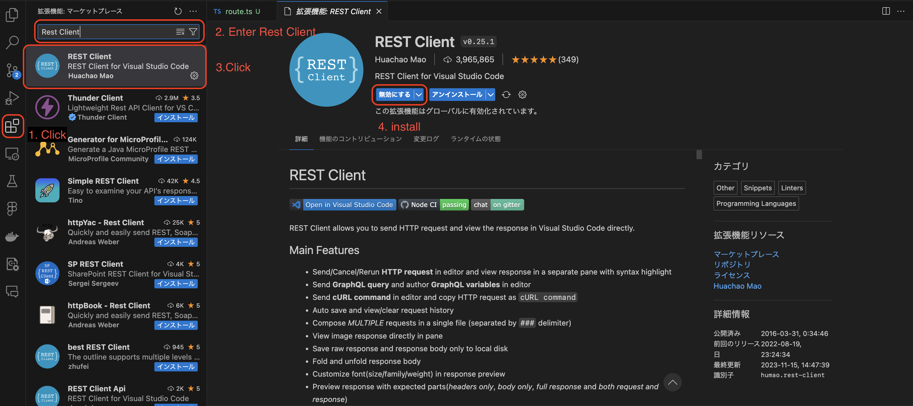
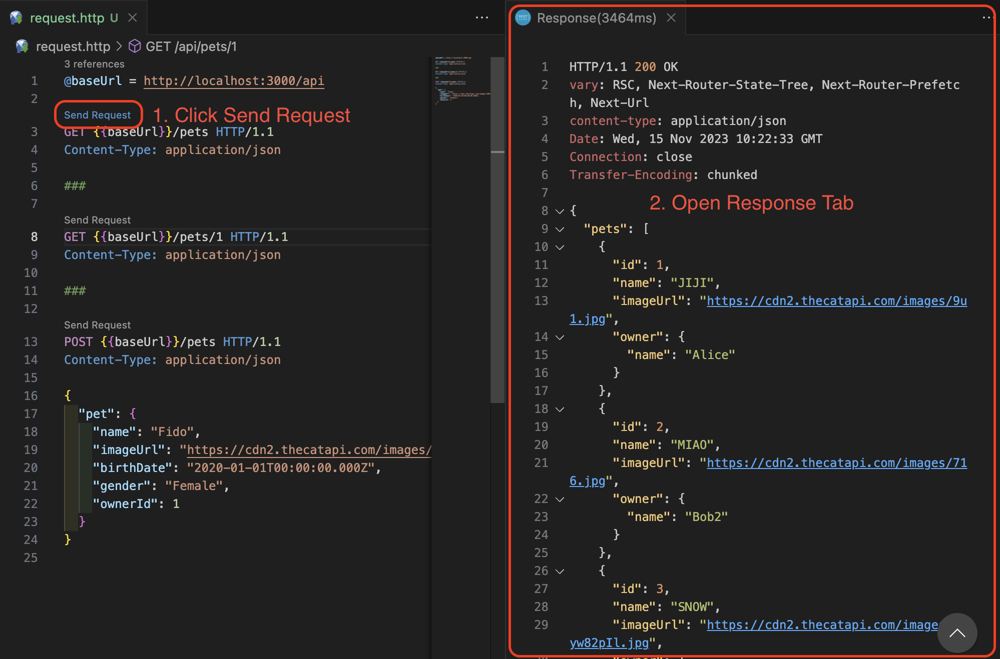
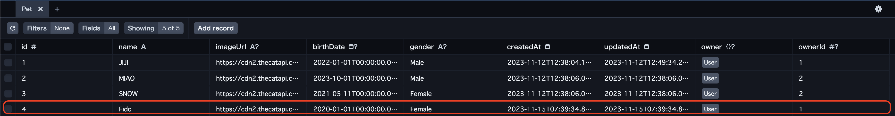

# Experience API Development Basics #2-2

## API implementations

### 5. Create a new Pet

| Resource | POST(Create)     |
| -------- | ---------------- |
| /pets    | Create a new pet |

Open file: [`src/app/api/pets/route.ts`](../src/app/api/pets/route.ts)

Enter the following code to your `route.ts`:

```ts
// POST /api/pets
export async function POST(request: Request) {
  // get data from request body
  const data = await request.json()
  // create pet record
  const pet = await prisma.pet.create({
    // data from request body
    data: data.pet,
  })
  // return Response with pet to json
  return NextResponse.json({ pet })
}
```

Diff

```diff
import { NextResponse } from 'next/server'

import prisma from '../../../../lib/prisma'

// GET /api/pets
export async function GET() {
  const pets = await prisma.pet.findMany({
    // sort by id ascending
    orderBy: { id: 'asc' },
    // include owner data
    // include: { owner: true },
    // select only id, name, imageUrl, and owner.name
    select: { id: true, name: true, imageUrl: true, owner: { select: { name: true } } },
  })
  // return Response with pets to json
  return NextResponse.json({ pets })
}

+// POST /api/pets
+export async function POST(request: Request) {
+  // get data from request body
+  const data = await request.json()
+  // create pet record
+  const pet = await prisma.pet.create({
+    // data from request body
+    data: data.pet,
+  })
+  // return Response with pet to json
+  return NextResponse.json({ pet })
+}
```

**Explanation of Code**

POST method is executed when `/api/pets` is accessed.  
However, the POST method is not executed when the URL is opened.

```ts
// POST /api/pets
export async function POST(request: Request) {
  ...
}
```

You can read the Request body using the standard Web API methods:

```ts
// get data from request body
const data = await request.json()
```

Create a single new record with the data:

```ts
// create pet record
const pet = await prisma.pet.create({
  // data from request body
  data: data.pet,
})
```

**Before execution**

Install Extentions:

1. Click Extentions
2. Enter `Rest Client`
3. Click `Rest Client`
4. Click Install button



Add file: [`request.http`](../request.http)

1. Click LEARNING-PHASE-4 folder
2. Click New File...
3. Enter `request.http`

Enter the following code to your `request.http`:

```ts
@baseUrl = http://localhost:3000/api

GET {{baseUrl}}/pets HTTP/1.1
Content-Type: application/json

###

GET {{baseUrl}}/pets/1 HTTP/1.1
Content-Type: application/json

###

POST {{baseUrl}}/pets HTTP/1.1
Content-Type: application/json

{
  "pet": {
    "name": "Fido",
    "imageUrl": "https://cdn2.thecatapi.com/images/xBR2jSIG7.jpg",
    "birthDate": "2020-01-01T00:00:00.000Z",
    "gender": "Female",
    "ownerId": 1
  }
}
```

- Click `Send Request`
- Open Respons Tab



Open URL: [`http://localhost:3000/api/pets`](http://localhost:3000/api/pets)

```json
{
  "pets": [
    {
      "id": 1,
      "name": "JIJI",
      "imageUrl": "https://cdn2.thecatapi.com/images/9u1.jpg",
      "owner": {
        "name": "Alice"
      }
    },
    {
      "id": 2,
      "name": "MIAO",
      "imageUrl": "https://cdn2.thecatapi.com/images/716.jpg",
      "owner": {
        "name": "Bob2"
      }
    },
    {
      "id": 3,
      "name": "SNOW",
      "imageUrl": "https://cdn2.thecatapi.com/images/wJyw82pIl.jpg",
      "owner": {
        "name": "Bob2"
      }
    }
  ]
}
```

Run `GET {{baseUrl}}/pets HTTP/1.1`

```json
HTTP/1.1 200 OK
vary: RSC, Next-Router-State-Tree, Next-Router-Prefetch, Next-Url
content-type: application/json
Date: Wed, 15 Nov 2023 10:28:49 GMT
Connection: close
Transfer-Encoding: chunked

{
  "pets": [
    {
      "id": 1,
      "name": "JIJI",
      "imageUrl": "https://cdn2.thecatapi.com/images/9u1.jpg",
      "owner": {
        "name": "Alice"
      }
    },
    {
      "id": 2,
      "name": "MIAO",
      "imageUrl": "https://cdn2.thecatapi.com/images/716.jpg",
      "owner": {
        "name": "Bob2"
      }
    },
    {
      "id": 3,
      "name": "SNOW",
      "imageUrl": "https://cdn2.thecatapi.com/images/wJyw82pIl.jpg",
      "owner": {
        "name": "Bob2"
      }
    }
  ]
}
```

Same result!

**Explanation of Code**

It means something like this:

`GET request http://localhost:3000/api//pets`

```ts
@baseUrl = http://localhost:3000/api

GET {{baseUrl}}/pets HTTP/1.1
Content-Type: application/json
```

It means something like this:

`POST request http://localhost:3000/api//pets`

request data:

```json
{
  "pet": {
    "name": "Fido",
    "imageUrl": "https://cdn2.thecatapi.com/images/xBR2jSIG7.jpg",
    "birthDate": "2020-01-01T00:00:00.000Z",
    "gender": "Female",
    "ownerId": 1
  }
}
```

```ts
POST {{baseUrl}}/pets HTTP/1.1
Content-Type: application/json

{
  "pet": {
    "name": "Fido",
    "imageUrl": "https://cdn2.thecatapi.com/images/xBR2jSIG7.jpg",
    "birthDate": "2020-01-01T00:00:00.000Z",
    "gender": "Female",
    "ownerId": 1
  }
}
```

Run POST Method:

1. Open `request.http` file
2. Click `Send Request`

```ts
Send Request
POST {{baseUrl}}/pets HTTP/1.1
```

Create pet record:

```json
HTTP/1.1 200 OK
vary: RSC, Next-Router-State-Tree, Next-Router-Prefetch, Next-Url
content-type: application/json
Date: Wed, 15 Nov 2023 10:42:49 GMT
Connection: close
Transfer-Encoding: chunked

{
  "pet": {
    "id": 4,
    "name": "Fido",
    "imageUrl": "https://cdn2.thecatapi.com/images/xBR2jSIG7.jpg",
    "birthDate": "2020-01-01T00:00:00.000Z",
    "gender": "Female",
    "createdAt": "2023-11-15T10:42:46.194Z",
    "updatedAt": "2023-11-15T10:42:46.194Z",
    "ownerId": 1
  }
}
```

Check your database:

1. Open URL [http://localhost:5555/](http://localhost:5555/)
2. Click Pet table

Created pet record!



### Exercise

Try modifying "request.http" to create new data.

### Exercise

Try writing code to create a new user.

### 6. Error case

| Resource | POST(Create) |
| -------- | ------------ |
| /pets/1  | Error        |

Skip for error case.

### 7. Summary of POST methods

**`create`**

`create` creates a new database record.

---

Next [`Experience API Development Basics #2-3`](./2-experience-api-development-4.md)
