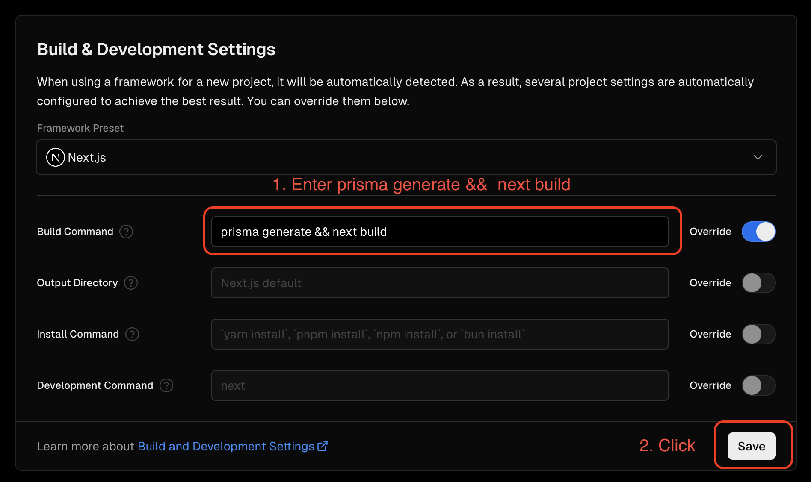
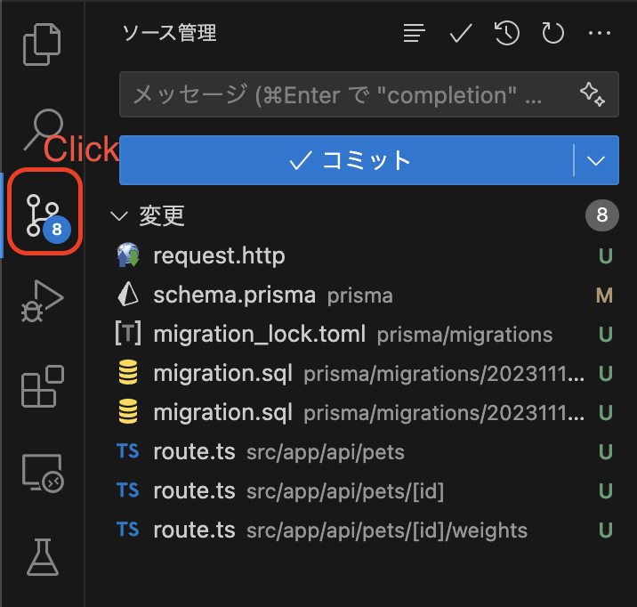
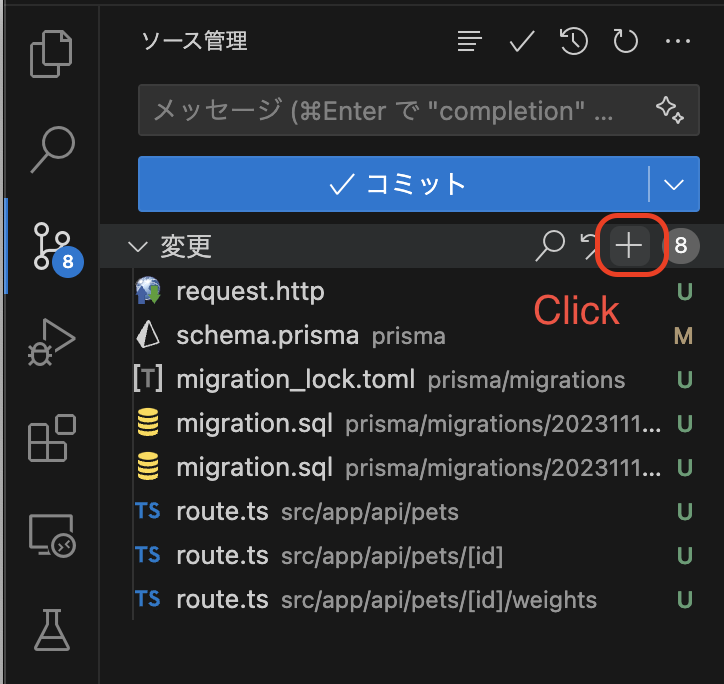
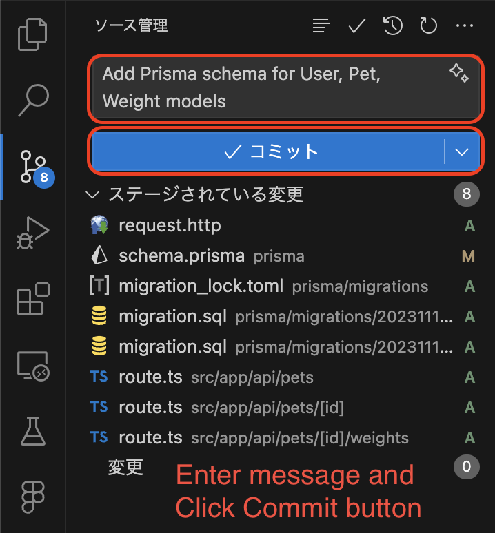
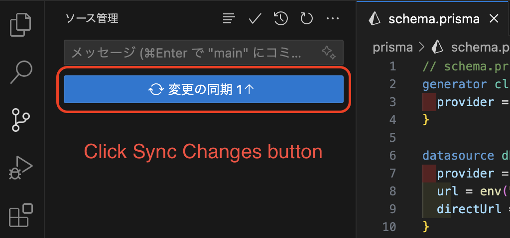
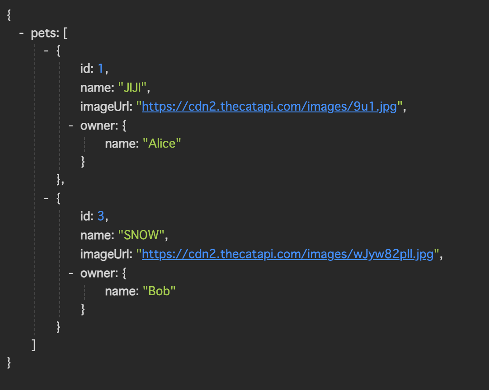

# Experience API Development Basics #2-6

## Deploy to Vercel

**Open Vercel Site**

1. Open URL `https://vercel.com/{{your-team}}/learning-phase-4`
2. Click `Settings`
3. Build Command -> Override -> ON


4. Enter `prisma generate && next build`
5. Click `Save` button



**Commit & Push to GitHub**

1. Click on Source Control



2. Click on Stage Changes



3. Enter commit message
4. Click Commit button



5. Click Sync Changes button



**Vercel Site**

Open your Vercel page:

1. Click `Visit` button


2. Open URL: `https://{{your-project-url}}/api/pets`



Success!

## Test and Operation check

List of URL

- `api/pets`
- `api/pets/1`
- `api/pets/1/weights`

Open file: [`request.http`](../request.http)

Edit the following code to your `request.http`:

```ts
@baseUrl = https://{{your-project-url}}/api

GET {{baseUrl}}/pets HTTP/1.1
Content-Type: application/json

###
```

Run:

- Click `Send Request`
- Open Respons Tab

Is it working correctly?

Now it's complete.

Thank you for your hard work!

An extra

Next [`Experience API Development Basics #3`](./3-experience-front-development-1.md)
